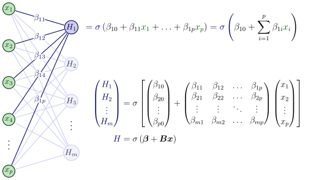
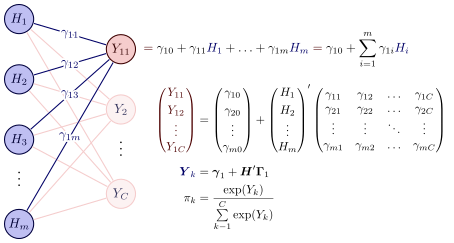

---
knitr:
  opts_chunk:
    cache.path: "../_cache/cls-neural-nets/"
---

# Neural Network Classifiers {#sec-cls-neural-nets}

```{r}
#| label: cls-neural-nets-setup
#| include: false
source("../R/_common.R")

# ------------------------------------------------------------------------------

library(tidymodels)
library(torch)
library(mirai)
library(spatialsample)
library(embed)
library(bestNormalize)
library(gt)
library(probably)
library(patchwork)
library(paletteer)
library(brulee)
library(tidyposterior)

# ------------------------------------------------------------------------------
# set options

tidymodels_prefer()
theme_set(theme_bw())
set_options()
theme_set(theme_bw())
daemons(parallel::detectCores())

source("../R/compare_models.R")

cls_mtr <- metric_set(brier_class, roc_auc, pr_auc, mn_log_loss)

# ------------------------------------------------------------------------------
# load data

load("../RData/forested_data.RData")
load("../RData/optimizers.RData")
load("../RData/dat_2d.RData")

# ------------------------------------------------------------------------------
# Gradient descent helpers

source("../R/setup_2D_GD.R")

# ------------------------------------------------------------------------------

aligned <- function(x, ...) {
  n <- nrow(x)
  p <- ncol(x)

  fmt <- format(x, ...)
  fmta <- format(abs(x), ...)
  nonneg <- x < 0
  signs <- ifelse(nonneg, "-", "+")
  vars <- colnames(x)

  amps <- rep(" & ", n)

  just <- "rr"
  res <- cbind(rownames(x), amps)
  res <- cbind(res, fmt[, 1], amps)
  for (i in 2:p) {
    symb <- rep(vars[i], n)
    vals <- gsub("^ +", "+", fmt[, i])
    res <- cbind(res, vals, amps, symb)
    just <- c(just, "rl")
    if (i < p) {
      res <- cbind(res, amps)
    }
  }
  res <- cbind(res, c(rep("\\\\", n - 1), ""))
  justs <- paste(just, collapse = "")
  colnames(res) <- rownames(res) <- NULL

  cat(paste0("\n\\begin{array}{", justs, "}\n"))
  tt <- apply(res, 1, function(x) cat(x, "\n"))
  cat(paste0("\\end{array}\n"))
}
```

This chapter contains _three_ sections on neural networks. The first describes the most basic version of these models, called the _multilayer perceptron_. The fundamentals of these models are discussed in this section. The second section explores various methodologies to enhance the performance of neural network models for tabular data, similar to their effectiveness in predicting images and text. At the time of this writing, substantial research on this topic is underway in the field. This section will also discuss one of the most effective tools for most deep learning models: attention-based transformers.

## Multilayer Perceptrons {#sec-cls-nnet}

Neural networks are complex models comprised of multiple hierarchies of _latent variables_ designed to represent different motifs in the data. The model's architecture consists of a series of _layers_, each containing a set of units. Neural networks begin with the input layer that contains units representing our predictors. After this are one or more _hidden layers_, each containing a preset number of hidden units. These are artificial features that are influenced by the layer before.  For example, if there were four predictors and the first hidden layer had two hidden units, each hidden unit is defined by an equation that includes each of the predictors. In the broadest sense, it is similar to how, in PCA, each principal component is a linear combination of the predictors. However, the similarities between neural networks and PCA end there. 

These connections between units on different layers continue as layers are added. Eventually, the last layer is the _output layer_. For classification, this usually has as many units as there are class levels in the outcome. @fig-nnet-cls shows a general architectural diagram for a basic model with a single hidden layer, where the lines indicate that a model parameter exists to connect the nodes. 

```{r}
#| label: fig-nnet-cls
#| echo: false
#| out-width: 40%
#| fig-width: 4
#| fig-height: 5
#| fig-cap: Architecture of a simple neural network with a single layer of hidden units.
#| fig-alt: "Diagram of a multilayer perceptron with an input layer of predictor nodes on the left, a single hidden layer of nodes in the middle, and an output layer with nodes for each class on the right. Lines connect every node in each layer to every node in the next layer, representing model parameters."
knitr::include_graphics("../premade/mlp.svg")
```

Traditionally, the connections that come into a hidden unit are combined using a linear predictor: each incoming unit has a corresponding slope, called a "weight" in the neural network literature^[For consistency, we'll use "slopes" and "intercepts" here.]. The linear combinations commonly include an intercept term (called a "bias"). These linear predictors are embedded within a nonlinear "activation" function ($\sigma$) to enable complex patterns. An example of an activation function would be a sigmoidal function, much like the logistic function used in @eq-logistic. 

::: {.note-box}
In this section we will primarily be concerned with multilayer perceptrons (MLPs), a subset of the broader class of neural networks. MLPs are feed-forward models, meaning each layer only connects to the subsequent layer; there are no feedback loops where future units connect to units in previous layers.

As a counterexample, residual networks [@he2016deep] are connected to previous layers (a.k.a. skip layers); therefore, they are not multilayer perceptrons. Another popular example is the long-term short memory model for sequential data such as time series [@hochreiter1997long]. 
:::

<br> 

Let's walk through the network structure, starting at the input layer. We have predictors $x_1, \ldots x_p$. These will be mathematically connected to the next layer containing $m$ hidden units $H_\ell$ ($\ell=1, \ldots m$). First, we create a separate linear predictor for hidden unit $H_l$ denoted as $\beta_{\ell 0} + \beta_{\ell 1} x_{1} + \ldots + \beta_{\ell p} x_{p}$. We then embed this inside the activation function $\sigma()$ used for this layer so that there is a nonlinear relationship between the predictors and their new representation. Visually^[
This representation and the one below were adapted from Izaak Neutelings's excellent work, which can be found at [`https://tikz.net/neural_networks/`](https://tikz.net/neural_networks/) and is licensed under a CC BY-SA 4.0.]:

```{r}
#| label: nnet-start
#| echo: false
#| out-width: 80%
#| fig-width: 4
#| fig-height: 5
#| fig-alt: "Diagram showing the input-to-hidden-layer portion of a neural network. Predictor nodes on the left connect via weighted lines to a single hidden unit on the right. The linear combination of inputs is passed through an activation function to produce the hidden unit's output."

```

As we add more layers, each of the first set of hidden units is similarly connected to the hidden units in the next layer, and so on. The layers do not have to use the same activation function. Also, the layers can be specialized, such as the image processing layers shown in @fig-vgg16. For each hidden layer, we have to specify the number of units and the activation function. These, along with the number of layers, are tuning parameters. 

Note that the units in the subsequent hidden layer are nested inside linear combinations of the previous hidden layers (plus the input units). These models have sets of nested nonlinear functions and can be very complex, but are mathematically tractable. 

For the final layer, the previous set of hidden units is often connected to the _output units_ using a linear activation. For classification, there are often $C$ output units (i.e., one for each class):

```{r}
#| label: nnet-end
#| echo: false
#| out-width: 70%
#| fig-width: 4
#| fig-height: 5
#| fig-alt: "Diagram showing the hidden-to-output-layer portion of a neural network. Hidden unit nodes on the left connect via weighted lines to C output units on the right, one per class. A linear activation is used for the output layer, and the raw outputs are then normalized via the softmax function."

```

Since linear activation is used for the final layer, the values of the output units ($Y$) are unlikely to be in the proper units for classification. To remedy this, the raw outputs are normalized to be probability-like via the softmax function: 

$$
\pi_{k} = \frac{\exp(Y_{k})}{\sum\limits_{k=1}^C \exp(Y_{k})}
$$

In this section, we'll describe the important elements of multilayer perceptrons, such as the different types of activation functions. We'll walk through a small but specific model. 

In later sections, we'll also spend a considerable amount of time discussing the various methods for training MLPs. There are also discussions on modern deep learning models that are specifically designed for tabular data. These are discussed below. 

### Activation Functions {#sec-nnet-activation}

```{r}
#| label: act-grid
#| include: false
lp_grid <- seq(-3, 3, length.out = 100)

act_functions <-
  bind_rows(
    tibble(
      input = lp_grid,
      output = binomial()$linkinv(lp_grid),
      activation = "logistic"
    ),
    tibble(input = lp_grid, output = tanh(lp_grid), activation = "tanh"),
    tibble(
      input = lp_grid,
      output = as.numeric(nnf_relu(lp_grid)),
      activation = "relu"
    ),
    tibble(
      input = lp_grid,
      output = as.numeric(nnf_elu(lp_grid)),
      activation = "elu"
    ),
    tibble(
      input = lp_grid,
      output = lp_grid - tanh(lp_grid),
      activation = "tanhshrink"
    ),
    tibble(
      input = lp_grid,
      output = as.numeric(nnf_softshrink(lp_grid)),
      activation = "softshrink"
    ),
    tibble(
      input = lp_grid,
      output = as.numeric(nnf_gelu(lp_grid)),
      activation = "gelu"
    ),
    tibble(
      input = lp_grid,
      output = as.numeric(nnf_silu(lp_grid)),
      activation = "silu"
    ),
    tibble(
      input = lp_grid,
      output = as.numeric(nn_softplus()(lp_grid)),
      activation = "softplus"
    )
  )
```

Historically, the most commonly used nonlinear activation functions were sigmoidal. This means that the linear combination of the elements in the previous layer was converted into a "squashed" format, typically bounded (e.g., logistic activation values range between 0 and 1). @fig-sigmoid-activations shows several such functions. The logistic (@eq-logistic) function and hyperbolic tangent are fairly similar in shape, and were typical defaults. 

```{r}
#| label: fig-sigmoid-activations
#| echo: false
#| out-width: 65%
#| fig-width: 6
#| fig-height: 2
#| fig-cap: "Different sigmoidal activation functions."
#| fig-alt: "Faceted line plot of three sigmoidal activation functions: logistic, tanh, and tanhshrink. The logistic function is bounded between zero and one with an S-shape. The tanh function has a similar shape but ranges from negative one to one. The tanhshrink function is near zero for small inputs and becomes approximately linear for large absolute inputs."
sig_lvl <- c("logistic", "tanh", "tanhshrink")

act_functions |>
  filter(grepl("(tan)|(sig)|(logistic)", activation)) |>
  mutate(activation = factor(activation, levels = sig_lvl)) |>
  ggplot(aes(input, output)) +
  geom_line() +
  facet_wrap(~activation, scale = "free_y", nrow = 1) +
  theme_bw()
```

One issue with bounded sigmoidal shapes, particularly the logistic function, is that they can become problematic when used in conjunction with many hidden layers. Since the logistic function is on [0, 1], repeated multiplication of such values can cause their values to converge to be very close to zero (as seen in @sec-naive-bayes). This is also true of their gradients, leading to the _vanishing gradient problem_. This is likely not an issue with shallow networks that have a handful of hidden layers.

The tanshrink function diminishes the impact of inputs that are in a neighborhood around zero, where it is sigmoidal. For larger input values, the output is linear in the output (with an offset of $\pm 1$). 

In modern neural networks, the rectified linear unit (ReLU) is the default activation function. As shown in @fig-relu-activations, the function resembles the hinge functions used by MARS; to the left of zero, the output is zero, and otherwise, it is linear. Much like MARS, this has the effect of isolating some region of the predictor space. However, there are a few key differences. MARS hinge functions affect a single predictor at a time, while neural networks' activation functions act on the linear combination of parameters. Also, neural networks with multiple layers recursively activate linear combinations inside the prior layers (and so on). 

```{r}
#| label: fig-relu-activations
#| echo: false
#| out-width: 90%
#| fig-width: 8
#| fig-height: 2
#| fig-cap: "Different ReLU-based activation functions."
#| fig-alt: "Faceted line plot of five ReLU-based activation functions: relu, softplus, gelu, silu, and elu. All are approximately zero or negative for negative inputs and approximately linear for positive inputs. ReLU has a sharp corner at zero, while softplus, gelu, silu, and elu provide smooth approximations with slightly different curvatures near the origin."
relu_lvl <- c("relu", "softplus", "gelu", "silu", "elu")

act_functions |>
  filter(grepl("(l[uU]$)|(softplus)", activation)) |>
  mutate(activation = factor(activation, levels = relu_lvl)) |>
  ggplot(aes(input, output)) +
  geom_hline(yintercept = 0, lty = 3) +
  geom_line() +
  facet_wrap(~activation, nrow = 1) +
  theme_bw()
```

There are various modified versions of ReLU that emulate the same form but have continuous derivatives. These are also shown in @fig-relu-activations, including softplus [@dugas2000incorporating;@glorot2011deep], gelu [@hendrycks2016gaussian], silu [@elfwing2018sigmoid],  elu [@clevert2015fast], and others. ReLU, and its offspring activation functions, appear to solve the issue of vanishing gradients. 

```{r}
#| label: nnet-ex-comps
#| include: false
#| cache: true
x <- seq(-3, 3, length.out = 100)
grid <- crossing(A = x, B = x)

set.seed(123)
fit_1 <- brulee_mlp(
  class ~ A + B,
  data = dat_2d_train,
  hidden_units = 4,
  penalty = 0,
  learn_rate = 0.001,
  activation = "relu",
  optimizer = "ADAMw",
  batch_size = 16L,
)

coefs <- stats::coef(fit_1)

grid_pred <-
  fit_1 |>
  predict(grid, type = "prob") |>
  bind_cols(grid)

get_elements <- function(x, model) {
  xtbl <- x
  x <- as.matrix(x)
  lp_01 <- x %*% t(coefs$model.0.weight) + coefs$model.0.bias
  colnames(lp_01) <- paste0("lp_", 1:ncol(lp_01))
  layer_01 <- as.matrix(torch::nnf_relu(lp_01))
  colnames(layer_01) <- paste0("relu_", 1:ncol(layer_01))
  lp_12 <- layer_01 %*% t(coefs$model.2.weight) + coefs$model.2.bias
  colnames(lp_12) <- paste0("output_", 1:ncol(lp_12))
  prob <- exp(lp_12) / sum(exp(lp_12))
  bind_cols(xtbl, as_tibble(lp_01), as_tibble(layer_01), as_tibble(lp_12))
}

components <- NULL
for (i in 1:nrow(grid)) {
  components <- bind_rows(components, get_elements(grid[i, ], fit_1))
}
```

Let's use an example data set with a simple MLP to demonstrate how ReLU activation works. @fig-nnet-ex displays the results of a model with a single layer comprised of four hidden units, utilizing ReLU activation. The model converged in `r fit_1$best_epoch` epochs and does a good job discriminating between the two classes. 

```{r}
#| label: fig-nnet-ex
#| echo: false
#| out-width: 60%
#| fig-width: 5
#| fig-height: 4.4
#| warning: false
#| fig-cap: "An example data set with two predictors and two classes. The black line is the class boundary from an MLP model using four hidden units with ReLU activation."
#| fig-alt: "Scatter plot of a two-class data set with predictor A on the x-axis and predictor B on the y-axis. The two classes form partially overlapping clouds. A black contour line shows the decision boundary from an MLP with four ReLU hidden units, which traces a a path similar to a piecewise-linear boundary separating the classes."
grid_pred |>
  ggplot(aes(A, B)) +
  geom_point(data = dat_2d_train, aes(col = class), alpha = 1 / 3) +
  geom_contour(aes(z = .pred_one), breaks = 0.5, col = "black") +
  coord_fixed(ratio = 1.2) +
  scale_color_manual(values = c("#007FFFFF", "#FF7F00FF"))
```

With two predictors and four hidden units, the first set of coefficients for the model is four sets of linear predictors (i.e., an intercept and two slopes) for each of the four hidden units. The predictors were normalized to have the same mean and variance (zero and one, respectively). The four equations produced during training were: 

```{r}
#| label: nnet-ex-first
#| echo: false
#| results: "asis"
align_equations <- function(
  coefs,
  symbols,
  outputs,
  digits = 2,
  ref = character(0)
) {
  n_eq <- nrow(coefs)
  n_terms <- ncol(coefs)
  n_align <- 1 + n_terms

  lines <- character(n_eq)

  for (i in seq_len(n_eq)) {
    parts <- character(n_terms + 1)
    parts[1] <- paste0(outputs[i], " &{}={}")

    for (j in seq_len(n_terms)) {
      val <- coefs[i, j]
      num_str <- formatC(abs(val), format = "f", digits = digits)
      sym_str <- if (nzchar(symbols[j])) paste0("\\,", symbols[j]) else ""

      if (j == 1) {
        sign_str <- if (val < 0) "-" else ""
        parts[j + 1] <- paste0("& ", sign_str, " & ", num_str, sym_str)
      } else {
        sign_str <- if (val < 0) "{}-{}" else "{}+{}"
        parts[j + 1] <- paste0("& ", sign_str, " & ", num_str, sym_str)
      }
    }

    lines[i] <- paste(parts, collapse = " ")
  }

  lines[-n_eq] <- paste0(lines[-n_eq], " \\\\")

  if (length(ref) > 0) {
    ending <- cli::format_inline("$$ {{#eq-{ref}}}\n")
  } else {
    ending <- "$$\n"
  }

  cat("$$\n")
  cat("\\begin{alignat*}{", n_align, "}\n", sep = "")
  cat(paste(lines, collapse = "\n"), "\n", sep = "")
  cat("\\end{alignat*}\n")
  cat(ending)
}

align_equations(
  cbind(coefs$model.0.bias, coefs$model.0.weight),
  c("", "A", "B"),
  paste0("H_{", 1:4, "}")
)
```

The first hidden unit has fairly small coefficients relative to the others. The second is almost equally weighted by both predictors, but with different signs. The slope coefficients within the third unit are also in parity, but both are negative. Finally, the fourth is mostly driven by the second predictor and has the largest intercept (a.k.a. bias) term of the four. 

The top of @fig-nnet-ex-layer-1 displays a heatmap illustrating how these four artificial features vary across the two-dimensional predictor space (before activation). The black line segments show the contour corresponding to zero values. The first panel shows weak coefficients for the first unit; the light colors indicate a muted effect on the model. The second and third panels show stronger effects and are nearly mirror images. The fourth panel demonstrates the strong slope for the second predictor. The contour shows that most of the effect is in the vertical direction. 

```{r}
#| label: fig-nnet-ex-layer-1
#| echo: false
#| out-width: 80%
#| fig-width: 7
#| fig-height: 5
#| dev: "ragg_png"
#| warning: false
#| fig-cap: "Heatmaps of the four linear predictors and their ReLU values across the predictor space. The black line emphasizes the location where the linear predictor is zero."
#| fig-alt: "Two rows of four heatmaps each. The top row shows the raw linear predictor values for four hidden units across the A-B predictor space, each with a black contour line at zero dividing positive and negative regions. The bottom row shows the same values after ReLU activation, where negative regions are set to zero and positive regions retain their values."
lp_layer <-
  components |>
  dplyr::select(-starts_with("relu_"), -starts_with("output")) |>
  pivot_longer(cols = c(starts_with("lp_"))) |>
  mutate(name = gsub("lp_", "hidden unit ", name)) |>
  ggplot(aes(A, B)) +
  geom_tile(aes(fill = value), show.legend = TRUE) +
  geom_contour(aes(z = value), breaks = 0, col = "black") +
  facet_wrap(~name, nrow = 1) +
  scale_fill_gradient2(high = "#5D74A5FF") +
  # coord_fixed() +
  theme(
    legend.position = "right",
    plot.title = element_text(hjust = 0.5),
    legend.title = element_blank()
  ) +
  labs(title = "Linear Predictor")

relu_layer <-
  components |>
  dplyr::select(-starts_with("lp"), -starts_with("output")) |>
  pivot_longer(cols = c(starts_with("relu_"))) |>
  mutate(name = gsub("relu_", "hidden unit ", name)) |>
  ggplot(aes(A, B)) +
  geom_tile(aes(fill = value), show.legend = TRUE) +
  geom_contour(aes(z = value), breaks = 0, col = "5AAE61FF") +
  facet_wrap(~name, nrow = 1) +
  scale_fill_gradient2(high = "#5D74A5FF") +
  # coord_fixed() +
  theme(
    legend.position = "right",
    plot.title = element_text(hjust = 0.5),
    legend.title = element_blank()
  ) +
  labs(title = "ReLU")

lp_layer / relu_layer
```

```{r}
weight_sum <-
  cbind(coefs$model.0.bias, coefs$model.0.weight)[, -1] |>
  abs() |>
  apply(1, sum)

top_weights <- sort(seq_along(weight_sum)[order(weight_sum, decreasing = TRUE)][
  1:2
])
top_weights <- sort(paste0("$H_{", top_weights, "}$"))
top_weights <- cli::format_inline("{top_weights}")
```

The figure's bottom panels illustrate the effect of the ReLU function, where values less than zero are set to zero. At this point, `r top_weights` have the most substantial effect on the model when judged on the sum of their absolute coefficients. From the contour plot, their patterns are nearly opposites.

However, the model estimates additional parameters that will merge these regions using weights that are estimated to be most helpful for predicting the data. Those equations were estimated to be: 

```{r}
#| label: nnet-ex-last
#| echo: false
#| results: "asis"
align_equations(
  cbind(coefs$model.2.bias, coefs$model.2.weight),
  c("", paste0("H_{", 1:4, "}")),
  paste0("Y_{", 1:2, "}")
)
```

@fig-nnet-ex-layer-2 illustrates the transition from the hidden layer to the outcome layer. The weighted sum of the four variables at the top produces the regions of strong positive (or negative) activation for the two classes. Once again, the black curve indicates the location of the zero contour. 

```{r}
#| label: fig-nnet-ex-layer-2
#| echo: false
#| out-width: 80%
#| fig-width: 7
#| fig-height: 5
#| dev: "ragg_png"
#| warning: false
#| fig-cap: "Heatmaps of the four ReLU units and their output units across the predictor space."
#| fig-alt: "Two rows of panels. The top row shows four heatmaps of ReLU-activated hidden unit values across the predictor space, with zero regions clearly visible. The bottom row shows two output unit heatmaps derived from weighted sums of the hidden units. The two output panels display nearly opposite patterns, with a black contour line at zero marking the class boundary."
output_layer <-
  components |>
  dplyr::select(-starts_with("lp"), -starts_with("relu_")) |>
  pivot_longer(cols = c(starts_with("output"))) |>
  ggplot(aes(A, B)) +
  geom_tile(aes(fill = value)) +
  geom_contour(
    # data = grid_pred,
    aes(z = value),
    breaks = 0,
    col = "black"
  ) +
  facet_wrap(~name, nrow = 1) +
  scale_fill_gradient2(high = "#420F75FF", low = "#EAC541FF") +
  coord_fixed() +
  theme(
    legend.position = "right",
    plot.title = element_text(hjust = 0.5),
    legend.title = element_blank()
  ) +
  labs(title = "Output", y = NULL)

relu_layer / output_layer
```

The two output panels at the bottom of the figure show nearly opposite patterns, which is not coincidental. The model converges to this structure, allowing the output units to favor one class or the other. The legend on the bottom right clearly shows inappropriate units; we'd like them to resemble probabilities. As previously mentioned, the softmax function coerces these values to be on [0, 1] and sum to one. This produces the class boundary seen in @fig-nnet-ex. 

As previously stated in @sec-fda, ReLU is not a smooth function, so this demonstration will somewhat differ from the other activation functions; they generally don't completely isolate regions of the predictor space. However, the overall flow of the network remains the same. 

Now that we've discussed the architecture of these models and how the layers relate to one another, let's examine how to estimate model parameters effectively.  

### Training and Optimization {#sec-nnet-training}

Training neural networks can be challenging. Their model structure is composed of multiple nested nonlinear functions that may not be smooth or continuous. The loss function for classification, commonly cross-entropy, is unlikely to be convex as model complexity increases with the addition of more layers. Consequently, we have no guarantees that a gradient-based optimizer will converge. There is also the possibility of local minima that might trap the training process, saddle points that could lead the search in the wrong direction, and regions of vanishing gradients [@hochreiter1998vanishing]. 

First is the challenge of local minima. In some cases, ML models can provide some guarantees regarding the existence of a global minimum loss value^[Generalized linear models are a good example of this]. This may not be the case for neural networks. Their loss surface may contain multiple valleys where the derivatives of some of the parameters are zero, but a better solution exists in another region of the parameter space. In other words, the model can appear to converge but has suboptimal performance. @baldi1989neural show that, under some conditions, single-layer feedforward networks can have a unique global minimum. It is expected that as more layers and units are added, the probability of finding a unique optimal solution decreases. When "caught" in a local valley, we need our optimization algorithm to be able to escape. 

A second related issue is saddle points. These are locations where all of the gradients are zero (i.e., a stationary point), but some directions have increasing loss, and others will produce a decrease. @dauphin2014identifying postulate that these will exist, and their propensity to occur increases with the number of model parameters. The concern here is that, depending on the type of multidimensional curvature encountered, the optimization algorithm may move in the direction of _increasing loss_ or become stuck. 

@fig-stationary has an example with two parameters and a highly nonlinear loss surface. There are four stationary points, the best of which minimizes the loss function at $\boldsymbol{\theta} = [`r round(stationary$x[stationary$type == "minimum"], 1)`, `r round(stationary$y[stationary$type == "minimum"], 1)`]$. The lower right region has a point associated with maximum loss. The other two locations are saddle points. The point at $\boldsymbol{\theta} = [`r round(stationary$x[stationary$type == "saddle point" & stationary$x > 6], 1)`, `r round(stationary$y[stationary$type == "saddle point" & stationary$x > 6], 1)`]$ is a good example; moving to the left or right of the point will increase the loss. Moving up or down will decrease the loss (with the upper value being the correct choice in this parameter range). Our optimizer should be able to move in the proper direction or, like simulated annealing, recover and move back to progressively better results. 

::: {#fig-stationary}

::::: {.figure-content}

```{r}
#| label: stationary
#| echo: false
#| out-width: 60%
#| fig-width: 5.5
#| fig-height: 4.7
#| dev: "ragg_png"
#| fig-alt: "Heatmap of a nonlinear loss surface over two parameters, with contour lines and four labeled stationary points: one minimum, one maximum, and two saddle points. The loss increases from lighter to darker shading. The minimum is in the upper-left region, the maximum in the lower right, and the saddle points lie between them."
loss_grid |>
  rename(loss = res) |>
  ggplot(aes(x, y)) +
  geom_tile(aes(fill = loss)) +
  geom_contour(aes(z = loss), col = "darkred", bins = 7, alpha = 3 / 4) +
  scale_fill_gradient(low = "white", high = "red") +
  scale_shape_manual(values = c(2, 6, 1)) +
  geom_point(
    data = stationary,
    aes(pch = type),
    cex = 2.5,
    col = "black"
  ) +
  coord_fixed(ratio = 5) +
  labs(x = expression(theta[1]), y = expression(theta[2]))
```

:::::

The loss surface for $\psi(\boldsymbol{\theta}) = \theta_1 cos(0.5\,\theta_1) - 2 \exp(-6(\theta_2 - 0.3)^2) + 0.2\, \theta_1 \theta_2$. Four stationary points are shown.

:::

Another possible factor is that many deep learning models are trained on vast amounts of data. This in itself presents constraints on how much data can be held in memory at once, as well as other logistical issues. This may not be an issue for the average application that uses tabular data; however, the problem still persists. 

Before proceeding, recall @sec-gradient-opt where gradient descent was introduced. There are two commonly used classes of gradient-based optimization: 

- _First-order techniques_: $\quad\boldsymbol{\theta}_{i+1} = \boldsymbol{\theta}_i - \alpha\,g(\boldsymbol{\theta}_i)$,

- _Second-order methods_: $\quad\boldsymbol{\theta}_{i+1} = \boldsymbol{\theta}_i - \alpha H(\boldsymbol{\theta_i})^{-1}\,g(\boldsymbol{\theta}_i)$,

where $\boldsymbol{\theta}$ are the unknown parameters, $\alpha$ is the learning rate, $g(\boldsymbol{\theta}_i)$ is the gradient vector of first derivatives, and $H(\boldsymbol{\theta_i})$ is the Hessian matrix of second derivatives. The Hessian measures the curvature of the loss function at the current iteration. Pre-multiplying by its inverse rescales the gradient vector, generally making it more effective. We'll discuss them both in @sec-gradient-descent and @sec-newtons-method. Generally speaking, second-order methods are preferred since they are more accurate _when they are computationally feasible_. However, first-order search is more commonly used because it is faster to compute and can be significantly more memory-efficient.

To demonstrate, we can use an MLP model for the forestation data that contains one layer of 30 ReLU units and an additional layer of 5 ReLU units, yielding `r num_optimizer_param` model parameters. An L<sub>2</sub> penalty of 0.15 was set to regularize the cross-entropy loss function. A maximum of 100 epochs was specified, but training was instructed to stop after five consecutive epochs with a loss increase (measured using held-out data). An initial learning rate of $\alpha = 0.1$ was used, but a variable, step-wise rate schedule was implemented to modulate the rate across epochs, as described below. 

The model was first trained using basic gradient descent. For illustration, training was executed five times using different initial parameter values. The leftmost panel in @fig-optimizers shows the results. In each case, the loss initially decreased in the first set of epochs. However, in each case, the model used all 100 epochs. This approach was not very successful. There was little reduction in the loss function, and the terminal phase had a minuscule decrease with no real improvement. This _could_ be due to the search approaching the saddle point. In this case, the gradient becomes very close to zero, and first-order gradient searches have tiny, ineffective updates. We can measure the efficiency of optimizers by computing the time it takes to train a complete iteration. For gradient descent, the time was `r round(optimizer_times$per_epoch[optimizer_times$method == "GD"], 3)`s per iteration. 

```{r}
#| label: fig-optimizers
#| echo: false
#| out-width: 70%
#| fig-width: 6
#| fig-height: 2.8
#| warning: false
#| fig-cap: "The loss function, using held out data, for the same MLP model for four optimization strategies. The lines on each panel represent runs initialized with different random numbers. The profiles are normalized to start from the same initial loss value."
#| fig-alt: "Faceted line plot with four panels comparing optimization strategies: gradient descent, SGD, SGD with momentum, and one additional method. Each panel shows holdout cross-entropy loss over epochs for five runs with different initializations. Gradient descent shows slow convergence with minimal loss reduction. SGD and SGD with momentum converge faster, with some runs stopping early due to early stopping criteria."
optimizers |>
  filter(method != "L-BFGS") |>
  ggplot(aes(epoch, loss_norm, col = seed, group = seed)) +
  geom_line(show.legend = FALSE, linewidth = 3 / 4, alpha = 1 / 2) +
  facet_wrap(~method, scale = "free_x", nrow = 1) +
  scale_x_continuous(breaks = pretty_breaks()) +
  labs(x = "Epochs", y = "Cross-Entropy (Holdout)")
```

When training neural networks, _stochastic_ gradient descent (SGD) is the standard approach. SGD uses randomly allocated _batches_ training set samples. The gradient search is updated by processing each of these batches until the entire trained set has been used, which signifies the end of that epoch. In other words, a potentially large number of parameter updates are computed based on a small number of training point samples. The batch size used here was 64 data points. As a result, for this training set size, about 76 gradient updates are executed before the model has seen all of the training data. 

For stochastic gradient descent, we track the process by _epochs_. An epoch is finished when the model has been updated using every data point in the training set. For this analysis, this means that there are about 76 parameter updates within an epoch. For regular gradient descent and second-order search methods, we'll count their progress as _iterations_ since there are no batches. 

As shown in @fig-optimizers, SGD does far better than plain GD and although none stop early, there is a relatively flat trend after about 20 epochs, where the search does not substantially reduce the loss. In terms of time per epoch, SGD takes much longer than GD at `r  round(optimizer_times$per_epoch[optimizer_times$method == "SGD"], 3)`s. 

As we'll see in the section below, many extensions to SGD have made it more effective. One improvement is to use _Nesterov momentum_ [@sutskever2013importance]. This initially computes a standard update to the parameters, then approximates the gradient at this position to compute a second prospective step. The actual update that is used is the lookahead position. This technique yields better results than SGD, with several iterations stopping early. However, the training time was longest, using `r round(optimizer_times$per_epoch[optimizer_times$method == "SGD with momentum"], 3)`s per epoch.  

::: {.note-box}
The intended takeaways from this exercise are that training these models can be challenging and that the type of parameter optimization can significantly impact model quality. 
:::

Let's discuss a few operational aspects of gradient-based methods before discussing the first- and second-order search techniques. 

### Initialization {#sec-nnet-initialization}

Network parameter initialization can significantly impact the success of training. Given the size and complexity of these models, it is nearly impossible to analytically derive optimal methodologies for setting initial values. As such, parameters are initialized using random numbers. This means that different initial values will results in different model parameter estimates.

There are a few approaches for simulating initial values.  @lecun2002efficient initialization uses a uniform distribution centered around zero with limits defined by the number of connections feeding into the current node (known as the "fan in" and is denoted as $m_{in}$). They used $U(\pm \sqrt{2/m_{in}})$ as the distribution. There have been a few variations of this: 

- Glorot/Xavier initialization [@glorot2010understanding]: $U(\pm \sqrt{6/(m_{in}+m_{out})})$ 
- He/Kaiming initialization [@he2015delving]: $N(0, \sqrt{2 / m_{in}})$.

where $m_{out}$ is the number of parameters leaving the node. 

One reason that initialization is important is to help mitigate numerical overflow errors. For example, the softmax transformation shown above exponentiates the raw output units (and sums them). If the output units have relatively large values, exponentiating and summing them can exceed allowable tolerances. For example, the output units shown in @fig-nnet-ex-layer-2 have a wide enough range that can be as large as `r max(round(abs(components$output_1)), 0)`. 

### Preprocessing {#sec-nnet-preprocessing}

Neural networks require complete, numeric features for computations. 

For non-numeric data, the tools described in @sec-categorical-predictors can be very effective. Additionally, there are pretrained neural network models that can translate the category string to a word embedding [@Boykis_What_are_embeddings_2023], such as  BERT [@devlin2019bert] or GPT-4 [@achiam2023gpt]. The potential upside to doing this is that the resulting numeric features may measure some relative context between categorical values. For example, suppose we have a predictor with levels `red`, `darkred`, `green`, `chartreuse`, and `white`. Basic encoders, such as binary indicators or hashing features, would not recognize that there are three clusters in these values and that sets such as {`red`, `darkred`} and {`green`, `chartreuse`} should have values that are "near" one another. LLMs can measure this semantic similarity and potentially generate more meaningful features. 

If the non-numeric predictors are not complex, a layer could be added early in the network, enabling the model to derive encodings based on the data when training. @guo2016entity describes a relatively simple architecture for doing this. While LLMs are better at creating embeddings overall, they are unaware of the _context_ in your data. Estimating the parameters associated with a simple embedding layer may be more effective, as it is optimized for your dataset. 

For numeric predictors, we suggest avoiding irrelevant predictors and highly collinear feature sets^[Although the need for preprocessing features prior to training a neural network has long been recognized, @lecun2002efficient and @wiesler2014mean re-emphasized that standardization (i.e., centering and scaling) and decorrelating are critical for the optimization algorithm to converge within a reasonable time. ]. @fig-irrelevant-predictors in @sec-feature-selection demonstrated the harm of including predictors unrelated to the outcome in a neural network. Multicollinearity can also affect these models, even if we do not invert the feature matrix or use the Hessian during optimization. Highly redundant predictors can result in the loss function having difficult characteristics and a large number of unnecessary parameters. Using an L<sub>2</sub> penalty or a feature extraction method can be very helpful. 

Also, predictors with highly skewed distributions might benefit from a transformation to make their distribution more symmetric. If not, outlying values can exert significant influence in computations, potentially preventing the generation of high-quality parameter estimates. 

Finally, since the networks use random initialization, we should ensure that our predictors are standardized to have the same units. If there are only numeric predictors, centering/scaling or orderNorm operations can be very effective^[orderNorm is perhaps more attractive since it standardizes the predictors and coerces them to a symmetric distribution.]. Using this approach, we must also apply the same standardization to binary indicators created from categorical predictors.  Alternatively, we could leave 0/1 indicators as-is, but _range_ scale our predictors to also be between zero and one. This may have a disadvantage; the range will be common across predictors, but the mean and variance can be quite different. 

### Learning Rates {#sec-nnet-learning-rates}

The learning rate ($\alpha$) can profoundly affect model quality, perhaps more than the structural tuning parameters that define complexity (e.g., number of hidden units). A high learning range ($\approx$ 0.1) will help converge towards effective parameter estimates, but once there, it can cause the model to consistently overshoot the best location. One approach to modulating the rate is to use a scheduler [@lu2022gradient,chapt 4]. These are functions/algorithms that will change the rate (often to decrease it) over epochs. For example, to monotonically decrease the rate, two options are:

- inverse decay: $f(\alpha_0, \delta, i) = \alpha_0/(1 + \delta i)$ 
- exponential decay: $f(\alpha_0, \delta, i) = \alpha_0\exp(-\delta i)$

where $i$ is the epoch number and $\delta$ is a decay value. These two functions gradually decrease the rate so that, when near an optimum, it is slow enough not to exceed the optimal settings. Another approach is a step function that decreases the rate but maintains it at a constant level for a range of epochs. Those ranges can be predefined or set dynamically to decrease when the loss function is reduced. The function for the former is: 

- step decay: $f(\alpha_0, \zeta, r, i) = \alpha_0 \zeta^{\lfloor i/r\rfloor}$ 

where $\zeta$ is the reduction value, $r$ is the step length, and $\lfloor x\rfloor$ is the floor function. 

Finally, some schedulers modulate the rate up and down. A cyclic schedule [@smith2017cyclical] starts at a maximum value, decreases to a minimum value, and then increases cyclically. For some range $r$ and minimum rate $\alpha_0$, an epoch's location within the series is $cycle = \lfloor 1 + (i / (2r) )\rfloor$ and the rate is

- cyclic: $f(\alpha_0, \alpha, r, i) = \alpha_0 + ( \alpha - \alpha_0 ) \max(0, 1 - x)$

where $x = |(i/r) - (2\,cycle) + 1|$. This is a good option when we are unsure how fast or slow the convergence will be. If the rate is too high near an optimum value, it will soon decrease to an appropriate value. Additionally, if the search is stuck in a local optimum (or a saddle point), increasing the learning rate may help it escape. 

@fig-schedulers uses the loss function example from @fig-stationary to demonstrate the effect of rate schedulers. Two starting points are used. One (in orange) is very close to a saddle point, while the other starts from the upper right corner of the parameter space (in green). 

```{r}
#| label: fig-schedulers
#| echo: false
#| out-width: 85%
#| fig-width: 8
#| fig-height: 2.8
#| dev: "ragg_png"
#| fig-cap: "The effect of different schedulers on the rate and success of convergence."
#| fig-alt: "Faceted heatmap with four panels for constant, cyclic, decay, and stepwise learning rate schedulers. Each panel shows the loss surface in two parameter dimensions with overlaid optimization paths from two starting points. The constant rate path oscillates near the optimum. The cyclic and decay schedules converge more smoothly, while the stepwise schedule shows mixed results depending on starting location."
base_sgd_plot(rates, NULL) + facet_wrap(~schedule, nrow = 1)
```

Using a constant learning rate of $\alpha = 0.1$, the search marches to the optimum value, but oscillates wildly on approach. Ultimately, it falls short of the best estimates, as it is constrained to make large jumps on each iteration. The cyclic schedule allowed rates to move between $\alpha_0 = 0.001$ to $\alpha = 0.1$ with a cycle range of $r = 10$ epochs. This appears to work well, or at least, it had good timing. The decay panel represents inverse decay with $\delta = 0.025$. For the corner starting point, this is a very effective strategy. From the saddle point, we can observe that decreasing the learning rate results in fewer oscillations as the search progresses and eventually leads to the optimum. Finally, the panel for stepwise reduction used an initial learning rate of $\alpha_0 = 0.1$, $\eta = 0.5$, and a step length of 20 epochs. This approach worked well when the search began from the saddle location, but performed poorly when starting at the corner. The success depended on when the search was near the optimum; if not timed right, the oscillations were too wide to converge on the best point. A reduction in the step length might help. 

The schedule type and its additional parameter(s) are added to the list of possible values that could be optimized during tuning.

### Regularization {#sec-nnet-regularization}

As seen in a previous chapter, we can add a penalty to the loss function to discourage particularly large model coefficients. This is especially beneficial for neural network models. 

While @hanson1988comparing and @weigend1990generalization made some early proposals for penalizing the size of the estimated parameters, @krogh1991simple proposed to use L<sub>2</sub> regularization to improve generalization. This is now a standard approach for training neural networks, and "weight decay" is now synonymous with squared penalties. 

While either L<sub>1</sub>, L<sub>2</sub>, or a mixture of the two can be used, there is some reason to use just L<sub>2</sub> penalization. While either type of penalty might be able to combat multicollinearity, the quadratic penalty has the advantage of maintaining a smooth loss surface. With an L<sub>1</sub> penalty, we have at least one point on the loss surface that is not differentiable. Also note that using the L<sub>1</sub> penalty will not produce exact zeros in the parameter estimates when using stochastic gradient descen.

As we will describe later in this chapter, @loshchilov2017decoupled note that there are cases when penalizing the loss function does not precisely match the definition of weight decay (in the neural network context of @hanson1988comparing). Their adjustment for these issues is called the "AdamW" method. 

Another regularization technique is called _dropout_. This method randomly removes some units (hidden or not) from the network. This drops incoming and outgoing connections to other units, which propagates through all of the layers. These temporary coercions to zero recur with each evaluation of the gradient. In the final training step, a full set of parameters is used. Dropout has an effect similar to averaging many smaller networks. The amount of dropout should be tuned.

### Early Stopping {#sec-early-stopping}

When should training stop? We can estimate the number of epochs that might be needed, but if we make an incorrect guess, we risk under- or overfitting the model. It makes sense to include the number of epochs as a tuning parameter, but this could be costly^[Although the submodel trick described in @sec-submodels could greatly improve the effectiveness of this approach.]. 

If we have some data to spare, an efficient and effective approach is to use early stopping. If we set aside a small proportion of the training set to measure the search's progress, we can set the _maximum_ number of epochs and stop training when the loss worsens (based on our holdout set). Often, we can tune the number of "stopping epochs.". If this value were five, we would stop training after five consecutive epochs where the loss function worsens (and use the parameter estimates from our last best epoch). Values greater than one protect against overreacting when the loss profile is noisy. 

### Batch Learning {#sec-batch-learning}

Operationally, within each epoch, a random batch is selected to evaluate the gradient and corresponding update the parameters. This occurs for each batch until the entire set is evaluated. This is the end of the epoch. If we are monitoring a holdout set for early stopping, this is the point at which we evaluate the loss function at the current parameter estimate using the holdout set. After this, the process begins again by iterating through the batches. 

SGD is thought to work well because it injects a considerable amount of variation into the gradients and updates. This would generally be considered a bad thing, but, as with simulated annealing, it makes the optimization less greedy. The somewhat noisy directions the optimizer takes can help the optimization escape from local optimums and be more resilient when the search veers near a saddle point or other regions where the gradient may be flat or consistently zero. @hoffer2017train referred to SGD as a "high-dimensional random walk on a random potential" process. 

As the search proceeds, lowering the learning rate can mitigate the extra noise in the gradients so that, hopefully, the search does not move away from the best parameter estimates. 

We can tune the batch size if there is no intuition for what a good value might be. Smallish batch sizes could range from 16 to 512 training set points^[Typically on log<sub>2</sub> units], depending on the training set size. @keskar2016large remarks that smaller batches tend to explore the parameter space more thoroughly and that, as the batch size becomes larger, SGD will find a solution that is closer to the initial values. 

@loshchilov2017decoupled make a few interesting observations related to L<sub>2</sub> penalization with stochastic gradient descent. Their results show that as the number of batches increases, the optimal penalization becomes smaller. In other words, as the batch size decreases, the amount of penalization should also decrease. 

### Gradient Descent Algorithms {#sec-gradient-descent}

Gradient descent methods for training neural networks have become a popular research topic over the last 15 years. We'll discuss a few major techniques here, but there are myriad other tools for training these models. In this section, we'll temporarily forgo discussing changes from epoch to epoch. Since we are focused on SGD, we'll use the term update to refer to the point at which the parameters move to a different location due to a batch step. 

#### Momentum {.unnumbered}

To start, let's consider a more common form of momentum in gradient search^[In @sec-nnet-training, we previously described Nesterov momentum. This is unrelated to the current tool bearing the same name.] Momentum is a useful tool that can help in situations such as the results in @fig-schedulers, where the updates make the search path make large, ineffective jumps. When the learning rate is consistently large, the search route bounces back and forth since the gradients are substantial in magnitude but moving in different consecutive directions. 

Momentum is one of several tools to adjust the gradient vector based on previous gradients. For iteration $i$, a vector is computed that is a combination of the current and previous gradients^[For the first update, the value is simply $v_1 = \alpha g(\boldsymbol{\theta}_i)$.]: 

$$
v_i = \phi v_{i-1} + \alpha_i g(\boldsymbol{\theta}_i)
$$

and this is used to make the update $\boldsymbol{\theta}_{i+1} = \boldsymbol{\theta}_i - v_i$. This weighting system emphasizes recent gradients while also taking into account previous gradients. This can accelerate the search and diminish oscillations.   

Values of $\phi$ are typically between 0.8 and 0.99, representing a weighted average of previous gradient directions, with a greater emphasis on recent iterations as $\phi$ increases. If the directions have been fairly stable, there is little change; however, if they are oscillating, the direction takes a more consistent central route with fewer directional jumps. It also helps if the search is in a region where gradients are close to zero; historical gradients will have some non-zero values that are unlikely to become stuck with updates near zero. 

@fig-sgd shows the results when momentum is used for our 2D toy example^[Since the loss function for this example is based on a single, deterministic value, the momentum value was set very low ($\phi = 2/3$). However, the overall trend is consistent with results from a typical performance metric like cross-entropy.]. The cyclic rate settings were used for this example, and the results appear very similar to the previous path when initialized near the saddle point. The corner point starting value shows that momentum can lead to a location near the optimal value, but takes a more circuitous route. 

```{r}
#| label: fig-sgd
#| echo: false
#| out-width: 100%
#| fig-width: 8
#| fig-height: 2.8
#| dev: "ragg_png"
#| warning: false
#| fig-cap: "Examples of four different optimizers for the loss surface previously shown in @fig-schedulers."
#| fig-alt: "Faceted heatmap with four panels for Momentum, AdaGrad, RMSprop with Nesterov, and ADAM optimizers. Each panel shows optimization paths from two starting points overlaid on the same two-dimensional loss surface. Momentum and ADAM converge effectively toward the minimum. AdaGrad stalls before reaching the optimum due to accumulated squared gradients. RMSprop with Nesterov converges smoothly."
bind_rows(momentum_res, adam_res, rms_prop_res, adagrad_res) |>
  mutate(
    technique = factor(
      technique,
      levels = c("Momentum", "AdaGrad", "RMSprop + Nesterov", "ADAM")
    )
  ) |>
  base_sgd_plot(NULL) +
  facet_wrap(~technique, nrow = 1)
```

Momentum should be used in conjunction with a rate scheduler, or at the very least, without a consistently large learning rate. Making very large jumps in a central direction might lead the search to points far away from regions of improvement. Penalization also helps. 

#### Adaptive Learning Rates {.unnumbered}

There is also a class of gradient descent methods that try to avoid using a single learning rate for all of the elements of $\boldsymbol{\theta}$.  Instead, they use a constant learning rate and, at each update, adjust the rate using functions of the gradient vector so that the rates are different from each $\theta_j$. 

One approach is the adaptive gradient algorithm, a.k.a. AdaGrad [@duchi2011adaptive], that scales the constant learning rate $\alpha$ by the accumulated square of the gradients: 

$$
\boldsymbol{v}_i =\sum_{b=1}^t g(\boldsymbol{\theta}_b)^2 
$$
so that 

$$
\boldsymbol{\theta}_{i+1} = \boldsymbol{\theta}_i - \frac{\alpha}{\sqrt{\boldsymbol{v}_i + \epsilon}}\, g(\boldsymbol{\theta}_i)
$$

where $\epsilon$ is a small constant to avoid division by zero. The square root in the denominator is required to keep the denominator units the same as those in the numerator. AdaGrad has the advantage of keeping the adjusted learning rate steady for elements of $g(\boldsymbol{\theta})$ that do not change substantially from update to update. At update $i$, the contribution to the learning rate is inversely proportional to the squared gradient value. 

The problem is the _unweighted_ accumulation of squared values. For a reasonable number of updates, elements of $\boldsymbol{v}$ can explode to very large values, and this prevents almost _any_ movement of $\boldsymbol{\theta}$ from update to update. For the example shown in @fig-sgd, some of these values were in the thousands, and progress clearly halted before reaching the optimal parameters. 

One method of fixing this problem is RMSprop [@hinton2012neural]. Here, the denominator uses an exponentially weighted moving average of the squared gradients: 

$$
\boldsymbol{v}_i = \rho\, \boldsymbol{v}_{i-1} + (1 - \rho)\, g(\boldsymbol{\theta}_i)^2 
$$

This formulation places more weight on the current and recent gradients than the statistic used by AdaGrad. The RMSprop update becomes: 

$$
\boldsymbol{\theta}_{i+1} = \boldsymbol{\theta}_i - \frac{\alpha}{\sqrt{\boldsymbol{v}_i + \epsilon}}\, g(\boldsymbol{\theta}_i).
$$

The "RMS" in the name is due to taking the square root of the weighted sum of squared gradients (i.e., similar to a traditional root mean square). 

@goodfellow2016deep suggested using RMSprop with Nesterov momentum. This leads to a more complicated procedure. First, we compute our initial update: $\quad\tilde{\boldsymbol{\theta}}_{i} = \boldsymbol{\theta}_{i} - \phi\,\boldsymbol{\delta}_{i-1}$ where $\boldsymbol{\delta}_0$ is initialized with a vector of zeros. We compute the gradient at this temporary update and use this to compute $\boldsymbol{v}_i$. From here: 

$$
\boldsymbol{\delta}_{i} = \phi\,\boldsymbol{\delta}_{i-1} - \frac{\alpha}{\sqrt{\boldsymbol{v}_i + \epsilon}}\, g(\tilde{\boldsymbol{\theta}}_i)
$$

The results are in @fig-sgd. The curves are similar to those for AdaGrad except that they do reach the location of minimum loss. The path for the starting value near the saddle point exhibits several minor oscillations en route to the optimal result. 

The adaptive moment estimation (Adam) optimizer from @kingma2017adammethodstochasticoptimization  extends the moving average approach to the gradient term as well:  

$$
\begin{align}
\boldsymbol{m}_i &= \phi\, \boldsymbol{m}_{i-1} + (1 - \phi)\, g(\boldsymbol{\theta}_i) \notag \\
\boldsymbol{v}_i &= \rho\, \boldsymbol{v}_{i-1} + (1 - \rho)\, g(\boldsymbol{\theta}_i)^2 \notag 
\end{align}
$$

Adam also tries to normalize these quantities so that the first few updates have larger values:   

$$
\begin{align}
\boldsymbol{m}^*_i &= \frac{\boldsymbol{m}_i}{1 - \phi^i}\notag \\
\boldsymbol{v}^*_i &= \frac{\boldsymbol{v}_i}{1 - \rho^i} \notag 
\end{align}
$$

This helps offset the initialization of $\boldsymbol{m}_0 = \boldsymbol{v}_0 = \boldsymbol{0}$. At update $i$, Adam's proposal is

$$
\boldsymbol{\theta}_{i+1} = \boldsymbol{\theta}_i - \frac{\alpha}{\sqrt{\boldsymbol{v}^*_i + \epsilon}}\,\boldsymbol{m}^*_i.
$$

The results above show that Adam's path towards the optimal parameters is slightly wobbly compared to RMSprop but otherwise effective. 

Both $\phi$ and $\rho$ are tunable in these models and typically range within [0.8, 0.99]. The constant learning rate $\alpha$ is also tunable. In @fig-sgd, $\phi=\rho=0.9$. AdaGrad, Adam, and RMSprop used $\alpha = 0.1$. For RMSprop, decreasing the rate to $\alpha = 0.08$ removed the oscillation effects shown in @fig-sgd.

As previously alluded to, @loshchilov2017decoupled recognized that, for Adam, penalizing the loss function does not align with the definition of weight decay. Without a remedy, they found that Adam is not as effective as it could be. Their method, called AdamW, includes the penalty in the gradient definition. The gradient used to compute $\boldsymbol{m}_i$ and $\boldsymbol{v}_i$ is a combination of the previous "raw" gradient and the penalty ($\lambda$): 

$$
g(\boldsymbol{\theta}_i) = \nabla \psi(\boldsymbol{\theta}_{i}) - \lambda \boldsymbol{\theta}_{i}
$$

The updating equation also uses an extra term containing the penalty: 

$$
\boldsymbol{\theta}_{i+1} = \boldsymbol{\theta}_i - \alpha_i\left[\frac{\boldsymbol{m}^*_i}{\sqrt{\boldsymbol{v}^*_i + \epsilon}} + \lambda \boldsymbol{\theta}_{i}\right].
$$

Note that the learning rate $\alpha$ now has a subscript. They also recommend trying a cyclic learning rate scheduler with AdamW.  

AdamW has become very popular for training and has superseded Adam. 

#### Other Methods {.unnumbered} 

As previously mentioned, there are numerous other variations of SGD that will not be discussed here, including AdaMax [@Diederik2015], Nadam [@dozat2016], MadGrad [@defazio2021], and others.  

### Newton's Method {#sec-newtons-method}

As previously shown, Newton's method (a.k.a., the Newton--Raphson method) uses both gradients and the Hessian matrix to update parameters. This approach can be very effective when the local loss surface can be approximated by a second-degree polynomial. When the local search includes a stationary point, the signs of the eigenvalues of the Hessian can characterize it: all non-negative imply a maximum, all non-positive imply a minimum, and mixed signs indicate a saddle point. 

One issue with the method is related to the Hessian. If there are $p$ parameters, the matrix needs to save $p(p+1)/2$ parameters. For neural networks, $p$ can be in the millions, so the basic application of Newton's method can be slow and might require infeasible amounts of memory (depending on the model size). We also need to invert the Hessian, making it even more costly.

We can approximate Newton's method using the Limited-memory Broyden--Fletcher--Goldfarb--Shanno algorithm (L-BFGS) search [@lu2022gradient,chapt 6]. It uses past gradients to approximate the Hessian as the search proceeds. L-BFGS computes gradients at different values of $\boldsymbol{\theta}$ for more than just updating the parameters (i.e., Hessian approximation and the line search), so it is not a good solution when loss function or gradient evaluations are expensive. 

However, if we have a small dataset, a low-to-medium complexity architecture, or both, L-BFGS can be a very effective tool for estimating parameters. 

### Forestation Modeling {#sec-nnet-forestation}

```{r}
#| label: load-forested-mlp
#| incude: false
# Code in R/forested_mlp.R
load("../RData/forested_mlp.RData")

brier_param_cor <-
  cor(brier_and_params$mean, brier_and_params$num_param, method = "spearman") |>
  round(2)

num_metrics <- vctrs::vec_unique_count(mlp_ranks$.metric)
num_configs <- nrow(mlp_ranks) / num_metrics
num_grid <- vctrs::vec_unique_count(mlp_ranks$.config)

wide_mtr <-
  mlp_ranks |>
  dplyr::select(wflow_id, .config, .metric, mean) |>
  pivot_wider(
    id_cols = c(wflow_id, .config),
    names_from = .metric,
    values_from = mean
  )
mtr_cor <- cor(wide_mtr$brier_class, wide_mtr$roc_auc) |> round(2)
```

For the forested data, there are a few options for preprocessing: 

- Use binary indicators to represent the `r length(levels(forested_train$county))` counties or a supervised effect encoding strategy. 
- Several predictors are highly skewed. We can leave them as-is before centering/scaling, or use an orderNorm transformation to coerce each predictor to a standard normal distribution. 
- Deal with the high correlation for some predictors via PCA extraction or leave as-is in the data. 

Several combinations of these operations were used: 

- An effect encoding with and without PCA feature extraction.
- Standard binary indicators with and without PCA feature extraction and with and without a symmetry transformation (i.e., orderNorm versus centering/scaling). 

For the PCA extraction, all possible components were used. 

For the model, there are a fair number of tuning parameters to combine: 

- One or two layers.
- The number of hidden units. For each layer, these ranged from two to fifty units. 
- The activation type: ReLU, elu, tanh, and tanhshrink.
- L<sub>2</sub> regularization values between 10<sup>-10</sup> and 10<sup>-1</sup>.
- Batch sizes between 2<sup>3</sup> and 2<sup>8</sup>.
- Learning rates between 10<sup>-4</sup> and 10<sup>-1</sup>.
- Learning rate schedules: constant, cyclic, and time decay.
- Momentum values between [0.8, 0.99].

AdamW was used to train the models, with a maximum of 25 epochs allowed, but early stopping could occur after five consecutive epochs with poor performance. 

A space-filling design with `r num_grid` candidates was evaluated. The six preprocessing schemes listed above were each run with the same model grid, resulting in `r num_configs` candidates to be evaluated. 

@fig-forest-mlp-ranks shows the results for the `r num_configs` candidates. They are ranked by their resampling estimate of the Brier scores, and the figure presents these rankings from best to worst, breaking out the combinations of preprocessing scenarios. While each panel contains models with sufficiently low Brier scores, several trends are evident. The "Indicators" panel represents models using dummy variable indicators with no symmetry transformation, and this did not do well (with or without PCA feature extraction). 

```{r}
#| label: fig-forest-mlp-ranks
#| echo: false
#| out-width: 95%
#| fig-width: 9
#| fig-height: 5.2
#| fig-cap: Rankings of multilayer perceptron models for the forestation models using the Brier score. The panels represent different types of preprocessing, and the vertical lines are 90% confidence intervals.
#| fig-alt: "Faceted dot plot of MLP model rankings by Brier score, arranged in a grid with columns for encoding type (Indicators, Indicators plus Symmetry, Effect Encoding plus Symmetry) and rows for PCA versus no PCA. Points are distinguished by one-layer and two-layer architectures. Vertical lines show 90% confidence intervals. PCA preprocessing generally produces worse results. The best performance comes from Indicators plus Symmetry and Effect Encoding plus Symmetry without PCA."
mlp_ranks |>
  mutate(
    encoding = map_chr(wflow_id, ~ strsplit(.x, split = "_")[[1]][1]),
    encoding = case_when(
      encoding == "orderNorm" ~ "Indicators + Symmetry",
      encoding == "plain" ~ "Indicators",
      .default = "Effect Encoding + Symmetry"
    ),
    encoding = factor(
      encoding,
      levels = c(
        "Indicators",
        "Indicators + Symmetry",
        "Effect Encoding + Symmetry"
      )
    ),
    extraction = map_chr(wflow_id, ~ strsplit(.x, split = "_")[[1]][2]),
    extraction = ifelse(extraction == "pca", "PCA", "No PCA"),
    extraction = factor(extraction, levels = c("No PCA", "PCA")),
    layers = ifelse(grepl("2L", wflow_id), "2 layers", "1 layer"),
    layers = factor(layers, levels = c("1 layer", "2 layers")),
    lower = mean - qnorm(0.05) * std_err,
    upper = mean + qnorm(0.05) * std_err
  ) |>
  filter(.metric == "brier_class") |>
  ggplot(aes(x = rank, col = layers)) +
  geom_errorbar(aes(ymin = lower, ymax = upper), alpha = 1 / 3) +
  geom_point(aes(y = mean), cex = 1 / 2) +
  facet_grid(extraction ~ encoding) +
  scale_color_manual(values = c("#0076BBFF", "#E9A17CFF")) +
  labs(x = "Overall Rank", y = "Brier Score") +
  theme(legend.position = "top")
```

In fact, PCA has suboptimal results in each of the three bottom panels. This could be due to the components being unsupervised; they are not optimized for prediction. Alternatively, the last few components might be measuring noise and have less relevance to the model. Adding irrelevant predictors to neural networks can diminish their effectiveness. 

The two cases that did the best were the "Indicators + Symmetry" and "Effect Encoding + Symmetry" panels. While both used the orderNorm transformation, the former panel employed indicators, whereas the latter used a supervised effect encoding, where a single column was used to represent the county effect. This suggests that eliminating distributional skew in the predictors may yield a modest improvement in predictive performance. 

```{r}
#| label: tbl-mlp-top-five
#| tbl-cap: "The best models as ranked by the Brier score."
top_five <-
  mlp_ranks |>
  filter(.metric == "brier_class") |>
  slice_min(mean, n = 5)

top_five |>
  inner_join(
    brier_and_params |> distinct(wflow_id, .config, num_param),
    by = join_by(wflow_id, .config)
  ) |>
  dplyr::select(wflow_id, .config, rank, num_param) |>
  inner_join(mlp_best_mtr, by = join_by(wflow_id, .config)) |>
  mutate(
    tmp1 = map2_chr(hidden_units, activation, ~ paste0(.x, " ", .y)),
    tmp2 = map2_chr(hidden_units_2, activation_2, ~ paste0(", ", .x, " ", .y)),
    tmp2 = ifelse(is.na(hidden_units_2), "", tmp2),
    Architecture = map2_chr(tmp1, tmp2, ~ paste0(.x, " ", .y)),
    Penalty = format(log10(penalty), digits = 3),
    Penalty = paste0("10<sup>", Penalty, "</sup>"),
    rate_schedule = ifelse(
      rate_schedule == "decay_time",
      "inverse decay",
      rate_schedule
    ),
    learn_rate = format(log10(learn_rate), digits = 3),
    learn_rate = paste0("10<sup>", learn_rate, "</sup>"),
    learn_rate = map2_chr(
      learn_rate,
      rate_schedule,
      ~ paste0(.x, " (", .y, ")")
    ),
    encoding = map_chr(wflow_id, ~ strsplit(.x, split = "_")[[1]][1]),
    encoding = case_when(
      encoding == "orderNorm" ~ "Indicators, Symmetry",
      encoding == "plain" ~ "Indicators",
      .default = "Effect Encoding, Symmetry"
    ),
    extraction = map_chr(wflow_id, ~ strsplit(.x, split = "_")[[1]][2]),
    extraction = ifelse(extraction == "pca", "PCA", "No PCA"),
    extraction = factor(extraction, levels = c("No PCA", "PCA")),
    Preprocessing = map2_chr(encoding, extraction, ~ paste0(.x, ", ", .y)),
    across(where(is.numeric), ~ format(.x, digits = 3))
  ) |>
  # fmt: skip
  dplyr::select(-wflow_id, -.config, -hidden_units, -hidden_units_2, -tmp1, -tmp2,
         -activation, -activation_2, -.estimator, -n, -std_err, -rate_schedule, 
         -encoding, -extraction, -penalty, -rank) |>
  # fmt: skip
  rename(`Learning Rate` = learn_rate, 
         `Batch Size` = batch_size, 
         Momentum = momentum, 
         `# Parameters` = num_param,
  ) |>
  pivot_wider(
    id_cols = c(
      `Learning Rate`,
      `Batch Size`,
      Momentum,
      Architecture,
      Penalty,
      Preprocessing,
      `# Parameters`
    ),
    names_from = c(.metric),
    values_from = c(mean)
  ) |>
  dplyr::select(
    Preprocessing,
    Architecture,
    `# Parameters`,
    Penalty,
    `Batch Size`,
    `Learning Rate`,
    Momentum,
    Brier = brier_class,
    ROC = roc_auc
  ) |>
  gt() |>
  fmt_markdown(columns = c(Penalty, `Learning Rate`)) |>
  tab_spanner("Performance", columns = c(Brier, ROC)) |>
  fmt_number(decimals = 3, columns = c(Brier, ROC)) |>
  cols_width(
    Preprocessing ~ pct(20),
    Architecture ~ pct(11),
    `# Parameters` ~ pct(9),
    Penalty ~ pct(9),
    `Batch Size` ~ pct(9),
    `Learning Rate` ~ pct(15),
    Momentum ~ pct(10),
    Brier ~ pct(8),
    ROC ~ pct(8)
  )
```

Digging in further, @tbl-mlp-top-five displays the top five candidates from a pool of 300. They are a mixture of one- and two-layer networks, but note that we have to go to the third decimal place to distinguish their Brier scores. Constant learning rates did well as long as their rates were fairly low and batch sizes were fairly small. The number of parameters varied as well; increasing the model's complexity did not appear to help for this dataset. In fact, the rank correlation between the Brier score and the number of parameters was `r brier_param_cor`, implying that there is little evidence that adding more layers and/or units to the MLP improves the model for these data.

The Brier scores are low and the areas under the ROC curves are all at least 0.94, indicating that the predictions effectively separate the classes and that the probability estimates are accurate. Across the candidates, the rank correlation between the Brier score and the ROC AUC was `r mtr_cor`; in this case, their optimization results are well-aligned. 

```{r}
#| label: mlp-mtr-diffs
#| inlcude: false
#| eval: false
mtr_differences <- function(split, ref_model) {
  mtr_vals <-
    split |>
    rsample::analysis() |>
    pivot_longer(cols = c(-class), names_to = "Model", values_to = "value") |>
    group_by(Model) |>
    cls_mtr(class, value) |>
    dplyr::select(-.estimator) |>
    pivot_wider(
      id_cols = c(.metric),
      names_from = Model,
      values_from = .estimate
    ) |>
    full_join(metrics_info(cls_mtr), by = ".metric") |>
    dplyr::select(-type)
  models <- colnames(mtr_vals)
  models <- setdiff(models, c(".metric", "direction", ref_model))
  for (i in models) {
    diffs <- mtr_vals[[ref_model]] - mtr_vals[[i]]
    new_nm <- paste0("loss_", i)
    mtr_vals[[new_nm]] <-
      if_else(mtr_vals$direction == "minimize", -diffs, diffs)
  }
  if (length(models) > 1) {
    mtr_vals <-
      mtr_vals |>
      dplyr::select(.metric, starts_with("loss_")) |>
      pivot_longer(
        cols = c(starts_with("loss_")),
        names_to = "term",
        values_to = "estimate"
      ) |>
      mutate(term = gsub("loss_", "", term))
  } else {
    mtr_vals <-
      mtr_vals |>
      dplyr::select(.metric, all_of(new_nm)) |>
      set_names(c(".metric", "estimate")) |>
      mutate(term = i)
  }
  mtr_vals
}

# ------------------------------------------------------------------------------

nonlin_pred <-
  mlp_best_res |>
  collect_predictions(parameters = mlp_best_config) |>
  dplyr::select(.row, mlp = .pred_Yes) |>
  full_join(
    forest_knn_pred |> dplyr::select(.row, class, knn = .pred_Yes),
    by = ".row"
  ) |>
  dplyr::select(-.row)

set.seed(789)
mlp_mtr_bt <-
  nonlin_pred |>
  bootstraps(times = 2000) |>
  mutate(stats = map(splits, mtr_differences, ref_model = "mlp"))

mlp_mtr_diffs <-
  mlp_mtr_bt |>
  int_pctl(stats, alpha = 0.1)

mlp_mtr <-
  mlp_best_res |>
  collect_metrics() |>
  inner_join(mlp_best_config |> dplyr::select(.config), by = ".config")

mlp_brier <- mlp_mtr$mean[mlp_mtr$.metric == "brier_class"]
knn_brier <-
  forest_knn_res |>
  collect_metrics() |>
  filter(.metric == "brier_class") |>
  inner_join(
    forest_knn_best,
    by = join_by(neighbors, weight_func, dist_power, prop_terms, .config)
  ) |>
  pluck("mean")

mlp_roc <- mlp_mtr$mean[mlp_mtr$.metric == "roc_auc"]
knn_roc <-
  forest_knn_res |>
  collect_metrics() |>
  filter(.metric == "roc_auc") |>
  inner_join(
    forest_knn_best,
    by = join_by(neighbors, weight_func, dist_power, prop_terms, .config)
  ) |>
  pluck("mean")
```

`r r_comp("cls-neural-nets.html#sec-cls-nnet")`

## Modern Tabular Network Models {#sec-cls-tab-net}

The previous section describes classical neural networks for tabular data. However, there has been an increasing research focus on adapting modern components of networks designed for image or text data to improve tabular data models. 
  
A fair amount of research has been motivated by the observation that tree ensembles often outperform tabular neural network models and are generally lower maintenance. As such, some methodologies try to add direct analogs to tree operations. In other cases, tabular models incorporate the same ideas that have catapulted neural networks to greater effectiveness in generative AI: attention and in-context learning. This section will describe a handful of potential upgrades to neural networks to improve their performance on tabular data.

@gorishniy2021revisiting, @borisov2022deep, and @shwartz2022tabular have good summaries of available models. We'll describe several here that highlight some of the current trends. 

### Batch Normalization {#sec-cls-batchnorm}

We previously noted that substantial preprocessing is required for our original predictors. @wiesler2014mean notes that the effects of this initial preprocessing can vanish as more layers are added to the network; there is no guarantee that the hidden units in later layers will have distributional properties that encourage convergence. 

Consider the example in  @sec-nnet-activation where, for a basic MLP model with ReLU activation, large portions of the parameter space have values of absolute zero. No matter the distribution entering the layer, the outputs are likely to have a large point mass at zero and perhaps a second distributional mode. 

For example, @fig-nnet-hidden-dist shows the distribution of a specific hidden unit in a model from @fig-nnet-ex, albeit with a larger batch size, showing how it changes over batches and epochs. The red bar shows how often absolute zero values occur. Within a batch, the point mass at zero can fluctuate over epochs. Given that the activated values must be non-negative, the distributions can become fairly skewed over epochs, although two of the distributions are somewhat bell-shaped for non-zero values. In any case, the values have certainly deviated from the centered and scaled distributions of the original predictor values.  

```{r}
#| label: fig-nnet-hidden-dist
#| echo: false
#| out-width: 90%
#| fig-width: 8
#| fig-height: 5
#| warning: false
#| fig-cap: "Histograms of the distributions of a hidden unit with ReLU activation across batches and epochs. The red bar indicates the frequency that absolute zero values occur. The model and data are from @fig-nnet-ex but with a larger batch size (225 instead of 16)."
load("../RData/hidden_units_trace.RData")

vert_format <-
  hidden_units_data |>
  pivot_longer(
    cols = c(starts_with("hidden_")),
    names_to = "embedding",
    values_to = "values"
  ) |>
  filter(epoch %in% c(1, 25, 50, 75, 100) & embedding == "hidden_2")

zeros <- vert_format |>
  filter(values > -.Machine$double.eps & values < .Machine$double.eps)
non_zero <- vert_format |>
  filter(values > .Machine$double.eps | values < -.Machine$double.eps)

non_zero |>
  ggplot(aes(values)) +
  geom_histogram(col = "white", bins = 15) +
  geom_histogram(
    data = zeros,
    col = "transparent",
    binwidth = 0.07,
    fill = "red",
    alpha = 1 / 2
  ) +
  facet_grid(epoch ~ batch, labeller = "label_both") +
  labs(x = "Hidden Unit Value")
```

@wiesler2014mean suggested that standardizing the embeddings at different points within the network could yield the same benefits for the model as initial standardization. Their solution was to use batches during SGD to compute a running mean of the model's internal features and to center the embeddings. 

@ioffe2015batch took this idea a few steps further to minimize _covariate shifts_ between batches. Their approach, called _batch normalization_ (a.k.a. "BatchNorm"), standardizes the current embeddings with some extra parameters:

$$
\tilde{H}_J = b\left(H_j\right) = \frac{H_j - \bar{H_j}}{\sqrt{s_j^2 + \epsilon}}\,  \theta_1 + \theta_2
$$

where $\epsilon$ is a small constant and $\bar{H_j}$ and $s_j^2$ are the estimated mean and variance of embedding $j$, respectively. Recall that during SGD, small batches of the training set are used. The sample mean and variance are computed on the current mini-batch of data and a moving average of their values is maintained. The extra term $\theta_1$ estimates a scale shift and $\theta_2$ estimates a location shift. These are learned parameters; they are estimated via gradient descent. After training, new samples being predicted are normalized by moving average statistics from the means and variances produced in the min-batches. 

In @ioffe2015batch, batch normalization occurs between the formation of a new linear predictor transformation and the application of a nonlinear activation. For example, this would have occurred between the two rows of variables shown in @fig-nnet-ex-layer-1. However, @he2016deep showed that "pre-activation" works better for their model. This means normalization occurs before forming the linear combination, which is also what @gorishniy2021revisiting suggests for tabular data. 

BatchNorm doesn't increase the model's predictive capacity; it generally lowers the difficulty level of SGD. It is unclear how. There is some dispute as to whether the correction for covariate shifts is the reason for its effectiveness. There is some belief that BatchNorm smooths the objective function [@santurkar2018does;@peng2023re]. 

### Residual Networks {#sec-cls-resnet}

Residual networks, a.k.a. ResNet, modify the basic MLP architecture by adding skip connections: the input to each block is added directly to the block's output before passing to the next layer^[Except for the final layer.]. 

Let's illustrate this using an MLP where the number of hidden units in each of the three layers is the same as the number of predictors ($p$), as shown on the left:  

$$
\overbrace{
\begin{aligned}
\boldsymbol{H}_1 &= f_1(\boldsymbol{x}) \notag \\
\boldsymbol{H}_2 &= f_2(\boldsymbol{H}_1) \notag \\
\boldsymbol{H}_3 &= f_3(\boldsymbol{H}_2) \notag \\
\boldsymbol{Y} &= f_4(\boldsymbol{H}_3) \notag
\end{aligned}
}^{\text{Standard MLP}}
\qquad\qquad
\overbrace{
\begin{alignat*}{}
\boldsymbol{H}_1 &{}={} & f_1(\boldsymbol{x}) &{}+{} &\boldsymbol{x} \notag \\
\boldsymbol{H}_2 &{}={} & f_2(\boldsymbol{H}_1) &{}+{} &\boldsymbol{H}_1 \notag \\
\boldsymbol{H}_3 &{}={} & f_3(\boldsymbol{H}_2) &{}+{} &\boldsymbol{H}_2 \notag \\
\boldsymbol{Y} &{}={} & f_4(\boldsymbol{H}_3) \notag
\end{alignat*}}^{\text{Residual Connections}}
$$  {#eq-resid-net}
  
For the MLP architecture, the idea is that ordinary feed-forward networks are tasked with learning, at each layer, a better representation of the outcome via $f_i(\cdot)$. This parameterization may be difficult to optimize since the changes between layers might be very small, leading to potential issues with the magnitude of the gradients.  
  
A residual network, shown on the right-hand side of @eq-resid-net, takes the current features prior to the hidden layer and adds them back into the embeddings (post-activation). In other words, the skip comes *before* $f_i(\cdot)$ and is added to the result *after* $f_i(\cdot)$ applies its activation. We'll use the term _residual block_ to describe the operations shown in each of the top three rows of the right-hand side.

 By adding the previous embeddings to this function, we've reframed the problem so that we are really learning $f_i(\boldsymbol{H}_{i-1}) = \boldsymbol{H}_i - \boldsymbol{H}_{i-1}$; a residual. 

This process makes training easier, especially for models with many layers. Early practitioners assumed that performance could be increased simply by adding more layers. This was not the case. @he2016deep showed that large models paradoxically saw both training and test error increase as the number of layers increased. This isn't believed to be related to overfitting, but due to how gradients flow through the system during optimization. Residual connections address this by giving gradients a direct path back through the network: for layer $i$, the gradient is $f_i'(\boldsymbol{H}_{i-1}) + I$. If we add too much capacity to the model (e.g., more layers), it can simply estimate zero for the residual. Also, the extra term $I$ in the gradient prevents them from becoming too small across the network, even if $f_i'(\boldsymbol{H}_{i-1})$ has elements that are approximately zero. We'll describe other potential benefits to this model towards the end of this section. 

@he2016deep is generally credited for the ResNet model. It showed significant improvements for convolutional neural networks for image analysis.  For tabular data, we'll focus on the formulation in Section 3.2 of @gorishniy2021revisiting. With this model, we'll refer to the elements being added as the "skip path" and the other components (e.g. nonlinear activation) as the "main path". 

Let's get back to the particulars. Our equations on the left-hand side of @eq-resid-net are unrealistic, as they assume the embedding dimension remains the same size as the predictor dimension throughout the network. Once we loosen that constraint, additional considerations are required to align the dimensions

Suppose we begin with $p=2$ predictors within $\boldsymbol{x}$. Suppose we use a "bottleneck" architecture in which the hidden unit layers have output dimensions (10, 3, 10) across the three layers. If $\boldsymbol{H}_1$ is (10 × 1) and $\boldsymbol{x}$ is (2 × 1), how can we add those to one another?

The answer is that we use a parameter matrix to form a linear combination of the inputs to achieve the correct dimensionality (i.e., project the inputs to the correct dimensions). For the first hidden layer, the skip path adds $\boldsymbol{P}_1\boldsymbol{x}$ where $\boldsymbol{P}_1$ is a (10 × 2) _projection matrix_. This generates a version of the original predictors that has the correct size. 

We also need to project the inputs again for the main path, where activation is applied. We'll use a different matrix of parameters ($\boldsymbol{W}_1$) that is the same size as $\boldsymbol{P}_1$. Both matrices coerce the input to the correct dimension, but serve different purposes:

- $\boldsymbol{P}_1\boldsymbol{x}$ should represent the original input as plainly as possible in order to produce an appropriate residual effect. 
- $\boldsymbol{W}_1^{(1)}\boldsymbol{x}$ is designed and estimated to support the nonlinear activation via $f_1(\bullet)$ so that it can learn better outgoing embedding. 

The elements of both of these matrices are learnable. The first residual block is: 

$$
\boldsymbol{H}_1 = \boldsymbol{W}_1^{(2)}f_1\left(\boldsymbol{W}_1^{(1)}\boldsymbol{x}\right) + \boldsymbol{P}_1\boldsymbol{x}
$$

where $\boldsymbol{W}_1^{(2)}$ is a (10 × 10) parameter matrix that enables more effective linear combinations of the activated inputs. It adds predictive capacity. The number of rows in $\boldsymbol{W}_1^{(1)}$ must be the same as the number of columns in $\boldsymbol{W}_1^{(2)}$. These features are sometimes called the _bottleneck units_. The number of rows in $\boldsymbol{W}_1^{(2)}$ represent the number of hidden units given to the _next_ layer. The matrix does not have to be square; it may be advantageous to tune it to have more or less dimensions than the bottleneck. 

The next two layers also have projection matrices that are (3 × 10) and (10 × 3) for the bottleneck pattern. The equation for future blocks is: 

$$
\boldsymbol{H}_j = \boldsymbol{W}_j^{(2)}f_j\left(\boldsymbol{W}_j^{(1)}\boldsymbol{H}_{j-1}\right) + \boldsymbol{P}_j\boldsymbol{H}_{j-1} 
$$
Residual connections are often used with batch normalization. For tabular data, we would apply the BatchNorm operator $b(\cdot)$ to the embeddings within the activation, such as: 

$$
\boldsymbol{H}_1 = \boldsymbol{W}_1^{(2)}f_1\left(b(\boldsymbol{W}_1^{(1)}\boldsymbol{x})\right) + \boldsymbol{P}_1\boldsymbol{x}
$$

t is difficult to say exactly why residual connections make it easier to train these models. This is partly due to the fact that residual connections are almost always used in conjunction with batch normalization, as they were in @he2016deep. 

@li2018visualizing dramatically makes the case that using residual connections greatly smooths the loss surface and eliminates many jagged regions where gradient descent can get stuck. Additionally, @veit2016residual shows that ResNet models can be rewritten as an additive structure of submodules that are also networks, but many of them are much shallower. They showed that the model might operate more like an ensemble of simpler models and that some of these modules can be ignored without a detrimental effect on performance. 

Let's move on to discuss a technique that has had a phenomenal impact on the quality of neural networks: attention. 

### Attention Mechanisms {#sec-cls-attention}

```{r}
#| label: col-att-start
#| include: false
load("../RData/col_att_demo.RData")
location_df <- col_att_grid |> slice(1:3) |> mutate(label = paste(1:3))
col_att_grid <- col_att_grid |> slice(-(1:3))
```


Attention is a technique that can help a neural network focus on relevant parts of the model to make better individual predictions. It computes a relevance score (an "attention weight") for each input based on its context and use it to modify the embeddings. We'll start by discussing the conceptual idea of what attention does, then segue to how we can use it in tabular models^[Many introductions to attention focuses on how it can be used in language models and applications such as sentence completion or translation. See @vaswani2017attention or Section 12 of @bishop2023deep for this type of introduction.]. 

Attention weights are typically created using a query/key/value (QKV) system. This is often explained to be similar to how a database would work. For example, if we had a database of information on published books, we could use it to find our next book to read based on our interests. Suppose the database consisted of a collection of keywords, such as `nonfiction`, `romance`, `history`, and so on, that are used to characterize the book's type and content. The totality of these variables corresponds to the database's _keys_. 

Our _query_ reflects what we are currently interested in. For example, I might make the query:

> I'm interested in a `fictional` `murder-mystery` set in an `isolated location` in `French Canada` with `quirky` characters and a `duck`. 

A database would `FILTER` on these values to find any rows that match the query. Hopefully, the query will return some _values_ that, in this case, correspond to names for relevant books.   

The mathematics of attention mechanisms differ in their tactics, but they pursue the same strategy as the database example above.  Attention computes a quantitative similarity score for the data, usually based on dot products, which are scaled to [0, 1]. This is more of a fuzzy-matching system than an exact match like a SQL `FILTER` would produce. 

Attention weights can be computed in different ways, but we'll focus on the most prevalent approach: *dot-product attention*. We'll represent a query containing $p$ features as the vector $\boldsymbol{q}$, and a database key as $\boldsymbol{k}$, also with $p$ entries. The dot-product attention weight for these values uses function $\mathbb{a}(\boldsymbol{q}, \boldsymbol{k}) = \exp\left(\boldsymbol{q}'\boldsymbol{k}\right)$ as its kernel. From @sec-dot-prod we know that this dot product is non-negative, but generally not much more. 

Most methods use _scaled attention_, which uses the softmax function to compute the attention weights:

$$
\mathbb{a}(\boldsymbol{q}, \boldsymbol{k}_i) = \frac{\exp(\boldsymbol{q}'\boldsymbol{k}_i / \sqrt{p})}{\sum_{i'}\exp(\boldsymbol{q}'\boldsymbol{k}_{i'} / \sqrt{p})},
$$ {#eq-scaled-attention}

where $p$ is the size of the keys and queries. The square-root terms in the divisors are there to help the numerical computations for cases where $p$ is very large; it stabilizes the resulting values. 

The function $\mathbb{a}(\boldsymbol{q}, \boldsymbol{k}_i)$ bounds the attention weights to be on [0, 1]. Let's denote a function $\mathbb{S}(\boldsymbol{X})$ that performs row-wise softmax on a matrix $\boldsymbol{X}$ and produces a matrix of the same size whose rows sum to one.

We'll denote original values as the vector $\boldsymbol{v}$. The values could be any characteristic of our data, and we will assume that these are numbers. For our book example, values could include quantities such as the number of pages, the publisher's recommended price, etc. Suppose we are interested in the latter. Let's consider a query that affects a specific key and value pairing to produce an _attended value_: 

$$
\mathbb{A}(\boldsymbol{q}, \boldsymbol{k}_i, \boldsymbol{v}_i) =  \sum_i \mathbb{a}(\boldsymbol{q}, \boldsymbol{k}_i) \boldsymbol{v}_i
$$ {#eq-attention-values}

Our "database" would contain many entries, say $i = 1, \ldots n$, so we would have $n$ **attended values**. For our French Canadian murder-mystery query, this would produce a weighted average of the prices of books with non-zero similarities. The weighting of multiple values can be thought of as _soft attention_ because it blends them using a weighted mean.

:::{.important-box}
In this database analogy, we have a potentially vast set of information (keys and values), and to do anything useful with it, we need a focusing mechanism that aligns with what we want to do. Our query does just that: it narrows the scope of the data so that our computations are only influenced by the relevant items in the database. In other words, the query provides **context** for our calculations. The literature often refers to the attended values as a "recontextualization of data."
:::

In essence, we are updating our data on a per-query basis.  A different query would generate different weights. As we'll see shortly, attention weights focus the computations to be relevant for each individual query that is made. 

How is attention incorporated into neural networks? The attention mechanism takes incoming embeddings and produces a set of improved embeddings in a supervised manner. This means that our attention weights need to be learnable parameters so that gradient descent can optimize them. 

Attention can be usually followed by one or more layers of traditional MLP-type hidden units that take the preceding embedding and make it more predictive of the outcome. Many neural networks typically use _self-attention_ where $\boldsymbol{X}$ is the query, key, and value elements. 

::: {.mathy-box}
There is a lot of linear algebra on the horizon. In the next section, we'll eventually bring things back down to Earth and demonstrate attention with a small-scale example. 
:::

To be more formal, let's describe the computation for a _single sample_. It enters the attention calculations as $p$ columns, that is, $p$ scalar values (across the batch, an $n \times p$ matrix). These might be the original $p$ predictors, or the hidden units from an earlier layer, depending on the situation.

Because self-attention needs a vector per column to form dot products, the block first embeds each scalar column into an $m$-dimensional vector, turning one sample's $p$ scalars into a ($p \times m$) matrix $\boldsymbol{X}$. Everything below operates on this per-sample matrix; the $n$ samples are each processed the same way, independently^[In code, these per-sample ($p \times m$) matrices are computed together for speed, but the algebra is identical to handling them one at a time.]. The output of the attention block will a re-mixed set of embeddings $\boldsymbol{Z}$ of the same shape, ($p \times m$). 

Why does self-attention use $\boldsymbol{X}$ for the query, keys, and values? The idea is that, at some point in the network's architecture, we have the current set of embeddings (e.g., the computed hidden units). These are fixed in the sense that their parameters are the same across all samples predicted by the model. With attention, each sample's representation is informed by its own internal feature context. The only type of data used here is the embeddings; the outcome or any other data are not (directly) used. Attention will refocus our embeddings based on the context of each sample^[A shorter answer to the original question is that the individual embeddings are being compared to, and updated by, themselves.]. 

The attention block estimates three sets of weight matrices, all of which are $m \times m$, that project each column's embedding into a query, key, and value: 

$$
\begin{align}
\boldsymbol{Q} &= \boldsymbol{X}\boldsymbol{W}^{q} \notag \\
\boldsymbol{K} &= \boldsymbol{X}\boldsymbol{W}^{k} \notag \\
\boldsymbol{V} &= \boldsymbol{X}\boldsymbol{W}^{v} \notag
\end{align}
$$ {#eq-self-attention}

$\boldsymbol{Q}$, $\boldsymbol{K}$ and $\boldsymbol{V}$ are all $(p \times m)(m \times m) = p \times m$. The $\boldsymbol{W}^*$ matrices are _shared_ across the $p$ columns (the same $\boldsymbol{W}^q$ is applied to every column's embedding) and are the supervised weights optimized during gradient descent. 

To create the attended embeddings: 

$$
\boldsymbol{Z} = \mathbb{A}(\boldsymbol{Q},\boldsymbol{K},\boldsymbol{V})= \mathbb{S}(\boldsymbol{Q}\boldsymbol{K}')\boldsymbol{V} = \boldsymbol{A}\boldsymbol{V}
$$ {#eq-attended-embeddings}

The score matrix $\boldsymbol{Q}\boldsymbol{K}'$ is $(p \times m)(m \times p) = p \times p$: one similarity for every ordered pair of columns. After the row-wise softmax and the product with $\boldsymbol{V}$, the attended embeddings are $(p \times p)(p \times m) = p \times m$. The number of samples $n$ never enters these dimensions — there is simply one ($p \times p$) attention matrix $\boldsymbol{A}$ per sample. This is exactly what lets attention adapt to each sample: every sample gets its own matrix of column-to-column weights. 

Again, the three $\boldsymbol{W}^*$ matrices are _learned_ during training and, because they are estimated, attention embeddings are indirectly supervised. The target data do _not_ affect the computation's attention during a forward pass; it isn't part of any of the equations above. The target influences the parameters during the backpropagation phase of training (i.e., when the gradients are updated). 

The part of the network that encompasses these calculations is called _an attention head_.  Attention for tabular data primarily occurs in two different ways: column-attention and row-attention. The derivation above, where the $p$ columns attend to one another, is column attention. Row attention instead treats the $n$ samples as the units that attend to one another, so its attention matrix is ($n \times n$). Let's talk about each in turn. 

### Column-wise Attention {#sec-cls-col-attention}

Column attention is intended to exploit relationships among features. In neural networks, the embedding layers treat each features independently, representing each one without reference to the others in the same sample. However, for our forestation data, we know that some predictors are correlated with one another, and we've also seen that some interact. Neural networks are complex models that can capture such relationships. However, it does this with a _fixed_ set of parameters. The model is not adapting to individual data points, so it cannot contextualize how to use their _local information_ to better predict the outcome. Column attention updates the incoming embeddings by blending them via a weighted average. The weights are determined by learned pairwise similarities among the feature embeddings.

Because the column attention matrix is built _per sample_, let's again describe the computation for one sample $i$; every other sample in the batch is handled the same way, independently. For sample $i$, write its feature-embedding matrix as $\boldsymbol{E}_i$ ($p \times m$), where row $j$ is the embedding of predictor $j$. This is the per-sample version of $\boldsymbol{X}$.

Projecting with the shared weights gives the query, key, and value matrices:

$$
\begin{align}
\boldsymbol{Q}_i = \boldsymbol{E}_i\boldsymbol{W}^q \notag \\
\boldsymbol{K}_i = \boldsymbol{E}_i\boldsymbol{W}^k \notag \\
\boldsymbol{V}_i = \boldsymbol{E}_i\boldsymbol{W}^v \notag
\end{align}
$$ {#eq-col-self-attention}

each ($p \times m$). Row $j$ of $\boldsymbol{Q}_i$ is feature $j$'s query $\boldsymbol{q}_i^{(j)}$ ($m\times 1$), and likewise $\boldsymbol{k}_i^{(j)}$ and $\boldsymbol{v}_i^{(j)}$ for keys and values. 

We attend column-to-column. The score for how column $j$ attends column $j'$ in sample $i$ is the scaled dot product of column $j$'s query and column $j'$'s key^[Both $j$ and $j^'$ go from $1\ldots p$.]:

$$
s_i^{(j, j')} =  \boldsymbol{q}_i^{(j)} \cdot \boldsymbol{k}_i^{(j')} = \sum_{\ell=1}^{m} q^{(j)}_{i,\ell}\, k^{(j')}_{i,\ell}
$$

These scores fill a ($p \times p$) matrix $\boldsymbol{S}_i$ for sample $i$. In this matrix, entry ($j, j'$) is $s_i^{(j, j')}$, which is exactly $\boldsymbol{Q}_i\boldsymbol{K}_i'$. There is one such matrix per sample, since the blend is tailored to each sample. 

The scaled attention weights for sample $i$ are:

$$
\boldsymbol{A}_i = \mathbb{S}(\boldsymbol{S}_i)
$$ 

Recall that $\mathbb{S}(\cdot)$ conducts a row-wise softmax transformation (the  scaling here is based on $\sqrt{m}$). Row $j$ of $\boldsymbol{A}_i$ sums to 1.0 and holds the weights describing how feature $j$ blends. 

Let's demonstrate with $p = 4$ columns. For sample $i$, row $j$ of $\boldsymbol{A}_i$ has four weights showing how the four value embeddings $\boldsymbol{v}_i^{(j')}$ ($j' = 1\ldots 4$) are blended to form column $j$'s attended embedding: 

$$
\boldsymbol{Z}_i^{(j)} = \sum_{j'=1}^{p} \boldsymbol{A}_i^{(j, j')}\, \boldsymbol{v}_i^{(j')}
$$

Each $\boldsymbol{Z}_i^{(j)}$ is ($m\times 1$) and is the outgoing embedding for feature $j$. Stacking the $p$ of them gives the attended matrix $\boldsymbol{Z}_i = \boldsymbol{A}_i\boldsymbol{V}_i$ of shape ($p \times m$). With $p = 4$ and $m = 2$, each sample therefore has a $4 \times 4$ attention matrix $\boldsymbol{A}_i$ and a $4 \times 2$ matrix of attended embeddings $\boldsymbol{Z}_i$. 

As a reminder, the attention weight matrices ($\boldsymbol{W}$'s) are initialized randomly and updated via gradient descent, optimizing the learned similarity over many gradient updates that improve the objective function. Shortly, we'll take the view that we are predicting several different data points after training, using the final estimates of the three $\boldsymbol{W}^*$ matrices.

It is sometimes said that column attention helps the model learn important interactions. This isn't really the case; interactions are combinations of predictors (or features) that jointly act on the outcome data. Their statistical relationship, whether captured by traditional correlation or dot-product similarity, has nothing to do directly with their connection to the outcome. Column attention operates entirely on the predictor side; the outcome plays no direct role in computing the attention weights. However, it emphasizes combinations of predictors (or their embeddings) that can be more effective at modeling the outcome. Since the attention parameters are learned, the attended representations are positioned to be optimized during gradient descent. We can think of this as a "learned feature co-representation."

As we'll see shortly, during prediction (i.e., the forward pass), columnar attention allows incoming embeddings to be blended on a sample-by-sample basis, resulting in a better _local_ representation. This enables the model to focus the attention block's outgoing embeddings, leading to a customized representation for each data point being predicted. 

::: {.important-box}
When we think of other machine learning models, it isn't uncommon to see a similar pattern where a prediction is based on on local data. K-nearest neighbors is the most obvious method^[There is a fairly straightforward connection to KNN and kernel methods. See [Cosma's notes on _"Attention", "Transformers", in Neural Network "Large Language Models"_](https://bactra.org/notebooks/nn-attention-and-transformers.html#attention) for a good discussion.], but we can also consider tree-based models. We've seen that they produce rules that carve out rectangular regions of the predictor space, and the prediction is based on the data in that local context. Attention is similar in spirit: based on the contents of a given data point, encourage the model to make better predictions for that data point. 

However, it's also important to understand that attention's locality is learned and dynamic. For a tree, the rules are not altered based on the data. With attention, the current embeddings are adjusted based on the current data. 
:::

To make this more concrete, let's return to the simple binary classification example shown in @fig-nnet-ex. Let's fit a modified neural network that begins with our two numeric predictors ($X$'s), then: 

1. Adds a fully connected layer with 4 hidden units ($H$'s) and ReLU activation (as before). 
2. Batch normalization of the 4 hidden units.
3. Column-wise self-attention with an embedding dimension of $m = 2$. The outgoing embeddings are denoted as $Z$'s.
4. Linear activation to produce $C = 2$ estimates for each class.
5. Softmax normalization. 

We'll be most concerned with the details of the third operation, where the normalized embeddings enter the attention process. The chosen number of embeddings in the attention head ($m=2$) is very small for illustrative reasons. 

The model was trained with a learning rate of 0.05, a batch size of 64, early stopping after 5 bad epochs, and a weight decay value of 0.01. After epochs, the model converged, and the fit is shown in @fig-attention-fit. The curve is similar to the original MLP fit^[Shown as the light grey line.] but shows some additional nuance in the center of the data mainstream. Three locations in the predictor space are highlighted for future discussion. 


```{r}
#| label: fig-attention-fit
#| echo: false
#| out-width: 60%
#| fig-width: 5
#| fig-height: 4.4
#| warning: false
#| fig-cap: "An alternate model is used to classify the data from @fig-nnet-ex. The model uses column attention after the four-unit hidden layer. Three points in the predictor spaces are shown and will be used as landmarks for the discussion. The black line shows the class boundary when using column attention and the grey line is the original MLP class boundary."

col_att_grid |>
  ggplot(aes(A, B)) +
  geom_point(data = dat_2d_train, aes(col = class), alpha = 1 / 3) +
  geom_contour(
    data = grid_pred,
    aes(z = .pred_one),
    breaks = 0.5,
    col = "black",
    alpha = 1 / 4
  ) +
  geom_contour(aes(z = prob), breaks = 0.5, col = "black", linewidth = 3 / 4) +
  geom_point(
    data = location_df,
    size = 6,
    shape = 21,
    fill = "white",
    color = "black"
  ) +
  geom_text(data = location_df, aes(label = label), size = 3) +
  coord_fixed(ratio = 1.2) +
  scale_color_manual(values = c("#007FFFFF", "#FF7F00FF"))
```

To examine attention in action, let's focus on the three landmarks shown in the figure. For these specific data points, how does attention blend their initial embeddings? Recall that the attention weights for each data point is the $p\times p$ matrix $\boldsymbol{A}_i$. @tbl-attention shows the matrix's values for locations $i = 1, 2, 3$. The columns represent the incoming dimension and the rows are the outgoing values. To try to avoid confusion, the updated versions of the embeddings are blended into $A_j$. 

```{r}
#| label: tbl-attention
#| tbl-cap: "Attention weights at the three locations in @fig-attention-fit. The columns are the feature providing context from the original hidden unit layer. The rows are the feature being updated for the landmark locations. The rows values will be combined with estimated parameters to create the two attended embeddings $Z_1$ and $Z_2$."
grm_ramp <- colorRampPalette(RColorBrewer::brewer.pal(9, "Greens")[-c(1, 9)])(
  20
)
grm_ramp <- colorRampPalette(c("white", "#6EB245FF"))(20)
location_df |>
  select(label, starts_with("attn")) |>
  pivot_longer(
    cols = c(starts_with("attn_")),
    names_to = "nm",
    values_to = "weights"
  ) |>
  mutate(
    split_up = map(nm, ~ strsplit(.x, split = "_")[[1]]),
    embedding_number = map_chr(split_up, ~ paste0("H_", .x[3])),
    Updated = map_chr(split_up, ~ paste0("$$A_", .x[2], "$$"))
  ) |>
  select(location = label, weights, embedding_number, Updated) |>
  pivot_wider(
    id_cols = c(Updated),
    names_from = c(location, embedding_number),
    values_from = "weights"
  ) |>
  gt() |>
  cols_add('spacr2' = '', .after = "1_H_4") |>
  cols_add('spacr3' = '', .after = "2_H_4") |>
  cols_label(
    'spacr2' = md('&emsp;&emsp;'),
    'spacr3' = md('&emsp;&emsp;')
  ) |>
  fmt_markdown(columns = Updated) |>
  fmt_number(columns = c(-Updated), decimals = 2) |>
  cols_label(
    contains("H_1") ~ md("$H_1$"),
    contains("H_2") ~ md("$H_2$"),
    contains("H_3") ~ md("$H_3$"),
    contains("H_4") ~ md("$H_4$")
  ) |>
  tab_spanner(label = "Location 1", columns = c(contains("1_"))) |>
  tab_spanner(label = "Location 2", columns = c(contains("2_"))) |>
  tab_spanner(label = "Location 3", columns = c(contains("3_"))) |>
  tab_style_body(style = cell_text(color = "gray70"), fn = function(x) {
    is.numeric(x) & x < 0.05
  }) |>
  cols_width(Updated ~ pct(9)) |>
  data_color(
    columns = c(contains("_H_")),
    palette = grm_ramp,
    alpha = 2 / 3,
    quantiles = 20,
    direction = "row",
    domain = c(0, 0.9),
    method = "quantile"
  ) |>
  opt_row_striping(row_striping = FALSE)
```

The results were: 

- For the first location, the second updated value ($A_2$) is dominated by $H_2$. The other updated values are a nearly uniform mix of the previous embeddings. 

- At location two, all of the updated values are fairly even mixtures of the original values, although $H_4$ appears to have slightly more influence than the others. 

- The third location has two patterns. $A_1$ and $A_3$ are mostly equal blends of $H_1$ and $H_2$. Also, $A_2$ and $A_4$ are equal blends across their four antecedents. 

The point of this table is to show how attention "recontextualizes" the global embedding values (i.e., the incoming hidden units) and adapts them on a per-sample basis. To understand this more globally, @fig-attention-weights shows this adjustment across the entire predictor space. The final class boundary and the three locations are shown for reference. The colored heatmap values are the final attention weights (after the weighted softmax operation). 

When reading this visualization, the values in the contour plots along each row will sum to 1.0 at each location. A few of the patterns show that the hidden units have an impact on the updated versions, including cells $(H_1, A_1)$, $(H_2, A_2)$, and $(H_4, A_4)$. Other hidden units have a broad influence on the new embeddings in large regions of the predictor space (e.g., $(H_4, A_4)$). 

```{r}
#| label: fig-attention-weights
#| echo: false
#| out-width: 95%
#| fig-width: 7.5
#| fig-height: 7
#| dev: "ragg_png"
#| warning: false
#| fig-cap: "A visualization of the attention weights across the entire predictor space. The colors show how each of the four embeddings is mixed into the context-aware versions produced by the attention head. The black line is the class boundary from @fig-attention-fit."

col_att_grid |>
  select(A, B, starts_with("attn_")) |>
  pivot_longer(
    cols = c(starts_with("attn_")),
    names_to = "nm",
    values_to = "weights"
  ) |>
  mutate(
    split_up = map(nm, ~ strsplit(.x, split = "_")[[1]]),
    embedding_number = map_chr(split_up, ~ paste0("H[", .x[3], "]")),
    updated_number = map_chr(split_up, ~ paste0("A[", .x[2], "]"))
  ) |>
  ggplot(aes(A, B)) +
  geom_tile(aes(fill = weights), show.legend = TRUE) +
  geom_contour(
    data = col_att_grid,
    aes(z = prob),
    breaks = 1 / 2,
    col = "black",
    linewidth = 3 / 4
  ) +
  geom_point(
    data = location_df,
    size = 4,
    shape = 21,
    fill = "white",
    color = "black"
  ) +
  geom_text(data = location_df, aes(label = label), size = 2) +
  facet_grid(
    updated_number ~ embedding_number,
    labeller = label_parsed,
    switch = "y"
  ) +
  scale_fill_gradient(low = "white", high = "#6EB245FF", limits = 0:1) +
  coord_fixed() +
  labs(fill = "Attention\nWeights") +
  guides(fill = guide_colorbar(barwidth = unit(1, "cm"))) +
  theme_bw()
```

Now that we've seen how the attention weights have influenced the blending of the embeddings, let's also remember that the attention process produces new embeddings that blend the $A_j$ with learnable parameters. Recall that this model used and outgoing embedding dimension of $m=2$. This number is unusually small but was chosen to simplify the results and make them easier to understand. Interestingly, there is a numerical consequence for using a two-dimensional embedding: $Z_1$ and $Z_2$ are redundant^[Across the predictor space, the second coordinate is, to numerical precision, a fixed rescaling of the first: ($z_{j,2} \approx 1.42 z_{j,1}$ for every feature $j$, with perfect correlation. The model has learned a linear dependency. This is acceptable since the final linear layer is going to combine two elements that are effectively the same data.]. For this reason, we can visualize one of the embedding values to understand how they both work. 

Let's examine how the updated hidden units $A_j$ affect $Z_1$. @fig-attended has heatmaps that show the relationships across the space of the original predictors. The first updated embedding has a boundary (with zero values) that separates somewhat diagonal regions of the predictor space. $A_2$ has strong negative values in the lower right side of the predictor space, but its boundary substantially breaks that pattern when predictor $A \le -1$. The other two updated embeddings exhibit similar patterns to one another: mostly positive values in the regions where predictor $B \ge 0$, with a slight downward dip at the center of the predictor space. Also, the boundary for $A_3$ curves diagonally when predictor $A \le -1$. 

```{r}
#| label: fig-attended
#| echo: false
#| out-width: 85%
#| fig-width: 8
#| fig-height: 3
#| dev: "ragg_png"
#| warning: false
#| fig-cap: "A visualization of how column attention affects the attended embeddings just prior to the final layer of linear combinations.  Each panel shows how the updated embeddings affect one of the attended values ($Z_1$). The black line shows the contour where the values are zero, and the grey line is the class boundary from @fig-attention-fit."
col_att_grid |>
  select(A, B, starts_with("z_")) |>
  pivot_longer(
    cols = c(starts_with("z_")),
    names_to = "nm",
    values_to = "Attended"
  ) |>
  mutate(
    split_up = map(nm, ~ strsplit(.x, split = "_")[[1]]),
    embedding_number = map_chr(split_up, ~ paste("Embedding", .x[3])),
    updated_number = map_chr(split_up, ~ paste0("A[", .x[2], "]"))
  ) |>
  filter(embedding_number == "Embedding 1") |>
  ggplot(aes(A, B)) +
  geom_tile(aes(fill = Attended), show.legend = TRUE) +
  geom_contour(
    data = col_att_grid,
    aes(z = prob),
    breaks = 1 / 2,
    col = "black",
    alpha = 1 / 5
  ) +
  geom_contour(aes(z = Attended), breaks = 0, col = "black", linewidth = 1) +
  labs(fill = expression(Z[1])) +
  facet_wrap(~updated_number, nrow = 1, labeller = label_parsed) +
  scale_fill_gradient2(high = "#5D74A5FF") +
  coord_fixed() +
  theme_bw()
```

The final linear operation combines these patterns and the softmax transofmration is used to make the values probability-like. These values then define the final class boundary

Attention can be incredibly powerful. For column attention, we can estimate relationships between embeddings. However, what if the data requires more complex joint relationships and perhaps a few _different_ joint representations? Our attention head can't do multiple representations. In the next section, we'll still focus on column attention, but scale it up by creating multiple attention heads. 

`r r_comp("cls-neural-nets.html#sec-cls-attention")`

### Multi-Head Attention {#sec-cls-multi-attention}

To improve attention, we can expand in two different directions. _Multi-head attention_ (MHA) is when there are multiple attention mechanisms that run in parallel to one another. The idea is to estimate different higher-order representations by having parallel estimates. Let's say that, in a data set, there were five underlying latent relationships that could be captured by attention. A single attention head would not be expressive enough to capture the patterns of multiple independent relationships. To increase the model's capacity, we can increase the dimensionality of attention. At the end of MHA, we concatenate the $\boldsymbol{Z}$ valure produces by each attention head (per sample). 

We can also increase capacity by using several multi-head attention components arranged in sequence. We could consider an _attention block_ to be a set of operations that centers on attention (multi-head or not). This term is often used to include other operations such as batch normalization, linear operations to create an embedding dimension, and so on. As we'll see with the SAINT model in the next section, it uses attention blocks with batch normalization, nonlinear activations, residual components, and _both_ row and column attention.  

Returning to column attention, AutoInt [@song2019autoint] is a model that uses multi-head column attention. The model natively incorporates qualitative predictors (if any), so there is no need to preprocess them into binary indicators or perform other external encoding operations. AutoInt begins with an initial layer that projects _each predictor_ into $p_{emb}$ dimensions via a learned linear operation. For example, in the forestation data, there are 16 predictors, and one (`county`) is qualitative with 39 categories in the training set. If $p_{emb} = 7$, the embedding layer has 7(39 + 15) = 378 parameters and produces 16 embeddings of dimension 7, one per predictor.

These features are passed to a multi-head column attention process. It begins with another linear operation so that attention can have its own embedding dimension (per head). The outputs of the column-attention processes are concatenated together to produce a broader set of attended embeddings. After this, a residual skip layer is added to the embeddings, and nonlinear activation is applied.

Suppose that, for the forestation data, we specified seven initial embedding dimensions per predictor and used three attention blocks, each with two attention heads, each with an embedding size of 13. A summary of the AutoInt model, tracking the output feature dimensions and the number of learned parameters at each stage, would be:

* **Embedding layer** that outputs 16 sets of 7-dimensional embeddings:
  * Categorical predictor: (39 × 7) embedding vectors using 273 parameters
  * Numeric predictors: (15 × 7) embedding vectors using 105 parameters
  * Embedding parameters: 378

* **Column self-attention**: 3 blocks, 2 heads of dimension 13, block output dimension (2 head × 13 dimensions = 26)
  * Block 1: input dimension 7 to output dimension 26, yielding output shape (16 × 26)
    * Query/key/value projections: (3 × (2 × 7 × 13)) = 546 parameters
    * Residual projection: 7 to 26 with (7 × 26 = 182) parameters
    * Add residual
    * ReLU activation
    * Block parameters: 728
  * Block 2: input dimension 26 to output dimension 26 with output shape (16 × 26)
    * Query/key/value projections: (3 × (2 × 26 × 13)) = 2,028 parameters
    * Residual projection 26 to 26: (26 × 26) = 676 parameters
    * Add residual
    * ReLU activation
    * Block parameters: 2,704
  * Block 3: input dimension 26 to 26 with output shape (16 × 26)
    * Same as Block 2
    * Block parameters: 2,704
  * Flatten: (16 × 26) = 416 values

* **Output head** output shape is $C = 2$
  * Linear operation projecting the 416 dimensions of the required $C = 2$. This uses 416 × 2 + 2 = 834 parameters (includes 2 bias terms)
  * Softmax

In total, there are 7,348 learned parameters.

```{r}
#| label: auto-int-load
load("../RData/forested_autoint.RData")

autoint_grid <-
  autoint_res |>
  collect_metrics() |>
  select(all_of(.get_tune_parameter_names(autoint_res))) |>
  distinct()

autoint_rngs <-
  autoint_res |>
  .get_tune_parameters() |>
  filter(id != "rate_schedule")

autoint_nms <- autoint_rngs$id
autoint_rngs <-
  autoint_rngs |>
  pluck("object") |>
  map(~ .x$range)

names(autoint_rngs) <- autoint_nms

scheds <- sort(unique(autoint_grid$rate_schedule))
scheds[scheds == "decay_expo"] <- "Decay (expo)"
scheds[scheds == "decay_time"] <- "Decay (expo)"
scheds <- tools::toTitleCase(scheds)

autoint_best <- show_best(autoint_res, metric = "brier_class", n = 1)
```


There are numerous tuning parameters related to the architecture, primarily the embedding sizes and the number of attention iterations. An AutoInt model was tuned over `r nrow(autoint_grid)` unique candidate values for the following tuning parameters: 

* Initial embedding dimension from `r autoint_rngs$num_embedding$lower` to  `r autoint_rngs$num_embedding$upper`.
* Dropout rate for initial embedding from `r autoint_rngs$dropout_embedding$lower` to  `r autoint_rngs$dropout_embedding$upper`.
* Attention embedding size from `r autoint_rngs$num_attn_feat$lower` to  `r autoint_rngs$num_attn_feat$upper`.
* Number of attention heads from `r autoint_rngs$num_attn_heads$lower` to  `r autoint_rngs$num_attn_heads$upper`.
* Number of attention blocks from `r autoint_rngs$num_attn_blocks$lower` to  `r autoint_rngs$num_attn_blocks$upper`.
* Dropout rate for attention parameters from `r autoint_rngs$dropout_attn$lower` to  `r autoint_rngs$dropout_attn$upper`.
* Learning rate from 10<sup>`r autoint_rngs$learn_rate$lower`</sup> to 10<sup>`r autoint_rngs$learn_rate$upper`</sup>.
* Rate schedules of `r cli::format_inline("{scheds}")`.
* Momentum from `r autoint_rngs$momentum$lower` to  `r autoint_rngs$momentum$upper`.
* Batch size from `r 2^autoint_rngs$batch_size$lower` to  `r 2^autoint_rngs$batch_size$upper`.

The models were trained for a maximum of 50 epochs of stochastic gradient decent with early stopping occurring after 10 poor results. 

The results are shown in @fig-auto-int-cls-tune where two other statistics, the average number of training epochs and the number of model parameters, are also included.  There is a significant amount of noise in these results, yielding few definitive trends. This is probably due to optimization issues. We can see from the mean number of epochs that models that stopped SGD earlier did worse than others. This suggests that the training process did not go well, perhaps due to poor initialization or a combination of suboptimal tuning parameters (such as a high learning rate combined with high momentum). We don't see a trend between performance and the number of model parameters in these results. 

There is some indication that six or more attention heads are useful, but the data appear to favor fewer attention blocks. There is a noisy trend in the learning rate that, somewhat surprisingly, performs better at lower rates. Also, smaller batch sizes do better than larger ones (on average). 

```{r}
#| label: fig-auto-int-cls-tune
#| echo: false
#| warning: false
#| message: false
#| out-width: 90%
#| fig-width: 8
#| fig-height: 7
#| fig-cap: AutoInt tuning results for the forestation data.
autoint_info <-
  autoint_res |>
  collect_extracts() |>
  mutate(
    epochs = map_int(.extracts, ~ .x$epoch_best),
    num_param = map_int(.extracts, ~ .x$num_param)
  ) |>
  summarize(
    `Mean Actual Epochs` = median(epochs),
    `# Parameters (log-10)` = log10(mean(num_param)),
    .by = c(.config)
  )

autoint_prm_nms <- .get_tune_parameter_names(autoint_res)


autoint_brier <-
  collect_metrics(autoint_res) |>
  filter(.metric == "brier_class") |>
  full_join(autoint_info, by = ".config") |>
  select(
    all_of(autoint_prm_nms),
    mean,
    `Mean Actual Epochs`,
    `# Parameters (log-10)`
  ) |>
  mutate(
    `Learning Rate (log-10)` = log10(learn_rate),
    `Batch Size (log-2)` = log2(batch_size)
  ) |>
  rename(
    `# Embedding Dimensions` = num_embedding,
    `# Embedding Dropout` = dropout_embedding,
    `Gradient Descent Momentum` = momentum,
    `Learning Rate Scheduler` = rate_schedule,
    `Attention Dropout Rate` = dropout_attn,
    `# Attention Blocks` = num_attn_blocks,
    `# Attention Heads` = num_attn_heads,
    `# Attention Features` = num_attn_feat
  ) |>
  select(
    -learn_rate,
    -batch_size
  ) |>
  pivot_longer(
    cols = c(
      -mean,
      -`Learning Rate Scheduler`
    ),
    names_to = "parameter"
  )

autoint_nms_order <-
  c(
    "# Embedding Dimensions",
    "# Embedding Dropout",
    "# Attention Features",
    "# Attention Heads",
    "# Attention Blocks",
    "Attention Dropout Rate",
    "Gradient Descent Momentum",
    "Learning Rate (log-10)",
    "Batch Size (log-2)",
    "Mean Actual Epochs",
    "# Parameters (log-10)"
  )

autoint_brier <-
  autoint_brier |>
  mutate(parameter = factor(parameter, levels = autoint_nms_order))

autoint_brier |>
  filter(mean < 0.15) |>
  ggplot(
    aes(
      value,
      mean,
      col = `Learning Rate Scheduler`
    )
  ) +
  geom_point(alpha = 3 / 4) +
  facet_wrap(~parameter, scales = "free_x") +
  theme(
    legend.position = "top",
    legend.box = "vertical"
    # legend.direction = "vertical"
  ) +
  labs(x = NULL, y = "Brier Score")
```

The best results corresponded to a model using `r autoint_best$num_embedding` dimensions for its initial embedding with a dropout rate of `r round(autoint_best$dropout_embedding, 2)`. For attention, `r autoint_best$num_attn_blocks` blocks, each with `r autoint_best$num_attn_heads` and a dimension of `r autoint_best$num_attn_heads` was best and had an associated dropout rate of `r round(autoint_best$dropout_attn, 2)`. The best learning rate was 10<sup>`r round(log10(autoint_best$learn_rate), 2)`</sup> with a `r autoint_best$rate_schedule` schedule. The batch size was `r autoint_best$batch_size` samples and the best momentum value was  `r round(autoint_best$momentum, 2)`. The estimated Brier score for this configuration was `r signif(autoint_best$mean[1], 3)`, which is competitive but does not beat the current best model.

Now we'll consider how attention functions when applied to our other data dimension. 

`r r_comp("cls-neural-nets.html#sec-cls-multi-attention")`

### Row-wise Attention {#sec-cls-row-attention}

Row attention, also called _intersample attention_, follows the same logic as column attention but in the other direction. It tries to address the question of 

> Which other rows are most similar to me, and how should they influence my representation? 

As we'll see, much of what was said previously about attention above also applies. There are some additional aspects to ponder that will be addressed in this section. We would usually place this operation in a network after any initial embedding operations and before the hidden-unit layers. Shortly, we'll discuss how a specific model, SAINT, uses row attention.

Recall that with column attention: 

- The data available during training is the current mini-batch of data. 
- Attention is computed per-feature and is across samples. 

The first bullet point does not change. However, by transposing the attention dimension to rows, we will compute per-sample and across features. We won't belabor the mathematics of row attention because, even though the unit of computation is different, the math is basically the same. 

In some ways, row attention might be more understandable that column attention. Let's once again illustrate how it works with a low-dimensional example.

```{r}
#| label: row-attention-example
#| include: false
row_attn_landmark <- tibble(A = 1, B = 1, label = paste(4))
landmark_mat <- as.matrix(row_attn_landmark |> select(A, B))
landmark_vec <- landmark_mat[1, ]

x_seq <- seq(-3, 3, length.out = 10)
x_n <- length(x_seq)
grid <- crossing(A = x_seq, B = x_seq)
grid_mat <- as.matrix(grid)

landmark_orig <-
  row_attn_landmark |>
  select(A, B) |>
  set_names(c("A_orig", "B_orig"))

# controlled sample from the training set
batch_ex <-
  tibble::tribble(
    ~A                 , ~B                  ,
     1                 ,  1                  ,
     0.606629100027197 ,  0.440379223736628  ,
     1.69544006326477  ,  0.401582618295843  ,
     0.213027111835879 ,  0.703020196990398  ,
     0.296515475887749 ,  0.262404324764046  ,
    -1.15664033209657  , -0.0535785509566918 ,
    -0.839225480909319 ,  0.0723110996271392 ,
     2.26934656760537  ,  2.68829278918183
  )

batch_mat <-
  batch_ex |>
  select(A, B) |>
  as.matrix()

lin <- kernlab::vanilladot()
lin_kern <-
  kernlab::kernelMatrix(lin, batch_mat, landmark_mat) |>
  as_tibble() |>
  set_names("dot_prod") |>
  mutate(
    dot_prod = as.numeric(dot_prod),
    expo = exp(dot_prod / sqrt(2)),
    scaled_dot_prod = expo / sum(expo)
  ) |>
  bind_cols(batch_ex) |>
  bind_cols(landmark_orig[rep(1, 8), ]) |>
  mutate(
    A_wt = scaled_dot_prod * A_orig,
    B_wt = scaled_dot_prod * B_orig
  )

attended <-
  tibble(
    A = weighted.mean(lin_kern$A, lin_kern$scaled_dot_prod),
    B = weighted.mean(lin_kern$B, lin_kern$scaled_dot_prod)
  )

max_wt <- lin_kern |>
  slice_max(scaled_dot_prod, n = 1) |>
  select(A, B, wt = scaled_dot_prod)
self_wt <- lin_kern |> slice(1) |> select(A, B, wt = scaled_dot_prod)
```

Let's create a fourth landmark location in the data from @fig-attention-fit and combine it with a random sample of 7 data points to simulate a batch of eight. To keep things simple, we'll use the original predictors without any initial dimension-expanding embedding operation. We can compute scaled dot-product attention for each sample across the two features. This produces an (8 × 8) matrix of attention weights. If we were interested in how much each of the 8 samples in the batch attends to the landmark, @fig-row-attention shows the results. This batch has locations that tended to be larger than the mainstream of the data for predictor B. One sample at roughly (`r round(max_wt$A, 1)`, `r round(max_wt$B, 1)`) was in approximately the same direction as the landmark (i.e., angle) and fairly far away^[This is a good example of how dot products are different from Euclidean distances. The dot product for this point is much larger than that of another point that is equidistant from the landmark but is moving in the opposite direction. Angles count in dot products.]. This value accounted for `r round(max_wt$wt * 100, 1)`% of the new attended value, shown as the red square. The landmark attended itself with a percentage of `r round(self_wt$wt * 100, 1)`%. We can see that the attended value is pull along the upper diagonal of the predictor space. 

```{r}
#| label: fig-row-attention
#| echo: false
#| out-width: 60%
#| fig-width: 5
#| fig-height: 4.4
#| warning: false
#| fig-cap: "An example of how row attention can change the embedding (landmark number 4) based on the data in the current mini-batch.  The light open circles in the background represent the entire training set, while the solid black points are the randomly selected points in a batch of 8. The size of the batch points represents how much they attend to the landmark. The red diamond is the attended value of the landmark point. "

col_att_grid |>
  ggplot(aes(A, B)) +
  geom_point(data = dat_2d_train, pch = 1, alpha = .1) +
  geom_point(data = lin_kern, aes(size = scaled_dot_prod), alpha = 1) +
  geom_point(
    data = row_attn_landmark,
    size = 6,
    shape = 21,
    fill = "white",
    color = "black"
  ) +
  geom_text(data = row_attn_landmark, aes(label = label), size = 3) +
  geom_point(
    data = attended,
    col = "red",
    pch = 18,
    size = 6
  ) +
  coord_fixed(ratio = 1) +
  scale_size_area(max_size = 8) +
  lims(x = c(-3, 3), y = c(-3, 3)) +
  labs(size = "Scaled Dot\nProduct") +
  theme_bw()
```

What happens at prediction time? After model training, how does row attention work? Consistent with previous discussions, the sample(s) being predicted undergo row attention. If a single data point is predicted, that value alone attends to itself. If multiple rows are being simultaneously predicted, these attend to one another (as they would have done in training if they were in the same batch). This means that the predicted values change if the prediction is on _a different collection of samples_. Despite this fact, there is a belief that predictions are generally improved by row attention. 

One could also envision other prediction-time strategies. First, we could find the $K$ nearest neighbors to the new sample being predicted and pass them along with it. In that way, similar samples from the training set can attend to one another. This could be made somewhat efficient by pre-computing the proper embeddings for the training set, making nearest-neighbor search the main computational cost. Another option, seen in the next section, is to pass the entire training set along with the new sample and use it to attend. This is a good option for a pre-trained foundational models. See @kossen2021self, @gorishniy2024tabr, and the discussion in @sec-cls-foundational for strategies to use row attention for _in context learning_. 

As an example, the SAINT (Self-Attention and Inter-sample Attention Transformer) model from @somepalli2021saint uses both column and row attention in its architecture. The model uses an initial embedding algorithm similar to the one described for AutoInt, with one exception noted below. 

Next, it applied the _SAINT block_, which encompasses alternating attention applications. It begins with a column attention block with the following steps: 

1. Multi-head column attention
2. Add a residual connection from the initial embedding results.
3. Layer normalization
4. A linear embedding operation
5. A residual connection from Step 3
6. Layer normalization

where layer normalization is a variant of batch normalization desribed in @ba2016layer. 

After this block, an analogous row attention block takes the embeddings and applies the same process, but substitutes row attention in the first step. 

The SAINT block can be repeated in sequence as many times as necessary. Optionally, additional hidden layers can be added to improve performance before passing the values to the final linear output layer (and softmax). 

Returning to the initial embeddings, SAINT also adds a single "token" for the target value to the embedding (called a `[cls]` token in the paper). It adds a learnable value to the embedding vector. During column attention, every feature can attend to the target, and vice versa, so the target slot accumulates a contextual summary of the sample^[In a very general sense, this strategy is similar to the effect-encoding methods discussed in @sec-effect-encodings, except that the target token is estimated simultaneously with the other parameters.]. During row attention, inter-sample attention sees the embedding sequence (plus the added token), so the target slot also exchanges information across samples in the batch.

After the two attention blocks, the head reads only the final-layer embedding of the target token (at the first position) and passes it through the subsequent hidden layers and the output layer. From the paper: 

> "We take the contextual embeddings from SAINT and pass only the embedding corresponding to the [target token] through an MLP to obtain the final prediction."

At prediction time, row attention affects all of the samples being simultaneously predicted. 

TODO common dimension for initial embedding and attention blocks

TODO say what a transformer was and is now


```{r}
#| label: saint-example
#| include: false
#| eval: false

# for how we got the itemized list below
saint_example <-
  saint_best |>
  mutate(
    target_token = TRUE,
    attention_type = "both",
    hidden_units = 20
  )

set.seed(28)
torch::torch_manual_seed(12)
saint_fit <-
  saint_res |>
  extract_workflow() |>
  finalize_workflow(saint_example) |>
  fit(data = forested_train)

saint_fit |>
  extract_fit_engine() |>
  summary()
```

Let's look at the details of a Saint model using an initial; embedding size of 10 and two repeats of the attention transformer. 

* **Embedding layer** starts with:
  * Categorical predictor: 29 country levels mapped to 10 embedding vectors using 390 parameters
  * Numeric predictors: each of the 15 are embedded via an MLP block with layer sizes [1, 100, 10], using 18,150 parameters. 
* **Transformer**: 2 identical blocks with 8 attention heads (column and row). The output dimension is 10 for each.  
  * Each Block: input dimension 10 to output dimension 26, yielding output shape of 10
	  * Layer normalization (10 embeddings) using 20 parameters
	  * Column Attention using 5,130 parameters
	  * Layer normalization (10 embeddings) using 20 parameters
	  * MLP with 10 dimensions (1,290 params)
	  * Layer normalization using 170 embeddings (10 dimensions for each of 16 predictors plus the target token) using 340 parameters
	  * Row Attention using 348,330 parameters
	  * Layer normalization (170 embeddings) using 340 parameters
	  * MLP with 170 dimensions projecting to 10 dimensions (348,330 params)
* **Hidden Layer** ingests 10 and outputs 20 embeddings
	* Linear operation followed by ReLU activation, with 220 parameters. 
* **Output head** output shape is $C = 2$
  * Linear operation from 20 to 2: 42 parameters (includes 2 bias terms)
  * Softmax

In total, there are 1,426,412 learnable parameters. 


```{r}
#| label: tab-saint-load
#| include: false

load("../RData/forested_saint.RData")
saint_prm_nms <- .get_tune_parameter_names(saint_res)

saint_epochs <-
  saint_res |>
  collect_extracts() |>
  mutate(
    epochs = map_int(.extracts, ~ .x$epoch_best),
    num_param = map_int(.extracts, ~ .x$num_param)
  ) |>
  summarize(
    `Mean Actual Epochs` = median(epochs),
    `# Parameters (log-10)` = log10(mean(num_param)),
    .by = c(.config)
  )

saint_brier <-
  collect_metrics(saint_res) |>
  filter(.metric == "brier_class") |>
  full_join(saint_epochs, by = ".config") |>
  select(
    all_of(saint_prm_nms),
    mean,
    `Mean Actual Epochs`,
    `# Parameters (log-10)`
  ) |>
  mutate(
    `Learning Rate (log-10)` = log10(learn_rate),
    `Batch Size (log-2)` = log2(batch_size),
    `Target Token` = jitter(as.numeric(target_token), factor = 1 / 4)
  ) |>
  rename(
    `# Embedding Dimensions` = num_embedding,
    `Gradient Descent Momentum` = momentum,
    `Learning Rate Scheduler` = rate_schedule,
    `Attention Dropout Rate` = dropout_attn,
    `# Attention Blocks` = num_attn_blocks,
    `# Attention Heads` = num_attn_heads,
    `Attention Type` = attention_type,
    `Hidden Dropout Rate` = dropout_hidden,
    `# Hidden Units` = hidden_units
  ) |>
  select(
    -learn_rate,
    -batch_size,
    -target_token
  ) |>
  pivot_longer(
    cols = c(
      -mean,
      -`Attention Type`,
      -`Learning Rate Scheduler`
    ),
    names_to = "parameter"
  )

saint_prm_order <-
  c(
    "# Embedding Dimensions",
    "# Attention Heads",
    "# Attention Blocks",
    "Attention Dropout Rate",
    "Hidden Dropout Rate",
    "# Hidden Units",
    "Target Token",
    "Gradient Descent Momentum",
    "Learning Rate (log-10)",
    "Batch Size (log-2)",
    "Mean Actual Epochs",
    "# Parameters (log-10)"
  )

saint_brier <-
  saint_brier |>
  mutate(parameter = factor(parameter, levels = saint_prm_order))


saint_best <- show_best(saint_res, metric = "brier_class", n = 1)
```

A Saint model was tuned over 25 candidates. The parameter ranges were the same as in the previous AutoInt model, as was the type of attention: column-only, row-only, or both. The tuning results in @fig-saint-cls-tune where, similar to the AutoInt results, most potential patterns are drowned out by the noise. There were eight candidates whose training ended quickly on average with very poor Brier scores^[Using AdamW as the optimizer did not improve this. Many of these used an exponential decay  learning rate scheduler.].  These results detrimentally affected the visualization and were removed from the figure. 

The use of a target token didn't appear to improve performance appreciably, and there is no real trend in the number of attention heads and blocks. Across the candidates, the best conditions were `r saint_best$num_embedding` dimensions for its initial embedding. For attention, `r saint_best$attention_type` attention was optimal with `r saint_best$num_attn_blocks` blocks, each with `r saint_best$num_attn_heads` and a dimension of and had an associated dropout rate of `r round(saint_best$dropout_attn, 2)`. The optimization favored a learning rate of 10<sup>`r round(log10(saint_best$learn_rate), 2)`</sup> with a `r saint_best$rate_schedule` schedule, a batch size of `r saint_best$batch_size` samples and momentum of `r round(saint_best$momentum, 2)`. This resulted in a Brier score of  `r signif(autoint_best$mean[1], 3)` which, for the moment, has a slight edge over the other models for these data.

```{r}
#| label: fig-saint-cls-tune
#| echo: false
#| warning: false
#| message: false
#| out-width: 90%
#| fig-width: 8
#| fig-height: 7
#| fig-cap: Saint tuning results for the forestation data. The mean epochs panel shows the average actual number of epochs used during training. The panel for the target token tuning parameter has been converted from true/false to jittered binary values.
saint_brier |>
  filter(mean < 0.10) |>
  ggplot(aes(
    value,
    mean,
    col = `Learning Rate Scheduler`,
    pch = `Attention Type`
  )) +
  geom_point(alpha = 3 / 4) +
  facet_wrap(~parameter, scales = "free_x") +
  theme(
    legend.position = "top",
    legend.box = "vertical"
    # legend.direction = "vertical"
  ) +
  labs(x = NULL, y = "Brier Score")
```

Before moving on to foundational models, let's give a quick overview of how **masking** can be used for different purposes in these models.  

### Masking {#sec-cls-masking}

There are a variety of other models and techniques that are useful for tabular deep learning that we don't have space to cover. We will briefly mention one that is relevant to future models: _masking_. 

Masking is a technique that can be used to selectively hide, ignore, or obscure parts of the data, both wininin training or prediction. A mask is the same size as the current data and is usually between [0, 1], though it can be binary integers. The mask can be applied to the data with element-wise multiplication. 

One application for masks is feature selection. TabNet [@arik2021tabnet] is a tabular model that emulates the instance-wise feature selection of decision trees. Across several sequential decision steps, a learnable "attentive transformer" produces a sparse (i.e., binary) mask using the sparsemax activation function [@martins2016softmax].  The transformer selects which features each sample uses at each step, and the outputs of the steps are combined. The masks double as per-sample and global feature-importance explanations.

Another is imputation. The GAIN [@yoon2018gain] and VIME [@yoon2020vime] models use a binary 0/1 mask to indicate missing values, and then the networks use learnable parameters to estimate them during training.  

Finally, masks can be used in a general way to prevent data from being used at specific times during training. Recall that in row attention, we must decide how to attend to rows when predicting new samples. One strategy passes in the training set along with a new sample so that the former can attend to the latter. This would include the target column, which does not exist for the new samples. A mask can be applied to this column for the new data so that missing values are ignored (and can be estimated later). 

## Foundational Models {#sec-cls-foundational}

```{r}
#| label: load-icl-data
#| include: false
load("../RData/pfn_icl_bench.RData")
load("../RData/icl_icl_bench.RData")

icl_predictions <- bind_rows(pfn_icl_predictions, icl_icl_predictions)

icl_predictions <-
  icl_predictions |>
  full_join(
    icl_predictions |>
      slice_max(sample, n = 1, by = c(model, .row)) |>
      select(final = .pred_Yes, model, .row),
    by = join_by(model, .row)
  ) |>
  mutate(
    id = factor(.row),
    id = reorder(id, final),
    id = paste("Sample", as.integer(id))
  )

icl_corrs <-
  icl_predictions |>
  select(.pred_Yes, model, .row, sample) |>
  pivot_wider(
    id_cols = c(sample, .row),
    names_from = model,
    values_from = .pred_Yes
  ) |>
  group_nest(.row) |>
  mutate(corr = map_dbl(data, ~ cor(.x$TabPFN, .x$TabICL))) |>
  pluck("corr") |>
  range() |>
  round(2)
```

Foundational models are very large neural networks estimated on an immense amount of training data. They are developed not for any one particular task but to create a broad understanding of a problem domain. Large language models are a good example; they are very proficient at understanding and reproducing human textual communication but were not designed for any one task (e.g., language translation). They can be applied, with some context, to help solve many different problems. 

For tabular data, foundational models have been developed using large amounts of simulated data and are highly effective at prediction. We'll focus on "prior fitted networks" (PFN) that emulate Bayesian inference using deep learning [@muller2021transformers]. 

::: {.important-box}
The models discussed in this section are pretrained. When we use them, no additional training or parameter estimation is required. We are applying a forward pass on a finalized model. The notion of the _training set_ is different. Training has already occurred. However, the training data for our specific data set is crucial to _set the context_ for the foundational model. 
:::

We'll focus on two implementations of this type of foundational model: TabPFN [@grinsztajn2026tabpfn] and TabICL [@qu2026tabiclv2]. There is a substantial amount of engineering that goes into both models, and TabPFN has been on a rapid development trajectory. TabPFN is also a proprietary model, and we don't have all of the implementation details. For these reasons, some of the nuanced aspects of these models will be discussed here. We'll focus on the general process of how those models are trained and how they perform. These results will also lead us to describe certain parts of the architectures to gain additional intuition.

Let's start by discussing the general process used to train a PFN. 

### Developing a Tabular Foundational Model

We've said that these models are trained on vast amounts of data. For the models under discussion here, the data are simulated. Existing, real data sets, such as those found on the UCI Machine Learning Database, are not used for training. That's where the "prior" in PFN comes in. 

simulation of data; the prior is the data-generating mechanism.

SGD where the data set is the batch. loss function. size of these models

Once the PFN model is trained and finalized, its parameters are retained, and we can push new samples through it. The key idea at this point is that in-context learning, primarily via attention mechanisms, makes it work. When predicting new samples, our training data is passed along with the new sample(s) being predicted. As previously discussed in @sec-cls-row-attention, these data can influence the embeddings in ways that make predictions relevant to our specific data. 

Let's start by discussing how the artificial data sets are generated for these models. 

### Data Generation

Our previous discussions on Bayesian estimation discussed that a prior distribution reflects our belief about what is possible for our model parameters before the data are observed. For example, in @sec-logistic-bayes, we illustrated Bayesian inference for two parameters in a logistic regression model, using two Gaussian priors.  Once the data are observed, the posterior distribution is a combination of our belief and our observed data. 

For prior fitted networks, the priors define the characteristics of the data that the model can observe. This can include the data dimensions (e.g., number of features, classes, samples, etc.), distributional characteristics (e.g., Gaussian, uniform, etc.), relationships between predictors (multicollinearity), and the relationship with the outcome. For example, we might have a small probability that a predictor has extreme outliers or missing values. 

One way that all of this can come together is to use a structural causal model (SCM). This is a directed graph that uses randomness to generate the data and relationships. We start with the general notation of a _cause_; these can be predictors, the outcome, latent (unobserved) features, and so on. One way to combine them is to use an MLP with random weights and biases generated from some distributional prior. 

For example, let's say that a sample from our prior was: 

- Fifteen causes.
- The outcome is a category with three classes.
- Three are distributed as Gaussian and two are uniform. 
- Ten hidden layers are used to combine them.
- The model parameters were sampled from a mixture distribution where 5% are $N(0, \sigma_1^2)$, 80% are $N(0, \sigma_2^2)$, and 15% are absolute zero. 
- $\sigma_1^2$ is distributed as $Expo(1)$ and $\sigma_2^2$ is $Expo(1/10)$. 
- Threshold parameters are simulated such that the class prevalences are 20%, 50%, and 30%. 
- One randomly selected cause is binned into seven categories using six cut-points that are uniformly distributed. 
- One randomly selected cause has its value exponentiated by a value of 0.0123.

and so on. The first six prior realizations define both the input data and the relationship between the 14 _potential_ causes and the outcome. The random parameter estimates will determine how, if at all, the causes related to the randomly selected cause influence the outcome. Nonlinear activation is used to produce the true model relationship. The parameter estimates are designed to be sparse; many of their values are either zero or small enough to be within the simulation's noise. For some prior realizations, many predictors affect the outcome, and for others, very few are relevant. Once we have simulated our data using these prior values, the last three operations in the list above are postprocessing operations that change the representation of the data to reflect how the priors believe the data will be _observed_. 

We can see the evolution of SCM simulated data sets for these foundational models in Section 4 and Appendix C of @hollmann2022tabpfn, Appendix C of @qu2025tabicl, Appendix E of @qu2026tabiclv2, and most recently Section 2.3 of @grinsztajn2026tabpfn. Additionally, @zhang2026mitra contains a history these data generation techniques and also proposes guiding principles for creating a data prior. @nagler2023statistical also takes a look at PFNs from a statistical perspective. For some time, the underlying functional relationship between the predictors/causes and the target was smooth (via MLP structures). @breejen2024fine showed that unsmooth functions, specifically tree- and rule-based relationships can also improve the quality of the final models. Similar ideas were then adopted into TabPFN and TabICL.

Data-generating mechanisms can be created very quickly and do not require storage beyond the time they are used for training. The deep learning model takes these data sets as data points. Let's say that our stochastic gradient descent optimizer uses a batch size of 64. That translates into 64 randomly generated data sets of different types and sizes. A good example comes from @hollmann2025accurate where they describe data sets with dimensional priors

- $n_{tr} \sim U[L,  2,048]$ for some unknown lower limit $L$
- $n_{val} = 128$
- $p \sim Beta(0.95, 8.0)$, a right-skewed distribution, and is scaled to be between 1 and 160.

Training proceeded over 2 million iterations, each with a batch size of 64 data sets. This means that 128 million synthetic data sets were used for training. @qu2026tabiclv2 reports that 82 million datasets were used to train the second version of TabICL.  

### Model Structure and Training  {#sec-cls-pfn-model}

@bilovs2026mechanistic 

For v3; this can change from version to version. Much of this descritption is from the source code; the intent is not always written down. Key constants: 

TabPFN3 has a few constants for parameters that could potentially change in the future. These are: 

- The maximum number of classes: $C_{max} = 10$
- The default embedding dimension: $p_{emb} = 128$
- The standardized aggregation dimension: $p_{agg} = 512$
- The number of aggregation tokens: $k = 4$
- The number of distribution prototype vectors: $p_{proto} = 128$

These numbers will be used in the details below, but may change in future versions. 

What is the structure of TabPFN's network? Keeping to the same convention used above, here is a summary for the forestation data: 

1. **Preprocessing** (no parameters):
   * Each of the 16 columns is mean-imputed and standardized
   * A completeness indicator column is computed alongside each feature. 
   * Output: two (16 × 2)-wide tables (values and indicators).
2. **Feature grouping** (no parameters)
   * Each cell is replaced by a circular-shifted group of $g = 3$ sibling columns, concatenated with their 3 indicators, giving 6 values per cell.
3. **Cell embedding layer** maps each cell's 6 values to a 128-dimensional vector:
   * Linear operation from 6 to 128: 896 parameters
   * Target-aware term: each training row's class label is added to all of its column tokens via a 10 × 128 orthogonal embedding table, using 1,280 parameters
4. **Feature-distribution embedder**: 3 identical induced-self-attention blocks (each time 2 stages). The output dimension is 128 per column.
   * Each block, using 289,872 parameters:
    * 128 learned prototype vectors (128 dimensions each) using 16,384 parameters
    * Cross-attention Stage 1
        * QKV projections: 65,536 parameters
        * Query multiplier via MLP: 10,576 parameters
        * GELU MLP with layer sizes [128, 256, 128] using 65,536 parameters
        * 3-layer normalizations (128 dimensions) using 384 parameters
    * Cross-attention Stage 2 
   * Feature-distribution embedder parameters: 869,616
5. **Column aggregator** (cross-feature interaction): 4 learned aggregation tokens are prepended to each row's 16 column tokens, giving a sequence of 20 tokens; 3 transformer blocks with 8 heads. The output shape is (4 × 128) per row.
   * 4 aggregation tokens (128 dimensions each) using 512 parameters
   * Rotary positional embedding frequencies (fixed, non-learnable): 8 values
   * Output layer normalization (128 dimensions) using 128 parameters
   * Each block, using 131,328 parameters:
      * Self-attention QKV projections:  65,536 parameters
      * GELU MLP with layer sizes [128, 256, 128] using 65,536 parameters
      * 2-layer normalizations (128 dimensions) using 256 parameters
   * Column aggregator parameters:  394,632
   * Flatten to the ICL dimension (no parameters): the 4 pooling vectors are concatenated into a per-row embedding of dimension k = 4 x 128 = 512.
7. **In-context (ICL) target encoder**: each training row's class label is added to its pooled token via a 10 × 512 orthogonal embedding table, using 5,120 parameters.
8. **ICL transformer**: 24 identical blocks with 8 attention heads (head dimension 64), where test rows attend to training rows only. The output dimension is 512 for each row.
   * Each block, using 2,139,904 parameters:
      * Cross-attention QKV projections: 1,048,576 parameters
      * Query-scaling MLP using 41,728 parameters
      * GELU MLP with layer sizes [512, 1024, 512] using 1,048,576 parameters
      * 2-layer normalizations (512 dimensions) using 1,024 parameters
   * ICL transformer parameters: 51,357,696
   * Followed by an output layer normalization (512 dimensions) using 512 parameters
9. **Output head** output shape is $n_{te} \times C$
   * Many-class retrieval decoder with head dimension 64 and 6 heads:
      * Query projection (test embeddings, 512 to 384): 196,992 parameters
      * Key projection (train embeddings, 512 to 384): 196,992 parameters
      * Initial class probability estimates.
      * Logit transformation
      * Softmax
   * Output head parameters: 393,984

In total, there are 53,023,736 learned parameters that have already been estimated. This count is the same regardless of the number of predictors, the number of categorical levels, or the number of classes (as long as $C \le C_{max}$).

#### Initial Internal Preprocessing {#sec-cls-pfn-preprocessing}

Initially, each entry of the predictor table is conceptualized as a _cell_. Every value is transformed into a two-element vector containing the predictor value and an integer indicating its completeness:

- 0 for finite and observed values
- -2 when data are missing
- +2 for positive infinity
- +4 for negative infinity

In other words, we begin with $n$ rows and $p$ columns, and each cell is represented as a two-dimensional vector.

Next, every non-finite value (i.e., missing and $\pm$infinite) is mean-imputed using the column means of the complete (finite) values from the training set. Only the predictor values are altered; the completeness integers are never imputed or rescaled.

Finally, a centering-and-scaling step is applied using statistics from the imputed training set. Because the imputation mean equals the complete-case column mean, it is subtracted back out during centering, so every value that was originally missing or infinite ends up encoded as (approximately) zero.

#### Feature Groupings {#sec-cls-pfn-feature-grouping}

TabPFN reorganizes the cells into groups whose values are reused across neighboring columns. Our data stays $n \times p$, but each cell — previously two numbers (value + completeness indicator) — now packs together $g = 3$ of the original cells, for a total of six numbers. Here $g$ is the number of features per group and defaults to 3; there are $p$ groups, one anchored at each column.

To define each group, a circular shift gathers neighboring columns: for a given column, it collects the values a fixed number of positions to the right, wrapping around the last column(s) back to the first. The offsets are $2^i$ for $i = 0, 1, 2$, i.e., 1, 2, and 4 positions. Illustrating the shift on predictors `A`, `B`, `C`, `D`, `E`:

- shift 1: `B`, `C`, `D`, `E`, `A`
- shift 2: `C`, `D`, `E`, `A`, `B`
- shift 4: `E`, `A`, `B`, `C`, `D`

These three shifted copies are stacked to form the groups. Take predictor `C` in column 3: its group becomes (`D`, `E`, `B`). _Positionally_, column 3 is still `C`'s cell, and it now carries `C`'s neighbors. However, _literally_, it does not contain `C`'s values^[However, for some values of $p$, the shifting might put a predictor back into its original position.]. `C`'s own value is reused in the groups of three other columns (1, 2, and 4).

With many columns, the grouped neighbors are genuinely nearby columns. This can be very effective when the columns have a natural sequential or spatial ordering. For example, recall that the barley predictors in @sec-barley represented 550 consecutive wavelengths in a spectrum. For this type of data, this additional column-neighborhood data can be very effective. 

Either way, the point is the same: each cell is pre-loaded with a little local cross-feature context, so when attention and later operations run, every element already carries some information about its potential neighbors.

#### Initial Cell and Target Embeddings {#sec-cls-pfn-initial-embedding}

After grouping, a linear operation created an embedding via

$$
\boldsymbol{H}_{ij} = \boldsymbol{W}_{emb}\, \boldsymbol{x}_{ij} + \boldsymbol{b}_{emb}.
$$

where $\boldsymbol{W}_{emb}$ is (128 x 6) and there are 128 bias terms. Note that this process is a linear projection from 6 columns to $p_{emb} = 128$. Both the predictor's _values_ and completeness _indicators_ are blended in this projection; there is no separate indicator channel from this point on.

The influence of the target classes is added to the cell embedding, but only for the training data. 

Each outcome class is represented by a pre-learned 128-dimensional vector. These vectors are initialized to be orthonormal^[They have a length of one and have pairwise dot products of zero.], which keeps the classes maximally distinguishable at the start of training; they are then learned during pretraining. TabPFN has a hard limit on the number of classes, $C_{max}$, and creates a static table $\boldsymbol{Y}_{emb}$ of size $C_{max} \times 128$. 

For the training data, the appropriate row of $\boldsymbol{Y}_{emb}$ is added to each cell embedding in that row (the same vector across all 128 columns), nudging them toward the class associated with that row. The test data are kept as-is. 

#### Feature-Distribution Embedding {#sec-cls-pfn-distribution}

Before proceeding, recall that each cell in our $n \times p$ array is now a 128-dimensional vector/ From this point on, we'll refer to a single column as a feature.

The feature-distribution embedder serves several purposes. First, it makes the model robust to arbitrary distributions in the current dataset. Because these foundation models are pretrained on a large number of synthetic datasets with widely varying distributions, the frozen model must represent a value by where it sits in its feature's distribution rather than by its raw magnitude. This achieves a normalization-like invariance. However, unlike the fixed centering/scaling used in preprocessing, it is achieved through a learned, nonlinear mechanism whose parameters were tuned during pretraining precisely because this improved predictions.

Second, this process will use a version of row attention. This produces a learned co-representation for a single feature at a time. Each row's embedding is re-expressed as a learned function of the other rows in its column. The model will eventually have to compare rows from the training set to rows from the test set. This sets up an apples-to-apples comparison between the two that will occur during the in-context learning portion of the model.

The attention process used here is a little different from the one described in @sec-cls-attention. We previously focused on _self_-attention.  In our current situation, *cross-attention* uses one data source for the queries and another for the keys and values. 

The cross-attention block has many moving parts, and we'll see its pattern applied repeatedly later in the network. Before we get deep into the minutiae, let's illustrate the primary computations using an extremely simplified scenario. For example, the real process has many supervised components and a high dimensionality (128). The example shown below is unsupervised and in two raw dimensions. This will give us a sense of what this part of the network is doing without getting buried in details. This illustration won't have perfect fidelity to the actual process, but will demonstrate the goal of cross-attention. We'll follow this with a description of the complete process. 

The current TabPFN model uses three attention blocks for its feature-distribution embedding. Each cross-attention block contains two stages: 

* Stage 1, where prototype points attend to training rows.
* Stage 2, where all rows attend to the prototype points.

Stage 1 has its own pretrained set of learned query inputs, denoted as $\boldsymbol{P}$, that is 128 x 128. These 128 rows are prototype vectors^[That the number of prototype vectors ($n_{prot}=128$) equals the embedding dimension ($p_{emb}=128$) is coincidental.]. Prototypes in machine learning are vectors chosen or estimated to represent a distribution [@HastieEtAl2017; chapt. 13]. These can be data points selected from a sample or estimated. We've seen a primative version of this in @sec-centroids where the centroids of a multivariate distribution for each class could be used as supplementary features. K-means clustering [@steinley2006k], learned vector quantization [@kohonen1995learning], and mixture discriminant analysis [@hastie1996discriminant] are more conventional methods that use multiple vectors to represent a more general distribution. The values in $\boldsymbol{P}$ are used as the query data for attention, while our embeddings serve as the keys and values (as we'll see shortly). 

Both stages use row attention. Within a single feature (column), the rows attend to one another. This is done indirectly here by having the prototype points $\boldsymbol{P}$ attend to the training rows' embeddings for that feature. Our first action is to use cross-attention with the $n_{tr}$ training points. This produces an array of size $n_{prot} \times p_{emb}$ (128 x 128) containing the attended training rows influenced by the prototypes. We also add a residual connection back to the original prototype vectors. We'll label the results as $\boldsymbol{H}_{prot}$, and they can be thought of as distributional reference values. 

@fig-cross-attention shows a simplified low-dimensional example. The left panel shows the training set from @fig-nnet-ex, along with 16 prototype points^[We chose these prototypes to be a regular grid, not because they are realistic, but to show how the resulting values change during this process.] in red and a single test point in black. These computations are simplified by omitting the initial embedding process, setting the attention matrices to the identity matrix (such as $\boldsymbol{W}^{q} = \boldsymbol{I}$, etc.), and omitting a few ancillary steps.

```{r}
#| label: cross-attention
#| include: false
point_types <- c("Training", "Prototype", "Test")
type_cols <- c("#088BBEFF", "#FF3F38FF", "#252525")

embd_train <-
  dat_2d_train |>
  select(-class) |>
  scale() |>
  as_tibble() |>
  mutate(type = factor("Training", levels = point_types))
embd_test <-
  tibble(A = 1, B = 0) |>
  mutate(type = factor("Test", point_types))

seq_4 <- seq(-3, 3, length.out = 4)
prototypes <-
  crossing(A = seq_4, B = seq_4) |>
  scale() |>
  as_tibble() |>
  mutate(type = factor("Prototype", levels = point_types))

num_ind <- nrow(prototypes)

# ------------------------------------------------------------------------------
# cross attention calcs

# convert to matrices
p_mat <- prototypes |> select(1:2) |> as.matrix()
tr_mat <- embd_train |> select(1:2) |> as.matrix()
te_mat <- embd_test |> select(1:2) |> as.matrix()
x_all <- rbind(tr_mat, te_mat) |> scale()

softmax <- function(x) exp(x - max(x)) / sum(exp(x - max(x)))
scale_term <- sqrt(2) # sqrt(p_emb), with p_emb = 2
# queries = the 6 prototype points; keys/values = the n training rows
S1 <- (p_mat %*% t(tr_mat)) / scale_term # scores  (num_ind x 1000)
attn_wts_1 <- t(apply(S1, 1, softmax)) # weights (num_ind x 1000), rows sum to 1
Hd <- p_mat + (attn_wts_1 %*% tr_mat) # panel   (num_ind x 1000)

summary_mat <- Hd
colnames(summary_mat) <- LETTERS[1:2]
summary_df <- as_tibble(summary_mat)


# ------------------------------------------------------------------------------
# step 2

Hd_scaled <- scale(Hd)
# queries = all n+1 rows; keys/values = the 6 summaries in the panel
S2 <- (x_all %*% t(Hd)) / scale_term # scores  (1001 x 2)
A2 <- t(apply(S2, 1, softmax)) # weights (1001 x 2), rows sum to 1
O <- A2 %*% Hd # attention output (1001 x 2)
out <- x_all + O # residual add

test_wts <-
  tibble(weight = A2[1001, ], point = 1:num_ind) |>
  bind_cols(
    summary_mat |> as_tibble()
  ) |>
  arrange(desc(weight)) |>
  mutate(type = factor("Prototype", levels = point_types))

test_val <- out
colnames(test_val) <- LETTERS[1:2]
test_val <-
  as_tibble(test_val) |>
  slice_tail(n = 1)

test_tmp <- bind_cols(
  embd_test |> select(A, B),
  test_val |> set_names(c("A_sum", "B_sum"))
) |>
  mutate(type = factor("Test", levels = point_types))

# ------------------------------------------------------------------------------

crs_att_x <- extendrange(c(prototypes$A, test_wts$A))
crs_att_y <- extendrange(c(prototypes$B, test_wts$B))

p_0 <-
  embd_train |>
  ggplot(aes(A, B)) +
  geom_point(aes(pch = type, col = type), alpha = 0.15, cex = 1) +
  geom_point(
    aes(pch = type, col = type),
    data = prototypes,
    cex = 2.5,
    alpha = 3 / 4
  ) +
  geom_point(aes(pch = type, col = type), data = embd_test, cex = 3) +
  coord_fixed(ratio = 1.0) +
  labs(color = NULL, pch = NULL, title = "Data") +
  lims(x = crs_att_x, y = crs_att_y) +
  scale_color_manual(values = type_cols) +
  scale_shape_manual(values = c(16, 16, 15)) +
  theme_bw() +
  theme(legend.position = "top")

p_1 <-
  p_0 +
  labs(color = NULL, pch = NULL, title = "Stage 1")

for (i in 1:num_ind) {
  dat_tmp <- bind_cols(
    prototypes |> slice(i),
    summary_df |> slice(i) |> set_names(c("A_sum", "B_sum"))
  ) |>
    mutate(type = factor("Prototype", levels = point_types))
  p_1 <-
    p_1 +
    geom_segment(
      data = dat_tmp,
      aes(xend = A_sum, yend = B_sum, col = type),
      linewidth = 1 / 2,
      alpha = 1 / 2,
      arrow = arrow(length = unit(0.15, "cm"), type = "closed"),
      show.legend = FALSE
    )
}

p_2 <-
  embd_train |>
  ggplot(aes(A, B)) +
  geom_point(
    aes(pch = type, col = type),
    alpha = 0.2,
    cex = 1,
    show.legend = FALSE
  ) +
  geom_point(
    data = embd_test,
    pch = 15,
    cex = 3,
    show.legend = FALSE,
    col = type_cols[3]
  ) +
  geom_point(
    data = test_wts,
    aes(A, B, size = weight),
    alpha = 2 / 3,
    col = type_cols[2],
    show.legend = FALSE
  ) +
  geom_segment(
    data = test_tmp,
    aes(xend = A_sum, yend = B_sum),
    linewidth = 1 / 2,
    arrow = arrow(length = unit(0.15, "cm"), type = "closed"),
    show.legend = FALSE,
    col = type_cols[3]
  ) +
  scale_color_manual(values = type_cols) +
  scale_shape_manual(values = c(16, 16, 15)) +
  coord_fixed(ratio = 1.0) +
  theme_bw() +
  lims(x = crs_att_x, y = crs_att_y) +
  labs(color = NULL, pch = NULL, title = "Stage 2")
```

```{r}
#| label: fig-cross-attention
#| echo: false
#| out-width: 100%
#| fig-width: 10
#| fig-height: 3.5
#| fig-cap: A simplified illustration of cross-attention. The data are scaled versions of the values in @fig-nnet-ex.

p_0 +
  p_1 +
  p_2 +
  plot_layout(guides = "collect") &
  theme(legend.position = "bottom")
```

The middle panel shows how cross-attention uses the training-set points to shift the 16 prototype points to $\boldsymbol{H}_{prot}$. The result is that the points emulate the correlation structure of the original data, albeit with larger variances. The prototype values occupy a space larger than the training data mainstream. 

The second stage of cross-attention uses all data (train and test) as queries, with $\boldsymbol{H}_{prot}$ as keys and values. The resulting attended values are also combined with their original values via a residual connection. 

The right panel shows that the single test sample was shifted toward the upper-right of the distribution. The variable-sized red points indicate the attended prototype vectors, and their sizes reflect the extent to which the test sample attended to each reference point^[Again, keep in mind that this has been an unsupervised example of how cross-attention works. The effect shown here isn't necessarily indicative of how cross-attention functions in the wild.]. While not shown, the training set maintains its shape but with a wider distribution than before. 

The literature often describes operations like these as "distributionally aware." Beyond the anthropomorphizing, this term doesn't really describe what is occurring. The prototype points are learned during pretraining and function as prototype vectors. Prototypes are learned vectors that act as "stand-ins" for a larger dataset. Since $\boldsymbol{P}$ is optimized by the objective function, it also serves as a prototype that carries some supervised information. In other words that are the best prototypes that encourage predictive accuracy. 

::: {.important-box}
The first stage of cross-attention pulled our example prototypes into the mainstream of the data. It recontextualized the prototype points to _our_ data. 

The second stage does the same thing but in reverse, and with our observed data. It pulls our data to the more realistic prototypes. The blended values are added to the row's own vector (the residual connection). This preserves the original information and adds more information about which prototypes it resembled and how strongly.
:::

Now we will describe the actual process and all of its operations. The process starts by normalizing the prototype points and our observed features. TabPFN uses RMSnorm to do this. Later on, we'll use some of the original values for a residual connection. 

After normalization, our previously described first stage of cross-attention occurs. The prototype points and the attention parameter matrices have all been estimated during pretraining. Operationally, the attention process is split into 8 attention heads, each taking 16 features from the full collection of 128, and coupling them with their corresponding columns of the attention $\boldsymbol{W}$ matrices. From this process, we have estimated the attention weights for the prototype points. 

However, the model takes an extra step to alter the attention weights. The concern is that the row-wise softmax operation, which coerces the attention weights to sum to 1, can lose focus when the training set is large. A multiplier for the queries is computed from two different MLP submodels, and then softmax is used. After this, the row-wise weights are coerced to sum to 1, and the attended prototype points are computed. These are denoted as $\boldsymbol{P}_a$

The newly adjusted prototype points $\boldsymbol{P}_a$ are then combined with a residual connection to their values (pre-normalization), producing $\boldsymbol{P}_r$. These values are then used in an MLP that first re-normalizes them, then uses layer sizes of (256, 128) and GELU activation (see @fig-relu-activations). The resulting features are then added back to $\boldsymbol{P}_r$ to produce our new prototypes previously labeled as $\boldsymbol{H}_{prot}$. Thus concludes the first stage of cross-attention. 

The second stage is the same as the first except that: 

- The combined training and test data serve as queries.
- $\boldsymbol{H}_{prot}$ plas the roles of keys and values. 
- There is no extra multiplier to improve the softmax since the dimensions are fixed at 128 due to the role changes.

This two-stage process repeats in each of the three blocks, with each block's output feeding the next.

#### Column Aggregator {#sec-cls-pfn-aggregation}

The two primary goals of the column aggregator module are: 

- Enact columnar self-attention to add more model capacity.
- Regardless of the original dimensions of the data, pool/flatten the data to a smaller but standardized dimension.

The second point is interesting. In our data, the number of columns $p$ will vary across datasets. However, the foundational model has been trained with specific fixed dimensions. This part of the network is here to rectify this discontinuity. 

Data-wise, let's look at where we currently are. Coming into this module, our embedding data are still $n \times p$ where each cell in that array is a 128-dimensional vector. For each row, the embedding data are

$$
\boldsymbol{E}_i = \bigl[\boldsymbol{e}_{i1}, \dots, \boldsymbol{e}_{ip} \bigr] \quad (p \times p_{emb})
$$

where each $\boldsymbol{e}$ is a vector of size $p_{emb} = 128$. 

The column aggregator will now augment that data structure with some pretrained values that we'll call aggregation tokens^[Historically, these would be called "CLS tokens" where CLS was an abbreviation for the target classes. To avoid the connotation of being cupervised, we'll call these aggregation tokens.] and denote them as $\boldsymbol{t}$. For TabPFN version 3, there are $p_{agg} = 4$ tokens, each with a pretrained vector of $p_{emb} = 128$ learned parameter estimates. Now, for a given row, we have 

$$
\boldsymbol{E}_i^+ = \bigl[\, \underbrace{\boldsymbol{t}_1, \dots, \boldsymbol{t}_4}_{k \text{ CLS tokens}},\ \underbrace{\boldsymbol{e}_{i1}, \dots, \boldsymbol{e}_{ip}}_{p \text{ embedding tokens}} \,\bigr]  \quad ((p + p_{agg}) \times p_{emb}).
$$

The same values are added to each row. These columns will come into play during the attention process in this block. They are designed to help summarize features within a row of data in order to reduce and standardize the feature dimension. They are not unlike the prototype vectors in the previous block. The aggregation tokens are designed to help aggregate the current data more effectively.  

TODO RoPE discussion

The primary operation in this module is a sequence of three column attention blocks. The first two are identical to one another and very similar to previous discussions. The third is a bit different. 

The two traditional attention blocks have a straightforward set of steps: 

1. Normalize the augmented data (LayerNorm, in this case)
2. Column-based self-attention using 8 heads with 16 features each (as before)
3. Add a residual connection to the augmented data (pre-normalization)
4. LayerNorm
5. A standard MLP architecture with two layers with (256, 128) units and GELU activation. 
6. Another residual connection to the data produced by Step 3. 
 
The final block uses **columnar cross-attention** where the aggregation tokens $\boldsymbol{t}_1, \dots, \boldsymbol{t}_4$ are the queries and the augmented data $\boldsymbol{E}_i^+$ are the keys and values. Since there are $p_{agg}=4$ queries, the output of this process is also reducing the embeddings down to $p_{agg}$ vectors. This is where the utility of the aggregation tokens comes into play. If the pretraining worked well, this cross-attention block will have designed the $\boldsymbol{t}$ parameters to be very effective at projecting the set of feature columns to a potentially much smaller space. 

After cross-attention, LayerNorm is used on the reduced set. 

Prior to this point, the embedding dimension has been specific to the data set. After cross-attention, we have a smaller standard dimension. Now our data are $n \times p_{agg}$, TODO, and each cell still contains 128-dimensional vectors. The last step is to flatten the data within each row into a single vector of $p_{agg} = 512$ scalars. 

#### In-Context Learning Blocks {#sec-cls-pfn-icl}

This block is the core of how this foundational model operates. Its process is very similar to past blocks, but the scale changes dramatically. It will apply _24 cross-attention blocks in sequence_. These attention blocks will use:

* The combined training and test data as queries
* The training rows serve as keys and values. 

This identifies the training rows that the test rows most resemble and reweights them accordingly. 

Recall that, in @sec-cls-pfn-initial-embedding, the training rows received additional terms that encoded the target information (labeled as $\boldsymbol{Y}_{emb}$). During these attention steps,  these additional terms project the test samples in a supervised direction. 

The details of this cross-attention process most resemble the one shown in @sec-cls-pfn-distribution: 

1. RMSNorm is used for normalization of the 512 scalars.
2. Rowwise cross-attention
3. Estimate the query multiplier
4. Row-wise softmax to generate attention weights
5. Compute the attended values
6. Use pretrained weights in a linear operation
7. Added residual connection from the pre-normalized values. 
8. Apply an MLP with sizes (1024, 512) and GELU activation.

Since we previously reduced the embedding dimension to a static value of 512, the 8 attention heads use a subset size of 64. 
As before, the outputs of these 8 heads are concatenated before step 5 is applied. 

After 24 iterations of cross-attention, RMSENorm is applied to the results. 

The output of this ICL block is the $n_{test} \times 512$ array of test values. These are sent to the next block to produce the class probabilities for our unknown samples. 

#### Output Head {#sec-cls-pfn-output}

At this point, we are ready to translate our embeddings to class probability estimates for the test samples. For a more conventional model, we would linearly project embeddings down to $C$ columns and then apply softmax to obtain probability-like outputs. 

Although the ICL process has indirectly used our target embeddings (via the training rows), we'll use cross-attention again to solve the problem. 

TabPFN uses separate linear operations with different pretrained weights to transform the $n_{te}$ rows and the $n_{tr}$ rows from 512 to 386 dimensions. Cross-attention is applied in a new way: 

- The $n_{te}$ test rows serve as the queries 
- The $n_{tr}$ training rows are the keys.
- The values are a matrix of binary indicators generated from a one-hot encoding of the training outcome column, assuming that there are $C_{max}$ class levels. 

This time, there are 6 attention heads, each using 64 separate columns. 

Since the values are binary and attention produces a weighted average of them, we can view the attended values as probability estimates [@watson1964smooth;@nadaraya1964estimating;@wang2022flexible]. These are produced for each head, and an overall average of the probability estimates is used for each row. At this point, we have an array of $n_{te} \times C_{max}$ probability estimates. However, if our data has fewer than $C_{max}$ classes, all indicators for the extra classes have zero entries in every row of the value matrix. These produce probability estimates of absolute zero and can be discarded.

The remaining initial estimates are converted to be logit-like via

$$
\eta_{ic} \;=\; \log\bigl(\max(\hat{p}_{ic}, \epsilon) + 3\epsilon\bigr).
$$

where $\epsilon = 10^{-5}$ is used to avoid division by zero. A final softmax estimate is used to produce the final class probability estimates. 

#### In Context Learning

To better understand, the training set was sampled in various sizes, and these data were used to initialize the model. To measure performance, out-of-sample predictions were generated^[Unfortunately, using the test set.], and the Brier score and the area under the ROC curve were computed. This was repeated 25 times, and the random numbers used to sample the training set were standardized so that both implementations used the same data in each replicate. 

@fig-icl-metrics shows how the metrics changed over data size. The three lines correspond to the 0.05, 0.50, and 0.95 quantiles. We can see that performance on extremely small samples is at the no-information rate for each metric, with a high degree of replicate-to-replicate variation. As data size increases, performance improves, and variation shrinks considerably. The trajectories of both metrics appear to improve only marginally with larger sample sizes, suggesting that more data might slightly improve them. 

```{r}
#| label: fig-icl-metrics 
#| echo: false
#| out-width: 60%
#| fig-width: 6
#| fig-height: 4
#| fig-cap: "Performance changes over 'training' set sizes. The lines represent estimated 5%, 50%, and 95% quantiles for the 25 replicates per sample size."

bind_rows(pfn_icl_metrics, icl_icl_metrics) |>
  ggplot(aes(samples, .estimate)) +
  geom_point(alpha = 1 / 20, cex = 1) +
  scale_x_continuous(transform = log2_trans()) +
  facet_grid(.metric ~ model, scales = "free_y") +
  geom_quantile(
    quantiles = 0.5,
    linewidth = 1,
    formula = y ~ splines::ns(x, df = 4),
    col = "#009F3FFF"
  ) +
  geom_quantile(
    quantiles = c(0.05, 0.95),
    linewidth = 3 / 4,
    formula = y ~ splines::ns(x, df = 4),
    col = "#8FDA04FF"
  ) +
  labs(col = NULL, pch = NULL, x = "Training Set Size", y = NULL) +
  theme(legend.position = "top")
```

It's also interesting to select a few out-of-sample data points to see how individual predictions vary with initialization size.  @fig-icl-predictions shows these patterns for both models with six different samples. The first two samples converge to very small probability estimates. The first oscillates between the extremes, quickly moving back and forth between very high and very low probability estimates. The second sample is drastically different. It decreases progressively but remains fairly consistent after about 100 samples. The other samples show similar patterns. Samples four and five exhibit moderate variation over sample size, while samples three and six move dynamically over data size. 

One remarkable aspect of this visualization is that both implementations exhibit highly similar patterns across almost every sample. The random numbers were fixed so that, for each replicate and sample size, both models used the same data. Given this, the patterns for the two independent implementations follow each other over sample sizes. The correlations were computed for each sample, and these ranged from `r icl_corrs[1]` to `r icl_corrs[2]`. 

```{r}
#| label: fig-icl-predictions 
#| echo: false
#| out-width: 90%
#| fig-width: 8
#| fig-height: 5
#| fig-cap: "The effect of 'training' set size on selected individual predictions. The same random numbers were used to sample from the training set for each point."

icl_predictions |>
  ggplot(aes(sample, .pred_Yes, col = model, pch = model)) +
  geom_point() +
  geom_line(alpha = 1 / 2) +
  facet_wrap(~id) +
  scale_x_continuous(transform = log2_trans()) +
  labs(col = NULL, pch = NULL, x = "Training Set Size", y = "Pr[Forested]") +
  scale_color_manual(values = c("#D84D16FF", "#132157FF")) +
  theme(legend.position = "top")
```

### Resistance to Irrelevant Predictors


### Application to the Forstation Data

```{r}
#| label: tab-pfn-load
load("../RData/forested_tabpfn.RData")
load("../RData/forested_tabicl.RData")

brier_rng <-
  c(
    collect_metrics(tabpfn_tune_res) |>
      filter(.metric == "brier_class") |>
      pluck("mean"),
    collect_metrics(tabicl_tune_res) |>
      filter(.metric == "brier_class") |>
      pluck("mean")
  ) |>
  extendrange()
```

```{r}
#| label: fig-foundational-cls-tune
#| echo: false
#| warning: false
#| message: false
#| out-width: 70%
#| fig-width: 6
#| fig-height: 6
#| fig-cap: TabPFN and TabICL tuning results for the forestation data. The y-axis range has been standardized in each plot.

p_pfn <-
  autoplot(tabpfn_tune_res, metric = "brier_class") +
  lims(y = brier_rng) +
  labs(y = "Brier Score", title = "TabPFN") +
  theme(legend.position = "bottom")
p_icl <-
  autoplot(tabicl_tune_res, metric = "brier_class") +
  labs(y = "Brier Score", title = "TabICL") +
  lims(y = brier_rng)

p_pfn / p_icl
```


`r r_comp("cls-neural-nets.html#sec-cls-foundational")`

## Comparisons to Previous Models {#sec-cls-nnet-compare}

```{r}
#| label: cls-nnet-compare
#| include: false
#| cache: true
load("../RData/forest_logistic_set_res.Rdata")
load("../RData/forest_glmnet_set_res.Rdata")
load("../RData/forest_linear_res.Rdata")

load("../RData/forest_fda_set_res.Rdata")
load("../RData/forest_knn_set_res.Rdata")

load("../RData/forest_mlp_set_res.Rdata")

forest_autoint_set_res <- as_workflow_set(AutoInt = autoint_res)
forest_saint_set_res <- as_workflow_set(Saint = saint_res)
forest_tabpfn_set_res <- as_workflow_set(TabPFN = tabpfn_tune_res)
forest_tabicl_set_res <- as_workflow_set(TabICL = tabicl_tune_res)

all_sets <-
  dplyr::bind_rows(
    forest_fda_set_res,
    forest_knn_set_res,
    forest_glmnet_set_res,
    forest_logistic_set_res,
    forest_mlp_set_res,
    forest_tabpfn_set_res,
    forest_tabicl_set_res,
    forest_autoint_set_res,
    forest_saint_set_res,
  )

set.seed(905)
nnet_compare <- compare_models(all_sets, chains = 10, cores = 10, iter = 5000)
nnet_compare

nnet_best <- nnet_compare$model[is.na(nnet_compare$probability)]

nnet_subset <-
  nnet_compare |>
  slice_min(median, by = c(class, engine)) |>
  mutate(
    model = as.character(model),
    model = ifelse(grepl("basic_", model), "Oblique Tree", model),
    model = ifelse(grepl("tab_pfn", model), "TabPFN", model),
    model = ifelse(grepl("autoint", model), "AutoInt", model),
    model = ifelse(
      grepl("logistic_mle", model),
      "Logistic (unpenalized)",
      model
    ),
    model = ifelse(grepl("1L", model), "MLP (1 Layer)", model),
    model = ifelse(grepl("2L", model), "MLP (2 Layers)", model),
    model = gsub("glmnet", "Logistic (penalized)", model),
    model = factor(model),
    model = reorder(model, median)
  )

knn_prob <- round(nnet_subset$pract_equiv[nnet_subset$model == "KNN"] * 100, 0)
```

Let's revisit how well models are predicting the forestation data. So far, the KNN and two-layer MLP models have performed best. We'll replicate the previous Bayesian analysis to include more models: AutoInt, Saint, TabICL, and TabPFN. However, since the naive Bayes model performed so poorly, we'll exclude it from further analysis. @fig-cls-nnet-compare shows the results. AutoInt did slightly better than a basic two-layer MLP model. TabPFN pulled into the lead with KNN trailing behind with a probability of practical equivalence of about `r knn_prob`%. 

```{r}
#| label: fig-cls-nnet-compare
#| echo: false
#| warning: false
#| out-width: 70%
#| fig-width: 6
#| fig-height: 3.5
#| fig-cap: "Comparisons of current forestation models. The intervals are 90% credible intervals. The bars on the right show the probability of practical equivalence to the current best model, assuming that a difference in Brier scores of +/- 0.01 is practical. "
p_brier <-
  nnet_subset |>
  ggplot(aes(median, model)) +
  geom_point() +
  geom_errorbar(aes(xmin = lower, xmax = upper), width = 1 / 2) +
  labs(y = NULL, x = "Brier Score") +
  theme(
    plot.margin = margin(t = 10, r = 2, b = 10, l = 10, unit = "pt")
  )

p_brier_diff <-
  nnet_subset |>
  ggplot(aes(pract_equiv, model)) +
  geom_bar(stat = "identity", aes(fill = pract_equiv), show.legend = FALSE) +
  labs(y = NULL, x = "Pr[Equiv]") +
  scale_x_continuous(breaks = round((0:2) / 2, 2), limits = 0:1) +
  scale_fill_viridis_c(direction = -1) +
  theme(
    axis.text.y = element_blank(),
    axis.ticks.y = element_blank(),
    plot.margin = margin(t = 10, r = 10, b = 10, l = 2, unit = "pt")
  )

p_brier + p_brier_diff + plot_layout(widths = c(4, 1))
```


## Chapter References {.unnumbered}

```{r}
#| label: cls-nnet-save
#| include: false

save(forest_tabpfn_set_res, file = "../RData/forest_tabpfn_set_res.Rdata")
save(forest_tabicl_set_res, file = "../RData/forest_tabicl_set_res.Rdata")
save(forest_autoint_set_res, file = "../RData/forest_autoint_set_res.Rdata")
save(forest_saint_set_res, file = "../RData/forest_saint_set_res.Rdata")
```
 
