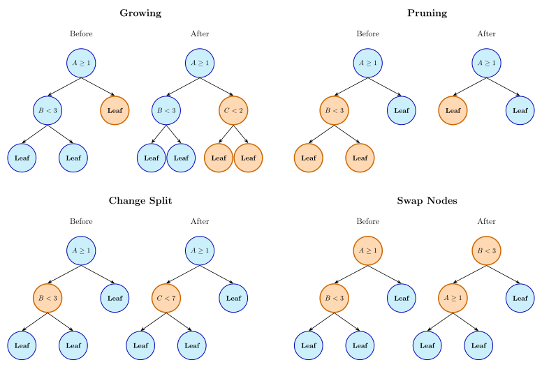

---
knitr:
  opts_chunk:
    cache.path: "../_cache/cls-trees/"
---

# Classification using Trees and Rules {#sec-cls-trees}

```{r}
#| label: cls-trees-setup
#| include: false

source("../R/_common.R")
source("../R/_themes.R")
source("../R/_themes_ggplot.R")
source("../R/_themes_gt.R")

# ------------------------------------------------------------------------------
# Required packages

library(tidymodels)
library(mirai)
library(spatialsample)
library(future)
library(rpart)
library(partykit)
library(patchwork)
library(rpart.plot)
library(gt)
library(gtExtras)
library(lorax)
library(bonsai)
library(probably)
library(forcats)
library(tidyposterior)
library(rules)
library(paletteer)

# ------------------------------------------------------------------------------
# set options

tidymodels_prefer()
set_options()
daemons(parallel::detectCores())
theme_set(thm_lt)

source("../R/compare_models.R")

# ------------------------------------------------------------------------------
# load data

load("../RData/forested_data.RData")

# fmt: skip
forest_rows <- 
  c(653L, 2071L, 3719L, 3687L, 4175L, 2978L, 747L, 3709L, 3693L, 
    3086L, 652L, 200L)

counties <- c("stevens", "yakima", "okanogan")

small_forest <-
  forested_train |>
  slice(forest_rows) |>
  mutate(county = factor(as.character(county), levels = counties))

r3 <- function(x) unname(round(x, 3))

pr_1 <- mean(small_forest$class == "Yes")
pr_2 <- mean(small_forest$class == "No")

pr_1_s <- mean(small_forest$class == "Yes" & small_forest$county == "stevens")
pr_2_s <- mean(small_forest$class == "No"  & small_forest$county == "stevens")

pr_1_y <- mean(small_forest$class == "Yes" & small_forest$county == "yakima")
pr_2_y <- mean(small_forest$class == "No"  & small_forest$county == "yakima")

pr_1_o <- mean(small_forest$class == "Yes" & small_forest$county == "okanogan")
pr_2_o <- mean(small_forest$class == "No"  & small_forest$county == "okanogan")

vm_vals <- sort(unique(small_forest$vapor_max))
vm_split <- 1250
vm_split_var <- small_forest$vapor_max <=  vm_split

vm_split_denom <- table(vm_split_var)
vm_split_left <- table(small_forest$class[vm_split_var])
vm_split_right <- table(small_forest$class[!vm_split_var])

pr_1_L <- vm_split_left["Yes"] / vm_split_denom["TRUE"]
pr_2_L <- vm_split_left["No"] / vm_split_denom["TRUE"]
pr_1_R <- vm_split_right["Yes"] / vm_split_denom["FALSE"]
pr_2_R <- vm_split_right["No"] / vm_split_denom["FALSE"]
n_L <- vm_split_denom["TRUE"]
n_R <- vm_split_denom["TRUE"]
n_tot <- nrow(small_forest)
gini_tot <- ((n_L / n_tot) * pr_1_L * pr_2_L) + ((n_R / n_tot) * pr_1_R * pr_2_R)
ce_tot <- ((n_L / n_tot) * -1 * (pr_1_L * log2(pr_1_L) + pr_2_L * log2(pr_2_L))) + 
  ((n_R / n_tot) * -1 * (pr_1_R * log2(pr_1_R) + pr_2_R * log2(pr_2_R)))
ce_par <- -(pr_1 * log2(pr_1) + pr_2 * log2(pr_2))

# ------------------------------------------------------------------------------
# Load pre-split grids

load("../RData/forested_split_examples.RData")
split_best <- 
  forested_split_examples |> 
  slice_max(value, by = metric) |> 
  mutate(split = format(split_value, digits = 3, big.mark = ","))

# ------------------------------------------------------------------------------

cls_mtr <- metric_set(brier_class, roc_auc, pr_auc, mn_log_loss)
```

TODO: 

 - review for CIT
 - fig-split-county issue

Classification trees are a powerful and interpretable approach for classification problems.  Their structure consists of nested if-then statements that partition the predictor space into regions, each of which is associated with a specific class. We've already seen them in a few different places:  @fig-reg-tree visualized a regression tree for the food delivery data, while @fig-hotels-agent-missing shows a classification tree to understand missingness. 

As a refresher, decision trees are a hierarchical set of splits of predictors that produce two or more nodes^[Some models, such as C4.5, can produce more than two groups, and these will be discussed on a case-by-case basis.]. The split conditions (or rules) are logical statements based on the predictor values. We've seen rules such as `hour < 14.769` and `day in {Fri, Sat}`. As decision trees are trained, the child nodes produced by each split are split further until a predefined stopping rule is triggered. At the end of the tree are the _terminal nodes_, and the training data that fall into these nodes are used to estimate the model predictions. The terminal nodes are defined by a complete set of mutually exclusive rules that contain all of the split conditions from each stage of splitting.  

The two seminal works in this area are @breiman1984classification and @quinlan1993c4. Additionally, @loh2014fifty provides a more recent and comprehensive review. 

To describe the myriad aspects of tree-based models, we'll start from the smallest computations first, the tools to choose a split point for the logical statement inside the rule. After this, we'll describe how missing values can be handled algorithmically during split selection, tree growth, and pruning, along with other relevant details. After these discussions, specific single-tree-based models are described, such as CART, C4.5, and others. Finally, the chapter concludes with discussions of tree stability and the creation of rule-based models.

As with previous chapters, we'll use the forestation data to illustrate how these methods work. 

## Creating Splits {#sec-cls-tree-split}

Splitting or recursively partitioning the data is the foundation of classification tree construction. The effectiveness of a classification tree largely depends on how well the method partitions the predictor space into regions that separate the classes.

In this section, we'll discuss the tactics of splitting qualitative and quantitative predictors using various methods. Our goal is to understand and elucidate the possible objective functions that could be optimized when evaluating a specific predictor. Recall that because splitting occurs recursively, we can explain the process independent of any splitting level. 

To more easily conceptualize splitting methods, we'll use the small training data subset shown in @tbl-small-forest. From these data ($n = `r nrow(small_forest)`$), the raw probabilities for each class are $\widehat{p}_1 = `r r3(pr_1)`$ (forested) and $\widehat{p}_2 = `r r3(pr_2)`$ (unforested). 

```{r}
#| label: tbl-small-forest
#| tbl-cap: "A small sample of the forestation data that will be used to illustrate splitting methods."
#| echo: false

small_forest |> 
  select(class, county, vapor_max) |> 
  arrange(class, county) |> 
  gt() |> 
  fmt_number(vapor_max, decimals = 0) |> 
  cols_label(
    vapor_max = "Maximum Vapor",
    class = "Forested?",
    county = "County"
  )
```

Let's assume that the splits in our trees are _binary_; they produce two partitions of the data. This can be via thresholding a continuous predictor or by assigning levels of categorical predictors to two groups (e.g., `{stevens, yakima}` vs `{okanogan}`). In either case, a proposed split can be represented by a 2 $\times$ 2 table as seen in @tbl-split-2-x-2.  

::: {.columns}
::::: {.column width="20%"}
:::::

::::: {.column width="60%"}
::::::: {#tbl-split-2-x-2}
```{r}
#| label: split-2-x-2
#| echo: false
#| classes: plain
split_df <- tibble(
  row_label = c("Left", "Right", ""),
  class_1 = c("$n_{11}$", "$n_{21}$", "$n_{+1}$"),
  class_2 = c("$n_{12}$", "$n_{22}$", "$n_{+2}$"),
  total = c("$n_{1+}$", "$n_{2+}$", "$n$")
)

# Create the gt table
split_df |>
  gt() |>
  cols_label(
    row_label = "",
    class_1 = "Class 1",
    class_2 = "Class 2",
    total = ""
  ) |>
  cols_align(align = "right", columns = row_label) |>
  cols_align(align = "center", columns = c(class_1, class_2)) |>
  cols_align(align = "right", columns = total) |>
  fmt_markdown(columns = everything()) |>
  # Box around the four interior cells with internal dividers
  tab_style(
    style = cell_borders(
      sides = c("top", "left", "bottom", "right"),
      weight = px(1),
      color = "black"
    ),
    locations = cells_body(columns = class_1, rows = 1)
  ) |>
  tab_style(
    style = cell_borders(
      sides = c("top", "bottom", "right"),
      weight = px(1),
      color = "black"
    ),
    locations = cells_body(columns = class_2, rows = 1)
  ) |>
  tab_style(
    style = cell_borders(
      sides = c("top", "left", "bottom", "right"),
      weight = px(1),
      color = "black"
    ),
    locations = cells_body(columns = class_1, rows = 2)
  ) |>
  tab_style(
    style = cell_borders(
      sides = c("top", "bottom", "right"),
      weight = px(1),
      color = "black"
    ),
    locations = cells_body(columns = class_2, rows = 2)
  ) |>
  # Remove all default lines
  tab_options(
    table.border.top.style = "none",
    table.border.bottom.style = "none",
    table.border.left.style = "none",
    table.border.right.style = "none",
    table_body.hlines.style = "none",
    table_body.vlines.style = "none",
    table_body.border.top.style = "none",
    table_body.border.bottom.style = "none",
    column_labels.border.top.style = "none",
    column_labels.border.bottom.style = "none"
  ) |> 
  opt_row_striping(row_striping = FALSE)
```

Example notation for a binary split of an outcome with $C=2$ class levels. 

:::::::

:::::

::::: {.column width="20%"}
:::::

:::

In this case, $n$ is the number of training set points available at the time, and the plus signs indicate the marginal totals; for example, $n_{+1} = n_{11} + n_{21}$. This table is shown for thresholding numeric predictors, but is also valid for categorical splits. When thresholding, we associate the "left split " with smaller predictor values (i.e., $X\le c$) and the "right split" with larger predictor values. 

Using this table, we can compute various statistics to assess the quality of the split. Many of these statistics seek to maximize the class _purity_ of the resulting partitions. For example, the perfect split for our example data occurs when each partition contains only a single class. 

The next section will describe general statistics that can be produced from this 2 $\times$ 2 table, all of which generalize to $C\ge 3$ classes. 

### General Splitting Criteria {#sec-tree-splitting}

The choice of splitting criterion is a critical decision in tree construction, because this determines how the algorithm evaluates potential splits.  Several metrics exist to evaluate the quality of potential splits, each with its own theoretical foundation and practical implications.

The Gini index [@breiman1984classification] is one of the most widely used splitting criteria in classification trees. For a two-class problem, the Gini index is defined as:

$$
\text{Gini} = p_1(1-p_1) + p_2(1-p_2) = 2p_1p_2
$$

where $p_1$ and $p_2$ are the class probabilities in the node.  The Gini index can be interpreted as a measure of node impurity. It reaches its minimum value of zero when a node contains only one class (perfect purity) and its maximum value of 0.5 when classes are evenly distributed (maximum impurity).  

When evaluating a potential split, the algorithm calculates the weighted average of the Gini indices for the resulting child nodes, with weights proportional to the number of samples in each node. The split that minimizes this weighted average is selected.

For the data in @tbl-small-forest, the Gini index for this node would be $2 \times `r round(pr_1, 3)` \times `r round(pr_2, 3)` = `r round(pr_1 * pr_2, 3)`$. We call the node, prior to being split, the _parent node_. 

Now, suppose a split value for maximum vapor of `r vm_split` creates two child nodes: 

::: {.columns}
::::: {.column width="20%"}
:::::

::::: {.column width="60%"}
```{r}
#| label: split-vapor
#| echo: false
#| classes: plain
make_split_df <- function(left, lbs) {
  rule <- rlang::enexpr(left)
  small_forest$left <- rlang::eval_tidy(rule, small_forest)
  xtab <-
    small_forest |>
    count(left, class) |>
    pivot_wider(id_cols = c(left), names_from = class, values_from = n)
  class_marginal <-
    small_forest |>
    count(class) |>
    pivot_wider(names_from = class, values_from = n) |>
    mutate(left = NA)
  res <-
    bind_rows(xtab, class_marginal) |>
    rowwise() |>
    mutate(total = sum(c_across(-left))) |>
    arrange(desc(left))
  res$left <- lbs
  res
}
make_split_df(
  vapor_max <= vm_split,
  c("Max. Vapor $\\le$ 1250", "Max. Vapor $>$ 1250", "")
) |>
  gt() |>
  cols_label(
    left = "",
    total = ""
  ) |>
  cols_align(align = "right", columns = left) |>
  cols_align(align = "center", columns = c(-left)) |>
  cols_align(align = "right", columns = total) |>
  cols_width(
    Yes ~ px(50),
    No ~ px(50)
  ) |> 
  fmt_markdown(columns = everything()) |>
  # Box around the four interior cells with internal dividers
  tab_style(
    style = cell_borders(
      sides = c("top", "left", "bottom", "right"),
      weight = px(1),
      color = "black"
    ),
    locations = cells_body(columns = Yes, rows = 1)
  ) |>
  tab_style(
    style = cell_borders(
      sides = c("top", "bottom", "right"),
      weight = px(1),
      color = "black"
    ),
    locations = cells_body(columns = No, rows = 1)
  ) |>
  tab_style(
    style = cell_borders(
      sides = c("top", "left", "bottom", "right"),
      weight = px(1),
      color = "black"
    ),
    locations = cells_body(columns = Yes, rows = 2)
  ) |>
  tab_style(
    style = cell_borders(
      sides = c("top", "bottom", "right"),
      weight = px(1),
      color = "black"
    ),
    locations = cells_body(columns = No, rows = 2)
  ) |>
  tab_spanner(label = "Truly Forested?", columns = c(Yes, No)) |>  
  # Remove all default lines
  tab_options(
    table.border.top.style = "none",
    table.border.bottom.style = "none",
    table.border.left.style = "none",
    table.border.right.style = "none",
    table_body.hlines.style = "none",
    table_body.vlines.style = "none",
    table_body.border.top.style = "none",
    table_body.border.bottom.style = "none",
    column_labels.border.top.style = "none",
    column_labels.border.bottom.style = "none"
  ) |>
  opt_row_striping(row_striping = FALSE)
```

:::::

::::: {.column width="20%"}
:::::

:::

Using these counts, we can compute the Gini statistic for each rule and then their weighted average:

$$
\begin{align}
\text{Left} &= 2 \times \frac{`r vm_split_left["Yes"]`}{`r vm_split_denom["TRUE"]`} \times \frac{`r vm_split_left["No"]`}{`r vm_split_denom["TRUE"]`} = `r r3(pr_1_L * pr_2_L)` \notag \\
\text{Right} &= 2 \times \frac{`r vm_split_right["Yes"]`}{`r vm_split_denom["FALSE"]`} \times \frac{`r vm_split_right["No"]`}{`r vm_split_denom["FALSE"]`} = `r r3(pr_1_R * pr_2_R)` \notag \\
\text{Total} &= \frac{`r n_L`}{`r n_tot`} `r r3(pr_1_L * pr_2_L)` + \frac{`r n_R`}{`r n_tot`} `r r3(pr_1_R * pr_2_R)` = `r r3(gini_tot)` \notag
\end{align}
$$

The Gini value for this split is lower than the parent node's, indicating a reduction in impurity. We often frame the importance of a split in terms of its _gain_ relative to the parent node. Following the notation from @sec-gradient-opt, our objective function is denoted as $\psi$, and the gain is computed as:

$$
\psi_{gain} = 
\begin{cases}
\psi_L + \psi_R - \psi_P & \text{if maximize } \psi \notag \\
\psi_P - \psi_L - \psi_R & \text{if minimize } \psi
\end{cases}
$$

where _L_, _R_, and _P_ represent the statistics from the left split, the right split, and the parent (i.e., prior to splitting). For the Gini statistic, the gain is `r round(pr_1 * pr_2, 3)` - `r r3(gini_tot)` = `r round(pr_1 * pr_2 - gini_tot, 3)`. During training, we can also impose a condition that a split can only be made if the expected gain exceeds a minimum threshold and/or if there are at least $n_{min}$ data points in the leaf. One or both of these can be treated as tuning parameters to discourage excessively deep trees, which may overfit.

When there are $C > 2$ classes, the more general form of the statistic is: 

$$
Gini = \sum _{k=1}^{C}\left(p_{k}\sum _{k'\neq k}^Cp_{k'}\right)
$$

Another common splitting criterion based on information theory is the cross-entropy statistic from @eq-cross-entropy, otherwise known as the information statistic, which also measures the reduction in uncertainty achieved by a split. In our current context, the statistic is: 

$$
CE = -\sum_{k = 1}^C p_k \log_2p_k
$$

The information content is measured in bits and can be interpreted as the average number of bits needed to encode the class of a randomly selected sample from the node. A node with perfect purity (all samples belonging to the same class) has an information value of zero, while a node with maximum impurity (equal distribution of classes) has the highest information value. Splits with larger information gains are preferred as they create more homogeneous nodes.

Using the same example as before, the information content of the parent node would be:

$$
CE = - \left[`r r3(pr_1)`\; \log_2\left(`r r3(pr_1)`\right) + `r r3(pr_2)`\; \log_2\left(`r r3(pr_2)`\right)\right] = `r r3(ce_par)`\; \text{bits}
$$

Breaking out the calculations for each side and weighting them shows that there is a non-zero gain for this split:

$$
\begin{align}
\text{Left} &= -\left[ \frac{`r vm_split_left["Yes"]`}{`r vm_split_denom["TRUE"]`}\; \log_2\left(\frac{`r vm_split_left["Yes"]`}{`r vm_split_denom["TRUE"]`}\right) +  \frac{`r vm_split_left["No"]`}{`r vm_split_denom["TRUE"]`}\; \log_2\left(\frac{`r vm_split_left["No"]`}{`r vm_split_denom["TRUE"]`}\right)\right]  = `r r3(-(pr_1_L * log2(pr_1_L) + pr_2_L * log2(pr_2_L)))` \notag \\
\text{Right} &= -\left[ \frac{`r vm_split_right["Yes"]`}{`r vm_split_denom["FALSE"]`}\; \log_2\left(\frac{`r vm_split_right["Yes"]`}{`r vm_split_denom["FALSE"]`}\right) +  \frac{`r vm_split_right["No"]`}{`r vm_split_denom["FALSE"]`}\; \log_2\left(\frac{`r vm_split_right["No"]`}{`r vm_split_denom["FALSE"]`}\right)\right]  = `r r3(-(pr_1_R * log2(pr_1_R) + pr_2_R * log2(pr_2_R)))` \notag \\
\text{Total} &= \frac{`r n_L`}{`r n_tot`} `r r3(-(pr_1_L * log2(pr_1_L) + pr_2_L * log2(pr_2_L)))` + \frac{`r n_R`}{`r n_tot`} `r r3(-(pr_1_R * log2(pr_1_R) + pr_2_R * log2(pr_2_R)))` = `r r3(ce_tot)` \; \text{bits}\notag \\
\text{Gain} &= `r r3(ce_par)` - `r r3(ce_tot)` = `r r3(ce_par - ce_tot)`\; \text{bits} \notag
\end{align}
$$

A limitation of information gain is its bias toward predictors with many possible values, particularly categorical predictors with numerous categories. To address this issue, @quinlan1986induction introduced the gain ratio in the C4.5 algorithm^[Quinlan's original classification tree model is called C4.5, while C5.0 is the latest version. The models are very similar, and until @sec-cls-c50 we will refer to the model as C4.5 (and then C5.0 from that point onward).]. The gain ratio is calculated by dividing the information gain by the intrinsic information of the split, which measures the potential information generated by dividing the samples according to the predictor:

$$
\text{gain ratio(split)} = \frac{\text{gain(split)}}{\text{intrinsic information(split)}}
$$  {#eq-gain-ratio}

The intrinsic information is calculated as:

$$
\text{intrinsic information(split)} = -\sum_{i=1}^{n} \frac{|S_i|}{|S|} \log_2 \frac{|S_i|}{|S|}
$$

Where $|S|$ is the number of samples in the parent node, $|S_i|$ is the number of samples in the $i$-th child node, and $n$ is the number of child nodes. The gain ratio penalizes splits that create many small partitions, thus addressing the bias of information gain toward predictors with many values.

Instead of purity, we can also measure the association between the class values and the class predictions produced by a candidate split. The most well-known is the $\chi^2$ statistic [@Agresti2002vi;@mchugh2013chi]. This is produced by summing a set of residuals that compare the observed counts in each cell to their expected values _if there were no association_. The expected values are produced by the marginals in each dimension: $e_{ij} = n\, p_{i+}\, p_{+j}$. This represents the number of training set points we would, on average, expect to fall into row $i$ and column $j$ if the split were completely uninformative. The statistic is: 

$$
\chi^2=\sum _{j=1}^{C}\sum _{k=1}^{C}{\frac {{\left(n_{jk}-e_{jk}\right)}^{2}}{e_{jk}}}
$$

or, for 2 $\times$ 2 tables^[This statistic can also be applied to tables of any dimensionality where the number of rows and columns is greater than 2.]: 

$$
\chi^2 = \frac{n\,(n_{11}\, n_{22} - n_{12}\, n_{21})^2}{n_{1+} \, n_{2+} \, n_{+1} \, n_{+2}}
$$ {#eq-chi2}

Since this statistic measures the difference between our model and an uninformative state, we want to maximize its value. This $\chi^2$ statistic is often used in _conditional inference trees_ [@hothorn2006unbiased]. In @sec-cls-cit, we'll describe the strategic advantages of minimizing the associated p-value of this value rather than maximizing the statistic itself. 

As we'll see in the next chapter, modern boosting models often use splitting criteria based on the log-likelihood. The rationales for the methods discussed in this chapter are described @sec-cls-modern-boost. Also, for simplicity, we'll assume that the outcome has $C = 2$ classes. We'll focus on the three most popular models: XGBoost [@xgb16], LightGBM [@lgb17], and CatBoost [@cat18].

These tools often minimize the sum of the Pearson residuals (previously seen in @sec-logistic-diagnostic):

$$
\psi = \sum_{i=1}^n\sum_{k=1}^{2}\frac{(y_{ik} - \widehat{p}_{ik})^2}{\widehat{p}_{i1} \widehat{p}_{i2}}
$$ {#eq-xgboost-objective}

It is common to add a small numeric constant to the denominator to avoid division by zero. 

The XGBoost model adds a few modifications to this statistic that are inspired by standard regularization methods^[We say "inspired" because regularization is a property that arises from an optimization problem. For XGBoost and LightGBM, these modifications are not derived in that way; they just emulate what previously published tools have done.]. Recall that L<sub>1</sub> penalization can shrink model coefficients directly to absolute zero (@sec-logistic-penalized). For XGBoost,  an analogous operation is applied to the raw residuals $e_{ik} = y_{ik} - \widehat{p}_{ik}$ so that only "large" values contribute to the splitting criteria. That function is:

$$
\tilde{e}_{ik} = \text{sign}(e_{ik})\, \max\left( 0, \,|e_{ik}| - \lambda_1\right) =
\begin{cases} 
  e_{ik} - \lambda_1 & \text{if } e_{ik} > \phantom{-}\lambda_1 \\ 
  e_{ik} + \lambda_1 & \text{if } e_{ik} < -\lambda_1 \\
  0 & \text{otherwise} 
\end{cases}
$$ {#eq-xgboost-l1}

For example, if a data point from the first class is mis-predicted using $\lambda_1 = 0.01$, it will disregard any data points with $\widehat{p}_{i1} < 0.01$ and will shrink the other residuals towards zero by subtracting 0.01 from their absolute value. 

Additionally, it can emulate weight decay by adding an L<sub>2</sub> regularization term $\lambda_2$ that affects the denominator of the statistic:

$$
\psi_{xgb}(\lambda_1, \lambda_2) = \sum_{i=1}^n\sum_{k=1}^{2}\frac{\tilde{e}_{ik}^2}{\widehat{p}_{i1} \widehat{p}_{i2} + \lambda_2}
$$ {#eq-xgboost-l2}

Unlike $\lambda_1$, this penalizes the sum of the current data at the node, which can range from 0 to $n/2$. All things being equal, this will penalize nodes with more data more than it does for nodes with fewer data points.  However, very uncertain predictions (values near $\widehat{p}_{ij} = 0.5$) will affect this sum more than others. Both regularization methods can be used simultaneously and treated as tuning parameters. 

As with previous statistics, this splitting statistic is computed for both sides of the split to measure the gain. LightGBM takes the same approach.

CatBoost uses essentially the same statistics with some slight alterations. First, no L<sub>1</sub> regularization is applied. Second, the L<sub>2</sub> penalty value is scaled to be: 

$$
\lambda_2^* = \frac{\lambda_2}{n}\sum_{i=1}^n \widehat{p}_{i1} \widehat{p}_{i2}
$$

This mechanism is probably intended to ensure that the regularization effect is similar as the tree becomes more and more certain about its predictions. For example, in initial iterations when there are few trees, the uncertainty in the predictions may be high, such that the variances $\widehat{p}_{i1} \widehat{p}_{i2}$ are larger than they will be in later boosting iterations. For example, suppose that, in the first tree created, the variance averages around $0.20$ for the $n$ data points in the node. If the tree improves over iterations, let's suppose they become more certain, and the average variance reduces to about $0.05$. Without scaling, the effect of $\lambda_2$  is largest at early iterations (which very well may be appropriate). When the penalty is scaled, its influence is normalized to be roughly the same across iterations and/or across prediction quality.  

Third, when computing the final splitting statistic, CatBoost does not subtract the parent value (i.e., $\psi_P$).

### Quantitative Predictors {#sec-tree-splits-quantitative}

```{r}
#| label: summy0split-info
#| include: false
# Example to illustrate partitioning of a categorical variable
# Force tree to have a max depth of 2 for illustration
adjacent_split_model <-
  rpart(
    class ~ .,
    control = rpart.control(
      maxdepth = 2,
      cp = -1,
      xval = 0
    ),
    data = forested_train
  )
first_surr <- rownames(data.frame(adjacent_split_model$splits)[2,])
first_surr <- name_key$text[name_key$variable == first_surr]

# Added this back in since we use binary_split_model below
# Create binary split variables for each county
binary_rec <-
  recipe(class ~ ., data = forested_train) %>%
  step_dummy(all_nominal_predictors(), one_hot = FALSE)

prep_binary_rec <-
  prep(binary_rec, training = forested_train)

forested_train_encoded <-
  bake(prep_binary_rec, new_data = NULL)

binary_split_model <-
  rpart(class ~ ., data = forested_train_encoded)

binary_split_model <-
  rpart(
    class ~ .,
    control = rpart.control(
      minbucket = 3,
      minsplit = 10,
      cp = 0.004,
      xval = 10
    ),
    data = forested_train_encoded
  )

max_depth_binary_split_model <-
  max(rpart:::tree.depth(as.integer(row.names(binary_split_model$frame))))

first_surr <- rownames(data.frame(adjacent_split_model$splits)[2, ])
first_surr <- name_key$text[name_key$variable == first_surr]
```

For continuous predictors, the conventional process of finding the optimal split point involves evaluating all possible binary partitions of the data based on the predictor values. The algorithm first orders the samples by predictor values, then evaluates splits between adjacent unique values. For each potential split point, it computes the chosen split criterion and selects the split that optimizes it.

The computational complexity of this process is generally $O(n \log n)$ for each predictor, where $n$ is the number of samples, due to sorting. Once the samples are sorted, evaluating each potential split point can be efficient, as class distributions can be updated incrementally as you move through the sorted list.

For large datasets with many unique predictor values, some implementations use approximations to reduce computational cost [@ke2017lightgbm;@ranka1998clouds]. For example, the implementations might consider only a subset of potential split points or use binning techniques to group similar predictor values. All three previously discussed boosting methods employ one or both of these strategies. 

@fig-tree-splits illustrates the metrics described in the previous section for the maximum vapor predictor from the entire forested training set. To facilitate comparisons, the statistics' values have been normalized to a common scale. The "rug" on the x-axis should indicate which data points were considered split candidates. 

Many of these criteria show similar patterns and recommend splits in the same region (if not the same value), except for the Gini statistic. It suggests a larger split value of `r split_best$split[split_best$metric == "Gini Index"]` although any split point larger than 1,400 produces nearly the same result. 

::: {#fig-tree-splits}
::::: {.figure-content}
```{shinylive-r}
#| label: shiny-tree-splits
#| viewerHeight: 550
#| standalone: true

library(shiny)
library(bslib)
library(dplyr)
library(ggplot2)
library(scales)

source("https://raw.githubusercontent.com/aml4td/website/main/R/shiny-setup.R")
# source("https://raw.githubusercontent.com/aml4td/website/main/R/shiny-penalty.R")

ui <- page_fillable(
  theme = bs_theme(bg = "#fcfefe", fg = "#595959"),
  padding = "1rem",
  layout_columns(
    fill = TRUE,
    column(
      width = 10,
      radioButtons(
        inputId = "method",
        label = "Method",
        choices = c(
          "Gini Gain",
          "Information Gain",
          "Information Gain Ratio",
          "Chi-Square",
          "XGBoost",
          "LightGBM",
          "CatBoost"
        ),
        inline = TRUE
      )
    )
  ),

  as_fill_carrier(plotOutput("scores"))
)

server <- function(input, output) {
  load(url(
    "https://raw.githubusercontent.com/aml4td/website/main/RData/forested_split_examples.RData"
  ))

  output$scores <-
    renderPlot(
      {
        chosen <-
          forested_split_examples %>%
          dplyr::filter(metric == input$method)

        if (input$method == "Gini Index") {
          best <-
            chosen |>
            slice_min(value)
        } else {
          best <-
            chosen |>
            slice_max(value)
        }

        others <-
          forested_split_examples %>%
          dplyr::filter(metric != input$method)

        p <-
          others %>%
          ggplot(aes(split_value)) +
          geom_line(
            aes(y = unit_value, group = metric, colour = metric),
            alpha = 0.3,
            show.legend = FALSE
          ) +
          geom_line(data = chosen, aes(y = unit_value), col = "black", linewidth = 0.75, alpha = 0.6) +
          geom_rug(
            data = chosen,
            aes(x = split_value),
            col = "black",
            alpha = 0.1,
            length = unit(0.02, "npc")
          ) +
          geom_vline(xintercept = best$split_value, col = "black", lty = 2) +
          labs(x = "Maximum Vapor", y = "Normalized Statistic") +
          theme_light_bl()

        print(p)
      },
      res = 100
    )
}

app <- shinyApp(ui = ui, server = server)

app
```

:::::

Different splitting criteria for the maximum vapor predictor data from the entire training set. The criteria values have been scaled to have the same range.

:::

The split curves and optimal values were the same for information gain, the $\chi^2$ statistic, and the three boosting methods. Note that, for the latter, the split-point candidates were not the same. Each boosting method used a binning strategy with 1,273 possible breaks. For 2 $\times$ 2 tables, the $\chi^2$ and information-based statistics are directly proportional to one another and differ by a constant. Their split values ranged from `r split_best$split[split_best$metric == "CatBoost"]` to `r split_best$split[split_best$metric == "Information Gain"]`, mostly due to small numerical differences. The curve for the information gain statistic was slightly shifted to the right, but it also produces an optimal split in this region. 

### Qualitative Predictors {#sec-tree-splits-qualitative}

Handling categorical predictors in classification trees presents unique challenges compared to continuous predictors. There are two main approaches to incorporating categorical predictors in tree models.  The first approach allows the algorithm to bin the levels of a predictor into two categories, while the second approach creates new dummy variables for each category (@sec-indicators). [Section 5.7](https://feat.engineering/05-Encoding_Categorical_Predictors.html#sec-categorical-trees) of @fes contains a broad discussion of these two strategies. 

When using the binning approach, the algorithm must determine how to optimally partition the categories into two groups.   For a predictor with $k$ categories, there are $2^{k-1} - 1$ possible ways to create a binary split. Evaluating all these possibilities becomes computationally infeasible for predictors with many categories. Therefore, algorithms often use heuristics to find good splits without exhaustive search. For example, in the Classification and Regression Trees (CART) methodology [@breiman1984classification], categorical predictors are ordered by the proportion of samples in each class, and then binary splits are evaluated between adjacent categories in this ordering. This approach, very similar to an effect-encoding strategy and to the process described by @fisher1958grouping, reduces computational complexity while still allowing the algorithm to find effective splits.

To illustrate the binning approach, consider the partitioning model illustrated in @fig-split-adjacent-tree.  The figure illustrates a tree of a maximum depth of 3 splits.  The first split uses the Gini index criterion to split the maximum vapor predictor at 1,248.  Samples with values greater than or equal to 1,248 are illustrated on the right side of the tree.  The next split on this side of the tree is the county variable.  The adjacent category methodology creates a split with 7 counties in one group and the remaining counties in the other group.  @fig-split-county demonstrates why the counties were partitioned into these groups.  The x-axis in (a) and (b) of this figure provides the counties ordered from the lowest proportion of forested counties (left) to the highest proportion (right).  The top portion of the figure provides the Gini index for the partitioning of the samples at that county and all counties to the left.  The purity is optimized between the counties of Asotin and Okanogan.  At this split point, 7 counties are placed into one group, and 13 counties are in the other group, as illustrated in @fig-split-adjacent-tree.

TODO: what is @fig-split-county referring to?

The second approach creates $k$ binary dummy variables, one for each category (or $k-1$ dummy variables to avoid redundancy). Each dummy variable is then treated as a separate predictor in the tree-building process. This approach, referred to as using independent categories, forces binary splits for the categories and effectively implements a one-versus-all splitting strategy.

The choice between these approaches can impact model complexity and interpretability.  The grouped categories approach can capture more complex relationships between categories and the response variable.  Because the algorithm groups categories that have similar effects on the response, this often leads to more accurate and interpretable models. The independent categories approach, on the other hand, may not select any categories, resulting in simpler, less accurate models.

```{r}
#| label: fig-split-adjacent-tree
#| echo: false
#| warning: false
#| out-width: 90%
#| fig-width: 14
#| fig-height: 6
#| fig-cap: Recursive partitioning tree when using the county variable in its adjacent category form.  The labels for the split points for the county variable have been simplified to summarize the number of counties included at each split. 
county_split_fun <- function(x, labs, digits, varlen, faclen) {
  #sub(" ", "\n", labs)
  # Get the frame to check variable names
  frame <- adjacent_split_model$frame
  split_vars <- as.character(frame$var)

  new_labs <- character(length(labs))

  for (i in 1:length(labs)) {
    lab <- labs[i]

    # Check if label is long and contains commas (categorical split)
    if (nchar(lab) > 15 && grepl(",", lab)) {
      # Count the number of categories
      categories <- trimws(strsplit(lab, ",")[[1]])
      n_cats <- length(categories)
      new_labs[i] <- paste0(n_cats, " counties")
    } else {
      new_labs[i] <- sub(" ", "\n", lab)
    }
  }

  return(new_labs)
}

# Create the plot
rpart.plot(
  adjacent_split_model,
  type = 4,
  extra = 101,
  box.palette = "GnBn",
  split.fun = county_split_fun,
  cex = 0.75,
  tweak = 1.6,
  clip.right.labs = FALSE,
  under = TRUE
)
```

```{r}
#| label: fig-split-binary-tree
#| echo: false
#| warning: false
#| out-width: 90%
#| fig-width: 14
#| fig-height: 14
#| fig-cap: Recursive partitioning tree when transforming the county variable into many dummy, binary variables.
# Create the plot
rpart.plot(
  binary_split_model,
  type = 4,
  extra = 101,
  box.palette = "GnBn",
  split.fun = function(x, labs, digits, varlen, faclen) {
    sub(" ", "\n", labs)
  },
  cex = 0.75,
  tweak = 1.6,
  clip.right.labs = FALSE,
  under = TRUE
)
```

However, the grouped categories approach can sometimes capture more complex relationships between categories and the response variable. It allows the algorithm to group categories that have similar effects on the response, potentially leading to more accurate and interpretable models. The independent categories approach, on the other hand, treats each category in isolation, which may miss important interactions between categories but often yields simpler models.

XGBoost and LightGBM take very similar approaches to split selection for categorical predictors. The predictor categories are ordered using some statistic, similar to the CART discussion earlier^[The specific statistics are discussed momentarily.]. If there are "few" category values, a full set of binary indicators is created and treated in the same way as numeric predictors. This would generate a potential set of one-versus-all splits. If there are numerous categories, a two-pass approach is used to limit the total number of possible splits to consider. The forward pass starts with the lowest-ranked categories and sequentially adds them to the left split grouping (all others go to the right). The backward pass does the opposite, sequentially grouping the highest-ranked categories. 

For example, suppose we have a predictor with 26 categories, ranked _A_ to _Z_. If we were to only consider a maximum of five categories within a split, we would consider partitions: 

::: {.columns}
::::: {.column width="50%"}
- `{A}` versus `{others}`
- `{A, B}` versus `{others}`
- `{A, B, C}` versus `{others}`
- `{A, B, C, D`} versus `{others}`
:::::

::::: {.column width="50%"}
- `{Z}` versus `{others}`
- `{Z, Y}` versus `{others}`
- `{Z, Y, X}` versus `{others}`
- `{Z, Y, X, W}` versus `{others}`
:::::

:::

The final split is the configuration with the best gain statistics for these two methods, as described above. This approach effectively limits the computational costs of splitting categories for a predictor, even when the number of categories is very large. 

For XGBoost, the ranking metric uses a function of standardized residuals that does not include the square in the numerator: 

$$
R_{xgb}(\lambda_1, \lambda_2) = \sum_{i=1}^n\sum_{k=1}^{2}\frac{-\tilde{e}_{ik}}{\widehat{p}_{i1} \widehat{p}_{i2} + \lambda_2}
$$ {#eq-xgboost-cat-rank}

LightGBM is very similar, but uses a modified ranking statistic and does not use L<sub>1</sub> regularization: 

$$
R_{lgb}(\lambda_2, \epsilon) = \sum_{i=1}^n\sum_{k=1}^{2}\frac{-e_{ik}}{\widehat{p}_{i1} \widehat{p}_{i2} + \lambda_2 + \epsilon}
$$ {#eq-lgb-multi-rank}

where $\epsilon$ is a smoothing value that attempts to provide additional regularization for high cardinality splits. The default value is $\epsilon = 10$. 

For categorical predictors, CatBoost uses a target encoding strategy similar to that described in @sec-effect-encodings. Its version of this is called Categorical Target Representation (CTR). They use the same Beta-Binomial estimate for the probability of an event for category $j$: 

$$
\widehat{p}_j = \frac{n_{+j} + \alpha}{n + \alpha + \beta}
$$

$n_{+j}$ is the number of events in in category $j$ within all of the $n$ rows under consideration. CatBoost uses $\beta = 1$ and calls $\alpha$ the "prior" parameter, which can be used for tuning. Once all of the $j$ values of $\widehat{p}_j$ are computed, the split determination treats the predictor as if it were quantitative from the start. CatBoost's algorithm, which uses the CTR values to determine the best predictor (and value) to split on, is fairly complex and is detailed in @sec-cls-modern-boost. 

So far, we've constrained our splits to be binary. C4.5 can create multiway splits for categorical predictors. For example, with categories `A`-`F`, a split might contain three groups such as `{A, B, C}`, `{D}`, and `{E, F}`. To do this, C4.5 uses a greedy, hill-climbing algorithm. When a specific split candidate is evaluated, it is rated using a penalized gain ratio. The gain is the improvement of the information statistic before and after combining categories. The penalty is based on the Minimum Description Length (MDL) principle [@quinlan1987inferring] and uses the logarithm of the number of ways to partition $C$ categories into $k$ groups (a.k.a. a Bell number) divided by the number of data points. 

We start with $k = C$ groups and immediately combine categories with the same frequency distributions (since they yield identical results). If we start with $k$-way splits, the first iteration loops through the $k$ splits and merges one additional category. Again, with categories `A`-`F`, the first round of candidates is

::: {style="text-align: center;"}

```
{A,B}  {C}   {D}   {E}   {F}
{A,C}  {B}   {D}   {E}   {F}
{A,D}  {B}   {C}   {E}   {F}
{A,E}  {B}   {C}   {D}   {F}
{A,F}  {B}   {C}   {D}   {E}
 {A}  {B,C}  {D}   {E}   {F}
 :     :     :     :     :
  {A}   {B}   {C}   {D}  {E,F}
```

:::

If there is no pair that improves the penalized gain, the algorithm stops with the current configuration. Otherwise, the combination with the best gain is used. This process continues until there are no more improvements or if there are two categories. 

For _ordered_ categories, some algorithms restrict splits to maintain the ordering, allowing only those that group adjacent categories.

### Oblique Splits {#sec-oblique-splits}

The tree structure that we have discussed splits on a single predictor at a time. This partitions the predictor space into a collection of (hyper)rectangles. For this reason, these splits are called "rectangular" or "axis-parallel". 

It is possible for trees to create class boundaries that do not result in rectangular partitions, and these occur when more than one predictor is used in a single rule. Some advanced tree algorithms consider splits based on linear combinations of predictors [@murthy1994system;@wickramarachchi2016hhcart]. These _oblique trees_^[Historically called _multivariate trees_ or _linear machines_.] can capture more complex decision boundaries than traditional trees, which are limited to axis-parallel splits. For example, an oblique tree might use a split like "if $2 \times \text{Predictor A} + 3 \times \text{Predictor B} > 5$ then...". While these splits can lead to more accurate models, they often sacrifice interpretability.

```{r}
#| label: oblique-split-calcs

set.seed(283)
logit_dat <- sim_logistic(500, ~ .1 + 5 * A - 5 * B , corr = .7)

x_seq <- seq(-3, 3, length.out = 100)
grid <- crossing(A = x_seq, B = x_seq)

obl_cart_fit <-
  decision_tree(mode = "classification") |>
  fit(class ~ ., data = logit_dat)

obl_cart_pred <- augment(obl_cart_fit, grid) |> dplyr::mutate(split = "Rectanular")
obl_cart_nodes <- sum(obl_cart_fit$fit$frame[, "var"] == "<leaf>")

# ------------------------------------------------------------------------------

set.seed(181)
obl_fit <- 
  rand_forest(min_n = 250, trees = 1) |> 
  set_engine("aorsf") |> 
  set_mode("classification") |> 
  fit(class ~ ., data = logit_dat)

# obl_fit |> 
#   extract_fit_engine() |> 
#   extract_rules() |> 
#   slice(1) |> 
#   pluck("rules") |> 
#   pluck(1) |> 
#   rule_text(digits = 10)

obl_pred <- grid
obl_pred$class <- logit_dat$class[1]
obl_pred$.pred_one <- predict(obl_fit, obl_pred, type = "prob")$.pred_one
obl_pred$split <- "Oblique"
```

To demonstrate, a logistic regression model was simulated with linear predictor $\eta = 0.1 + 5.0\, A - 5.0\, B$ where A and B had a bivariate Gaussian distribution with a correlation coefficient of 0.7. This configuration results in slightly overlapping data clouds, as seen in the left-hand panel of @fig-oblique-splits. While this pattern is trivial for a logistic model to estimate, a tree-based model must go to heroic lengths to emulate a diagonal line. The tree fit shown in the middle panel required `r obl_cart_nodes` terminal nodes to produce the blocky step function that does a mediocre job in separating the data. 

::: {#fig-oblique-splits}
::::: {.figure-content}
```{r}
#| label: oblique-splits
#| echo: false
#| warning: false
#| out-width: 85%
#| fig-width: 7
#| fig-height: 3

orig_dat <-
  grid |>
  dplyr::mutate(split = "Data", .pred_one = runif(nrow(grid), max = .1))

oblique_example <-
  bind_rows(orig_dat, obl_cart_pred, obl_pred) |>
  dplyr::mutate(split = factor(split, levels = c("Data", "Rectanular", "Oblique"))) |>
  select(-class)

oblique_example |>
  ggplot(aes(A, B)) +
  geom_point(data = logit_dat, aes(col = class), alpha = 1 / 2, cex = 3 / 4) +
  geom_contour(
    aes(z = .pred_one),
    breaks = 1 / 2,
    col = "black",
    linewidth = 3/4
  ) +
  coord_fixed() +
  facet_wrap( ~ split) +
  scale_color_manual(values = c("#DF9ED4FF", "#3C4B99FF"))
```

:::::

An example of rectangular and oblique splits. The data were simulated using a linear predictor of $\eta = 0.1 + 5.0\, A - 5.0\, B$ and a logit link.

:::

An oblique tree required a single split to produce the class boundary shown in the right-hand panel. Using a training set of $n_{tr} = 500$ data points in the training set, the diagonal split does a remarkable job approximating the underlying pattern; it's split uses the rule 

$$
- 1.71 \, \left(\frac{A - 0.0652}{0.966}\right) + 1.81\,\left(\frac{B - 0.048}{1.01}\right)  \le 0.0494.
$$   {#eq-oblique-split}

The values inside the parentheses are means and standard deviations used to scale the predictors. When simplified: 

$$
0.020+1.77\, A-1.80 \, B \ge 0
$$

We'll discuss a specific technique for creating oblique trees in @sec-cls-oblique.

## Understanding Bias in Splitting {#sec-tree-bias}

For trees created using greedy optimization, there is the possibility of selection bias -- some predictors are, all other things being equal, more likely to be selected because of the characteristics of their distribution. The primary way this can occur is when some predictors have a higher information content than others. For example, imagine a dense numerical predictor whose values are all unique (i.e., high precision) and range uniformly from 0.0 to 10.0. Say we have $n = 1,000$ training set points. If we make a version of that predictor and round it to the first decimal place, there should be 100 unique values (on average). In a model such as CART, the original predictor is evaluated 10 times more than the truncated version. If they have the same relationship with the outcome, the version with full precision is much more likely to have the best splitting criterion value just by chance. 

Bias in tree-based models has been well-studied. Good places to begin are @quinlan1993c4, @white1994bias, @loh1997split, @dobra2001bias, @hothorn2006unbiased, and @strobl2007bias.

This has a variety of consequences, the foremost of them being that our tree might not favor the truly best predictors. This can be particularly critical if the model's variance importance score is a primary focus of the analysis. Also, if most informative predictors have few unique values (e.g., categorical predictors) and many irrelevant predictors with high precision, the model might overfit to the (wrong) predictors. 

There are a few methods to mitigate this issue. First, the standard splitting criteria can be adjusted to account for predictor precision. For example, Quinlan's gain ratio normalizes the statistic to help compensate for the differences.  A second approach is to decouple the process of choosing the predictor to split on from the process of choosing the best split for that predictor. If each predictor provides a single answer to the question of whether it is the best predictor, we might have less bias in the process. This idea hinges on the assumption that this single value should also be free of bias. Several models greatly reduce the bias by quantifying the association between each predictor and the outcome to determine which is best. One tool that will be described more in @sec-cls-cit uses different statistical tests for significance as the statistic. The most significant predictor is chosen (if one is chosen at all), and then standard split-value determination can be performed. 

## Missing Data Handling {#sec-cls-missing-data}

Classification trees can have built-in mechanisms for handling missing predictor values, which provides a significant advantage over many other modeling techniques. Instead of requiring imputation or discarding samples with missing values, trees can work directly with incomplete data during both training and prediction. 

Missing data is a common issue across datasets and can arise for various reasons, such as measurement errors, non-response, or data integration issues.  Traditional predictive modeling methods often require complete data, forcing the user to either discard incomplete samples or impute missing values. The discussions in @sec-missing-data are directly applicable here. 

Tree models can handle missing values directly, without requiring sample deletion or explicit imputation. This capability stems from the tree's hierarchical structure and the flexibility of the splitting and prediction processes.

### Binning Missing Values {#sec-missing-bins}

For XGBoost and LightGBM, observations with missing predictor values are placed in a separate bin. They differ in how they are treated in the forward and backward passes described in @sec-tree-splits-qualitative.  XGBoost always adds the missing value category to the side of the initial categories used in the scan. For example, for the grouped splits listed above in @sec-tree-splits-qualitative, missing are added to the groups containing _A_ on the forward pass and those containing _Z_ on the backward pass. LightGBM _always_ adds the missing data category to the larger group (shown as `{others}` above in @sec-tree-splits-qualitative). 

### Surrogate Splits {#sec-surrogate-splits}

In the CART methodology, missing values are handled differently during tree construction and prediction. During tree construction, CART uses a "surrogate split" approach. When evaluating a potential split on a predictor with missing values, only the samples with non-missing values for that predictor are used to determine the optimal split point and calculate the improvement in the impurity measure. This ensures that the split is based on actual data rather than imputed values.

Once a split has been selected, CART identifies surrogate splits that can be used when the primary split variable is missing. A surrogate split is an alternative split on a different predictor that mimics the primary split as closely as possible. Specifically, CART looks for splits that send samples to the same child nodes as the primary split would.

For example, the first split in @fig-split-adjacent-tree uses the maximum vapor predictor.  Its first surrogate for this split is `r first_surr`. Although the forestation data set has no missing values, the model would use `r first_surr` at this point in the tree to send the sample directly to a terminal node (provided the sample did not have a missing value for this predictor).

CART ranks surrogate splits by how well they replicate the primary split's behavior on the training data. For each primary split, CART identifies multiple surrogate splits in order of performance, creating a hierarchy of alternatives to use when predictors have missing values.

During prediction, when a sample reaches a node with a split on a predictor for which the sample has a missing value, CART uses the best available surrogate split to determine which child node the sample should go to. If all potential surrogate splits also involve predictors with missing values for that sample, CART sends the sample in the direction of the majority of training samples.

This approach allows the tree to make predictions for samples with missing values without requiring explicit imputation. It also naturally handles patterns of missingness, as the surrogate splits are chosen based on the relationships observed in the training data.

### Fractional Accounting {#sec-missing-propagation}

The C4.5 algorithm takes a different approach to handling missing values, based on probabilistic weighting rather than surrogate splits. During tree construction, C4.5 adjusts the information gain calculations to account for missing values. When evaluating a potential split on a predictor with missing values, C4.5 calculates the information gain using only the samples with non-missing values for that predictor, then scales this gain by the fraction of non-missing data. This adjustment ensures that predictors with many missing values are not unfairly penalized or favored.

C4.5 also modifies how it handles categorical predictors with missing values. When calculating the information value for a categorical predictor (used in the gain ratio calculation), C4.5 treats missing values as a separate category. This increases the number of branches in the split and affects the penalty applied to the information gain.

A distinctive aspect of C4.5's approach is how it handles missing values when determining the class distribution in the resulting splits. Instead of assigning samples with missing values to a specific child node, C4.5 allows them to contribute fractionally to all child nodes. The fractional contribution is based on the distribution of non-missing values among the child nodes.

For example, if 70% of samples with non-missing values go to the left child and 30% go to the right child, a sample with a missing value would contribute 0.7 of a sample to the left child and 0.3 of a sample to the right child. This fractional accounting means that the class frequency distribution in each node may not contain whole numbers, and the number of errors in a terminal node can also be fractional.

During prediction, C4.5 uses a similar fractional approach. When a sample with missing values reaches a node with a split on a predictor for which the sample is missing, the sample is sent down all possible paths, with weights proportional to the distribution of non-missing values in the training data. The final prediction is based on a weighted vote from all relevant terminal nodes.

This approach allows C4.5 to make use of all available information in a sample, even when some predictors have missing values. It also provides a natural way to incorporate uncertainty due to missing values into the prediction process.

### Comparison of Approaches {#sec-tree-missing-comparison}

Both the CART and C4.5 approaches to handling missing data have their strengths and weaknesses. The CART approach with surrogate splits is more deterministic, as each sample follows a single path through the tree. This can make the prediction process easier to interpret and explain. Surrogate splits also explicitly model relationships between predictors, providing additional insights into the data. However, identifying and storing surrogate splits increases the model's computational complexity and memory requirements.

The C4.5 approach with fractional samples is more probabilistic and can better represent the uncertainty introduced by missing values. By allowing samples to contribute to multiple nodes, it leverages all available information in the tree. This approach can be particularly effective when missingness is informative or when there are complex patterns of missingness in the data. However, fractional accounting can make the model more difficult to interpret and the prediction process more complex.

Both approaches have been shown to perform well in practice, and the choice between them often depends on the specific requirements of the application, such as the need for interpretability, the patterns of missingness in the data, and the computational resources available.

### Practical Considerations for Missing Data {#sec-tree-missing-considerations}

While classification trees can handle missing values directly, there are still practical considerations to keep in mind when working with incomplete data.

First, the effectiveness of the missing value handling mechanisms depends on the patterns of missingness in the data. If values are missing completely at random (MCAR), both CART and C4.5 should perform well. If values are missing at random (MAR) or missing not at random (MNAR), performance may depend on whether the tree can capture relationships between missingness and other predictors, or between missingness and the response variable.

Second, even with these sophisticated mechanisms, very high rates of missingness can still be problematic. If a predictor has too many missing values, it may not be selected as a split variable, even if it would be highly informative when available. In such cases, imputation might still be beneficial as a preprocessing step.

Third, the handling of missing values can interact with other aspects of the tree-building process, such as pruning. For example, in C4.5, the fractional accounting for missing values affects the calculation of the pessimistic error rate used for pruning. This interaction should be considered when tuning the model.

## Growing Trees {#sec-cls-tree-grow}

For some shape and size of a tree, the search space of which predictors and splits to use to create all the data partitions is vast. Traditionally, trees are built from the top down using _greedy optimization_. Growing a classification tree involves recursively applying the splitting process described above until a stopping criterion is met. This will be our main focus, but @sec-cls-tree-global will describe an alternative, non-greedy approach to creating trees. 

Most growing processes begin with all the training data in a single root node. The algorithm then searches for the best predictor and split point according to the chosen splitting criterion, as described in the previous section.  Once identified, the split divides the data into two child nodes. This process repeats recursively for each child node until one or more stopping criteria are met.

At each step, the algorithm considers all available predictors and all possible split points for each predictor. This exhaustive search ensures that the selected split is the best possible split according to the chosen criterion. However, it also makes tree growing computationally intensive, especially for large datasets with many predictors.

The recursive nature of tree growing means that each split is conditional on the previous splits. This allows trees to automatically capture interactions between predictors, without the need for explicit interaction terms. For example, in @fig-split-adjacent-tree, the first partition on the left side used the maximum vapor variable.  This split was followed by a split using the roughness variable. This structure implicitly models an interaction between maximum vapor and roughness.

To further illustrate how recursive partitioning across predictors serves as an implicit surrogate for predictor interactions, consider @fig-split-interactions, which displays heatmaps of the predicted probability of forestation for two different pairs of variables from the forestation data set.

The left panel was constructed using a logistic regression model with maximum vapor, roughness, and their two-way interaction as predictors. The predicted probability of forestation is represented by color, with green indicating a high probability of forestation and brown indicating a high probability of non-forestation. The probability surface exhibits notable curvature, with the probability of forestation changing substantially across values of maximum vapor, conditional on the value of roughness. This non-linear relationship between the predictors and the outcome is the hallmark of a statistical interaction: accurate prediction requires knowledge of both predictor values simultaneously, as neither predictor's effect can be understood in isolation.

In contrast, the right panel displays results from a logistic regression model using maximum vapor, northness, and their two-way interaction term as predictors. Here, the probability surface shows no curvature, with the probability of forestation remaining relatively constant across northness values for any given value of maximum vapor. The straight contours indicate that there is no meaningful statistical interaction between these predictors. In this case, the predictors contribute additively to the probability of forestation, and each predictor's effect can be interpreted independently of the other's value.

```{r}
#| label: fig-split-interactions
#| echo: false
#| warning: false
#| out-width: 80%
#| fig-width: 8
#| fig-height: 5
#| fig-cap: Heat maps of predicted probabilities of forestation from two different logistic models with main effects and interactions. (a) A model containing maximum vapor and roughness.  (b) A model with maximum vapor and northness.

vapor_max_roughness_model <-
  glm(
    class ~ vapor_max + roughness + vapor_max:roughness,
    data = forested_train,
    family = binomial()
  )

vapor_range <- seq(
  min(forested_train$vapor_max),
  max(forested_train$vapor_max),
  length.out = 100
)
roughness_range <- seq(
  min(forested_train$roughness),
  max(forested_train$roughness),
  length.out = 100
)
vapor_max_roughness_grid <- expand.grid(
  vapor_max = vapor_range,
  roughness = roughness_range
)

vapor_max_roughness_grid$probability <-
  predict(
    vapor_max_roughness_model,
    newdata = vapor_max_roughness_grid,
    type = "response"
  )

vapor_max_roughness_fig <-
  ggplot(
    vapor_max_roughness_grid,
    aes(x = vapor_max, y = roughness, fill = probability)
  ) +
  geom_tile(show.legend = FALSE) +
  scale_fill_gradient2(
    low = "#d4ad42",
    mid = "white",
    high = "#218239",
    midpoint = 0.5,
    limits = c(0, 1)
  ) +
  labs(title = "(a)", x = "Maximum Vapor", y = "Roughness") +
  theme_bw() +
  theme(plot.title = element_text(hjust = 0, size = 14))

vapor_max_northness_model <-
  glm(
    class ~ vapor_max + northness + vapor_max:northness,
    data = forested_train,
    family = binomial()
  )

vapor_max_range <- seq(
  min(forested_train$vapor_max),
  max(forested_train$vapor_max),
  length.out = 100
)
northness_range <- seq(
  min(forested_train$northness),
  max(forested_train$northness),
  length.out = 100
)
vapor_max_northness_grid <- expand.grid(
  vapor_max = vapor_max_range,
  northness = northness_range
)

vapor_max_northness_grid$probability <-
  predict(
    vapor_max_northness_model,
    newdata = vapor_max_northness_grid,
    type = "response"
  )

vapor_max_northness_fig <-
  ggplot(
    vapor_max_northness_grid,
    aes(x = vapor_max, y = northness, fill = probability)
  ) +
  geom_tile() +
  scale_fill_gradient2(
    low = "#d4ad42",
    mid = "white",
    high = "#218239",
    midpoint = 0.5,
    limits = c(0, 1)
  ) +
  labs(
    title = "(b)",
    x = "Maximum Vapor",
    y = "Northness",
    color = "P(class)"
  ) +
  theme_bw() +
  theme(
    plot.title = element_text(hjust = 0, size = 14),
    legend.position = "bottom"
  )

vapor_max_roughness_fig +
  vapor_max_northness_fig +
  plot_layout(guides = 'collect') &
  theme(legend.position = "bottom")
```

As the tree grows, the nodes become increasingly homogeneous with respect to the response variable. In the extreme case, each terminal node would contain samples from only one class, resulting in perfect classification on the training data. However, such a tree would likely overfit the training data and perform poorly on new, unseen data. Therefore, various stopping criteria are used to prevent excessive tree growth.

When should the algorithm stop recursively partitioning the data?  Several parameters control when tree growth should terminate. These stopping criteria are essential for preventing overfitting and ensuring that the tree generalizes well to new data.

As previously mentioned, one common criterion is the minimum node size, which prevents the algorithm from splitting when a node contains fewer than a specified number of samples (i.e., $n_{min}$). This criterion ensures that each node has sufficient data to make reliable predictions. If a node has too few samples, any patterns observed there might be due to random variation rather than true relationships in the data. The optimal minimum node size depends on the dataset size and the complexity of the underlying relationships. Larger minimum node sizes lead to smaller trees with fewer terminal nodes, reducing the risk of overfitting but potentially increasing the risk of underfitting and missing important patterns in the data.

A second stopping criterion is tree depth, which limits the number of levels in the tree. A tree with a maximum depth of 1 would have only the root node.  A tree without a maximum depth constraint could have as many levels as there are samples in the training data. Like the minimum node size, the maximum depth controls the tree's complexity during the growing phase.  Deeper trees can capture more complex relationships but are more prone to overfitting.

Some tree-growing algorithms also use a minimum improvement criterion, which requires that a split improve the objective function by at least a specified amount to be considered. This criterion prevents splits that provide only marginal improvements, which are likely to capture noise rather than true patterns. The minimum improvement threshold can be set based on statistical significance (see @sec-cls-cit below) or as a fixed value.

Another criterion is early stopping. In this approach, the tree is grown incrementally, and the performance on a validation set is monitored. When the validation performance starts to deteriorate, tree growth is stopped. This approach directly optimizes for generalization performance but requires additional computational resources for cross-validation.

Stopping criterion is a tuning parameter.  To find a good fit for the data, that is, a model that does not under- or overfit, we should utilize some context-appropriate form of cross-validation (@sec-resampling-basics).

## Reducing Tree Complexity {#sec-cls-tree-prune}

Trees grown to maximum depth typically overfit the training data, capturing noise rather than underlying predictive patterns. _Pruning_, the process of removing leaves in a tree, addresses this issue by simplifying an overgrown tree, removing branches that do not contribute significantly to the model's predictive performance. Pruning is a critical step in tree construction, as it helps balance the trade-off between model complexity and predictive performance.

Unpruned classification trees often exhibit excellent performance on the training data but poor performance on new, unseen data. This discrepancy occurs because the tree has learned not only the underlying patterns in the data but also the random noise present in the training samples. By fitting the noise, the tree becomes overly complex and fails to generalize well.

Pruning aims to identify and remove the parts of the tree that are likely capturing noise rather than true patterns. The goal is to find a subtree of the original tree that minimizes the expected error on new data. This subtree should be complex enough to capture the important patterns in the data but simple enough to avoid fitting the noise.

The pruning process can be viewed as a form of regularization, similar to the penalty terms used in linear models like ridge regression or lasso. By penalizing complexity, pruning encourages the model to focus on the most important patterns in the data while ignoring noise.

#### Cost-Complexity Pruning {#sec-cost-complexity}

Cost-complexity pruning, also known as weakest-link pruning, is used in the CART methodology and other methods. It introduces a complexity parameter ($\alpha$) that penalizes the tree size:

$$
R_\alpha(T) = R(T) + \alpha|T|
$$

where $R(T)$ is the misclassification rate (or another measure of error) on the training data, $|T|$ is the number of terminal nodes in the tree, and $\alpha$ controls the trade-off between accuracy and complexity. Larger values of $\alpha$ result in smaller trees, as the penalty for additional nodes increases. This is another regularization method, not unlike the ones shown in @sec-logistic-penalized.

The cost-complexity pruning process involves several steps:

1.	Grow a maximal tree $T_{max}$ that fits the training data as well as possible, subject only to minimum node size constraints.

2.	Calculate a sequence of nested subtrees $T_1, T_2, ..., T_k$ and corresponding complexity parameters $\alpha_1, \alpha_2, ..., \alpha_k$, where $T_k$ is the root node (a tree with a single node). Each subtree $T_i$ is obtained by pruning $T_{i-1}$ in a way that minimizes the cost-complexity measure for the corresponding $\alpha_i$.

3.	Use an _internal_ cross-validation to estimate the optimal complexity parameter $\alpha_{opt}$ that minimizes the expected error on new data.

4.	Return the subtree $T_i$ corresponding to $\alpha_{opt}$ as the final pruned tree.

The sequence of nested subtrees is constructed by iteratively collapsing the internal node that yields the smallest increase in training error per node removed. This node is called the "weakest link" because it contributes the least to the tree's performance relative to its complexity.

An _internal_ cross-validation is used to select the optimal complexity parameter because the training error alone does not reliably indicate generalization performance. The complexity parameter that minimizes this resampled error is selected. This process is identical to previously discussed resampling procedures, but occurs _inside_ the training routine. 

Some tree implementations use a "one standard error" rule when selecting the optimal complexity parameter. Instead of choosing the complexity parameter with the minimum cross-validated error, they select the largest complexity parameter (resulting in the smallest tree) whose cross-validated error falls within one standard error of the minimum. This rule favors simpler models when the performance differences are not statistically significant.

This automated selection heuristic can be very effective, but one can also tune the cost-complexity parameter $\alpha$ using the usual (external) resampling procedure of choice. 

#### Pessimistic Pruning {#sec-pessimistic-pruning}

Pessimistic pruning, used in the C4.5 algorithm, differs from cost-complexity pruning. Instead of using cross-validation, which can be computationally expensive, pessimistic pruning uses a statistical heuristic to estimate the expected error on new data.

The key insight of pessimistic pruning is that the apparent error rate on the training data is an optimistic estimate of the true error rate on new data. To correct for this optimism, C4.5 computes an upper confidence bound on the error rate, serving as a pessimistic estimate of the true error rate.

For a node with $n$ training samples and $\mathcal{E}$ misclassifications, the apparent error rate is $\mathcal{E}/n$. The pessimistic error rate is calculated using the upper bound of a confidence interval for this proportion:

$$
\text{pessimistic error rate} = \frac{\mathcal{E} + 0.5 + \frac{z^2}{2} + \sqrt{z^2 \left[ (\mathcal{E} + 0.5)\left(1 - \frac{\mathcal{E} + 0.5}{n}\right) + \frac{z^2}{4} \right]}}{n + z^2}
$$ {#eq-pessinistic-error}

where $z_{\alpha/2}$ is the critical value from the standard normal distribution for the desired confidence level. C4.5 uses a default confidence level of 75% (corresponding to $z_{\alpha/2} = 0.69$), but this can be adjusted as a tuning parameter. @eq-pessinistic-error is the Wilson Score technique for constructing a confidence interval [@wilson1927probable]. 

The pessimistic pruning process involves a bottom-up traversal of the tree, starting from the terminal nodes. For each internal node, the algorithm compares the pessimistic error rate of the subtree rooted at that node with the pessimistic error rate if the node were converted to a terminal node (i.e., if the subtree were pruned). If pruning would reduce the pessimistic error rate, the subtree is pruned.

C4.5 also considers a more complex operation called "subtree raising," where a subtree is moved up to replace its parent node. This operation is evaluated using the same pessimistic error rate criterion.

While pessimistic pruning lacks the theoretical foundation of cost-complexity pruning, it is computationally efficient and often works well in practice. The confidence level parameter controls the aggressiveness of pruning, with higher confidence levels resulting in more aggressive pruning.

## Terminal Node Estimates {#sec-tree-estimates}

After the classification tree is built, each terminal node generates a raw probability for each class based on the training samples that fall into that node. For example, in the table shown in @sec-tree-splitting, the left split contains six samples, and based on the split results, the probability estimates are (5/6, 1/6).

For a new sample, the predicted class probabilities are determined by the terminal node it reaches after traversing the tree according to the splitting rules.  The sample is typically assigned to the class with the highest probability in that node, which is equivalent to the majority class among the training samples in the node.

Some tree implementations also provide confidence intervals or other measures of uncertainty for these probability estimates. For example, C4.5 uses a pessimistic estimate of the error rate to provide upper and lower bounds on the class probabilities.

The class probability estimates from terminal nodes can be used not only for classification but also for ranking and probability estimation. When a terminal node contains few samples, the quality of the probability estimates decreases. It is possible to apply Laplace smoothing as previously described for naive Bayes or to use a regularized estimate, such as the Beta-binomial method from @eq-beta-bin-mean (as described for CatBoost). 

Alternatively, C4.5 decision trees add the event rate to the numerator count and 1.0 to the denominator. For example, our previous left split, the raw probability for the "Yes" class was 5/6, and 7/12 of the data were truly forested.  C4.5 would compute it as (5 + (7/12)) / (6 + 1) = `r round((5 + (7/12)) / (6 + 1), 3)` instead of the raw estimate of `r round(5/6, 3)`. In the context of that model, this terminal node estimate is called the "confidence value."

For XGboost and LightGBM, once the split is made, the probability estimates for the leaves are estimated by: 

$$
\begin{align}
\widehat{\mathcal{F}}_{ik} &= \sum_{i=1}^n\sum_{k=1}^{2}\frac{\tilde{e}_{ik}}{\widehat{p}_{i1} \widehat{p}_{i2} + \lambda_2}\notag \\
\widehat{p}_{ik} &= \frac{1}{1 + e^{-\widehat{\mathcal{F}}_{ik}}}\notag
\end{align}
$$ {#eq-xgboost-estimate}

In these equations, $\widehat{\mathcal{F}}_{ik}$ plays a part similar to a linear predictor and can range across the entire real line. The relationship between that value and the probability $\widehat{p}_{ik}$ is a _logistic_ link. We'll see more of this format in the next chapter. 

There is also the possibility of including an additional model inside each terminal node. For example, we could embed a logistic or multinomial regression model within each terminal node, trained on the data captured by the rule that leads to that node. One of the earliest proposals of this kind was for regression "model trees" described by @quinlan1992learning. This specific model will be described in @sec-reg-cubist. For classification models, there are similar models: @loh2002regression, @landwehr2005logistic, @chan2004lotus, @gama2004functional, and @zeileis2008model. 


## Specific Tree-Based Models {#sec-cls-tree-models}

### CART {#sec-cls-cart}
CART, short for Classification And Regression Trees, is the most popular approach for creating individual trees [@breiman1984classification]. These trees are restricted to binary splits and use the following tactics discussed above: 

- Recursive greedy searches that typically optimize the Gini statistic.
- Grouping two sets of categories when splitting qualitative predictors. 
- Reduced tree complexity via cost-complexity pruning. 
- Surrogate splits account for missing predictor data. 
- Basic estimates of proportions in the terminal nodes. 

The primary tuning parameters are: 

- The cost-complexity parameter $C_p$. Values tend to range between 0.1 (usually a tree with a single split) and zero (no pruning). Grids for this parameter are often created with equal spacing on the log<sub>10</sub> scale. 
- $n_{min}$ and the maximum tree depth to reduce the complexity of the tree in the growing phase. 

Despite multiple exhaustive searches, CART models are very efficient during training and can be created (and predicted) very quickly. Like all of the models described in this chapter, these models can be easily converted to highly efficient code, especially via SQL. 

They are _very_ low maintenance; they require almost no preprocessing, handle missing data, and have automatic feature selection. 

The downside to these models is that their split selection is biased towards predictors with higher information content (i.e., many unique values). Despite this, CART is a staple of ML modeling. 

```{r}
#| label: forest-cart
#| include: false
#| cache: true

cart_spec <- 
  decision_tree(cost_complexity = tune(), tree_depth = tune(), min_n = tune()) |> 
  set_mode("classification")

cart_wflow <- workflow(class ~ ., cart_spec)

cart_param <- 
  cart_wflow |> 
  extract_parameter_set_dials() |> 
  update(tree_depth = tree_depth(c(1, 30)))

cart_extract <- function(x) {
  require(tidymodels)
  require(lorax)
  fit <- extract_fit_engine(x)
  preds <- active_predictors(fit) |> 
    dplyr::mutate(
      .estimate = purrr::map_int(active_predictors, length),
      .estimator = "none",
      .metric = "# Active Predictors") |> 
    select(-active_predictors)
  rules <- 
    fit |> 
    extract_rules() |> 
    dplyr::mutate(
      terms = purrr::map_chr(rules, rlang::expr_deparse, width = 10^4),
      terms = strsplit(terms, split = "&"),
      num_terms = purrr::map_int(terms, length)
    ) |> 
    dplyr::summarize(
      `Mean Rule Size` = mean(num_terms),
      `# Terminal Nodes` = length(num_terms)
    ) |> 
    tidyr::pivot_longer(
      c(`Mean Rule Size`, `# Terminal Nodes`),
      names_to = ".metric",
      values_to = ".estimate"
    ) |> 
    dplyr::mutate(.estimator = "none")
  dplyr::bind_rows(preds, rules)
}

forest_cart_res <-
  cart_wflow |>
  tune_grid(
    resamples = forested_rs,
    grid = 25,
    param_info = cart_param,
    control = control_grid(
      save_pred = TRUE,
      save_workflow = TRUE,
      extract = cart_extract,
      pkgs = "lorax"
    ),
    metrics = cls_mtr
  )

forest_cart_best <- select_best(forest_cart_res, metric = "brier_class")

forest_cart_pred <-
  forest_cart_res |>
  collect_predictions(parameters = forest_cart_best) |>
  mutate(wflow_id = "CART") |>
  relocate(wflow_id)

forest_cart_mtr_ex <-
  forest_cart_pred |>
  cls_mtr(class, estimate = .pred_class, .pred_Yes)
```

```{r}
#| label: forest-c5
#| include: false
#| cache: true

c5_spec <- 
  decision_tree(min_n = tune()) |> 
  set_engine("C5.0", CF = tune()) |> 
  set_mode("classification")

c5_wflow <- workflow(class ~ ., c5_spec)

c5_extract <- function(x) {
  require(tidymodels)
  require(lorax)
  mold <- x$pre$mold
  train_data <- dplyr::bind_cols(mold$outcomes, mold$predictors)
  fit <- extract_fit_engine(x)
  fit <- lorax:::as.party.C5.0(fit, data = train_data)
  preds <- active_predictors(fit) |> 
    dplyr::mutate(
      .estimate = purrr::map_int(active_predictors, length),
      .estimator = "none",
      .metric = "# Active Predictors") |> 
    select(-active_predictors)
  rules <- 
    fit |> 
    extract_rules() |> 
    dplyr::mutate(
      terms = purrr::map_chr(rules, rlang::expr_deparse, width = 10^4),
      terms = strsplit(terms, split = "&"),
      num_terms = purrr::map_int(terms, length)
    ) |> 
    dplyr::summarize(
      `Mean Rule Size` = mean(num_terms),
      `# Terminal Nodes` = length(num_terms)
    ) |> 
    tidyr::pivot_longer(
      c(`Mean Rule Size`, `# Terminal Nodes`),
      names_to = ".metric",
      values_to = ".estimate"
    ) |> 
    dplyr::mutate(.estimator = "none")
  dplyr::bind_rows(preds, rules)
}


forest_c5_res <-
  c5_wflow |>
  tune_grid(
    resamples = forested_rs,
    grid = 25,
    control = control_grid(
      save_pred = TRUE,
      save_workflow = TRUE,
      extract = c5_extract,
      pkgs = "lorax"
    ),
    metrics = cls_mtr
  )

forest_c5_best <- select_best(forest_c5_res, metric = "brier_class")

forest_c5_pred <-
  forest_c5_res |>
  collect_predictions(parameters = forest_c5_best) |>
  mutate(wflow_id = "C5.0") |>
  relocate(wflow_id)

forest_c5_mtr_ex <-
  forest_c5_pred |>
  cls_mtr(class, estimate = .pred_class, .pred_Yes)
```


```{r}
#| label: forest-c5rules
#| include: false
#| cache: TRUE

c5rules_spec <- 
  decision_tree(min_n = tune()) |> 
  set_engine("C5.0", CF = tune(), rules = TRUE) |> 
  set_mode("classification")

c5rules_wflow <- workflow(class ~ ., c5rules_spec)

c5rules_extract <- function(x) {
  require(tidymodels)
  require(lorax)
  mold <- x$pre$mold
  train_data <- dplyr::bind_cols(mold$outcomes, mold$predictors)
  fit <- extract_fit_engine(x)
  preds <- active_predictors(fit) |> 
    dplyr::mutate(
      .estimate = purrr::map_int(active_predictors, length),
      .estimator = "none",
      .metric = "# Active Predictors") |> 
    select(-active_predictors)
  rules <- 
    fit |> 
    extract_rules(data = train_data) |> 
    dplyr::mutate(
      terms = purrr::map_chr(rules, rlang::expr_deparse, width = 10^4),
      terms = strsplit(terms, split = "&"),
      num_terms = purrr::map_int(terms, length)
    ) |> 
    dplyr::summarize(
      `Mean Rule Size` = mean(num_terms),
      `# Rules` = length(num_terms)
    ) |> 
    tidyr::pivot_longer(
      c(`Mean Rule Size`, `# Rules`),
      names_to = ".metric",
      values_to = ".estimate"
    ) |> 
    dplyr::mutate(.estimator = "none")
  dplyr::bind_rows(preds, rules)
}

forest_c5rules_res <-
  c5rules_wflow |>
  tune_grid(
    resamples = forested_rs,
    grid = 25,
    control = control_grid(
      save_pred = TRUE,
      save_workflow = TRUE,
      extract = c5rules_extract,
      pkgs = "lorax"
    ),
    metrics = cls_mtr
  )

forest_c5rules_best <- select_best(forest_c5rules_res, metric = "brier_class")

forest_c5rules_pred <-
  forest_c5rules_res |>
  collect_predictions(parameters = forest_c5rules_best) |>
  mutate(wflow_id = "C5.0 Rules") |>
  relocate(wflow_id)

forest_c5rules_mtr_ex <-
  forest_c5rules_pred |>
  cls_mtr(class, estimate = .pred_class, .pred_Yes)
```

```{r}
#| label: forest-cit
#| include: false
#| cache: true

cit_spec <- 
  decision_tree(min_n = tune(), tree_depth = tune()) |> 
  set_engine("partykit", mincriterion = tune(), testtype = tune()) |> 
  set_mode("classification")

forested_train |> 
  count(county) |> 
  mutate( percent = n / nrow(forested_train)) |> 
  arrange(desc(percent)) |> 
  add_rowindex() |> 
  arrange(percent) |>
  mutate(cumulative = cumsum(percent)) |> 
  filter(.row <= 30)

cit_rec <- 
  recipe(class ~ ., data = forested_train) |> 
  step_other(county, threshold = 0.14)

cit_wflow <- workflow(cit_rec, cit_spec)

cit_param <-
  cit_wflow |>
  extract_parameter_set_dials() |>
  update(
    mincriterion = conditional_min_criterion(c(0.80, .99), trans = NULL),
    testtype = conditional_test_type(c("Univariate", "Bonferroni"))
  )

cit_extract <- function(x) {
  require(tidymodels)
  require(lorax)
  mold <- x$pre$mold
  train_data <- dplyr::bind_cols(mold$outcomes, mold$predictors)
  fit <- extract_fit_engine(x)
  preds <- active_predictors(fit) |> 
    dplyr::mutate(
      .estimate = purrr::map_int(active_predictors, length),
      .estimator = "none",
      .metric = "# Active Predictors") |> 
    select(-active_predictors)
  rules <- 
    fit |> 
    extract_rules() |> 
    dplyr::mutate(
      terms = purrr::map_chr(rules, rlang::expr_deparse, width = 10^4),
      terms = strsplit(terms, split = "&"),
      num_terms = purrr::map_int(terms, length)
    ) |> 
    dplyr::summarize(
      `Mean Rule Size` = mean(num_terms),
      `# Terminal Nodes` = length(num_terms)
    ) |> 
    tidyr::pivot_longer(
      c(`Mean Rule Size`, `# Terminal Nodes`),
      names_to = ".metric",
      values_to = ".estimate"
    ) |> 
    dplyr::mutate(.estimator = "none")
  dplyr::bind_rows(preds, rules)
}


forest_cit_res <-
  cit_wflow |>
  tune_grid(
    resamples = forested_rs,
    param_info = cit_param,
    grid = 25,
    control = control_grid(
      save_pred = TRUE,
      save_workflow = TRUE,
      extract = cit_extract,
      pkgs = "lorax"
    ),
    metrics = cls_mtr
  )

forest_cit_best <- select_best(forest_cit_res, metric = "brier_class")

forest_cit_pred <-
  forest_cit_res |>
  collect_predictions(parameters = forest_cit_best) |>
  mutate(wflow_id = "CIT") |>
  relocate(wflow_id)

forest_cit_mtr_ex <-
  forest_cit_pred |>
  cls_mtr(class, estimate = .pred_class, .pred_Yes)
```

```{r}
#| label: forest-oblique-tree
#| include: false
#| cache: true

obl_extract <- function(x) {
  require(tidymodels)
  require(lorax)
  mold <- x$pre$mold
  train_data <- dplyr::bind_cols(mold$outcomes, mold$predictors)
  fit <- extract_fit_engine(x)
  preds <- active_predictors(fit) |> 
    dplyr::mutate(
      .estimate = purrr::map_int(active_predictors, length),
      .estimator = "none",
      .metric = "# Active Predictors") |> 
    select(-active_predictors)
  rules <- 
    fit |> 
    extract_rules() |> 
    nrow()
  rules <- tibble::tibble(.estimate = rules,
                          .estimator = "none",
                          .metric = "# Terminal Nodes", 
                          tree = 1)
  dplyr::bind_rows(preds, rules)
}

obl_spec <- 
  rand_forest(min_n = tune(), mtry = 16, trees = 1) |> 
  set_engine("aorsf") |> 
  set_mode("classification")

ridge_ctrl <- aorsf::orsf_control_classification(method = "net", net_mix = 0)
obl_ridge_spec <- 
  rand_forest(min_n = tune(), mtry = 16, trees = 1) |> 
  set_engine("aorsf", control = !!ridge_ctrl) |> 
  set_mode("classification")

glmn_ctrl <- aorsf::orsf_control_classification(method = "net", net_mix = 1/2)
obl_glmn_spec <- 
  rand_forest(min_n = tune(), mtry = 16, trees = 1) |> 
  set_engine("aorsf", control = !!glmn_ctrl) |> 
  set_mode("classification")

lasso_ctrl <- aorsf::orsf_control_classification(method = "net", net_mix = 1)
obl_lasso_spec <- 
  rand_forest(min_n = tune(), mtry = 16, trees = 1) |> 
  set_engine("aorsf", control = !!lasso_ctrl) |> 
  set_mode("classification")

forested_obl_set_res <- 
  workflow_set(
    preproc = list(basic = class ~ .),
    models = list(
      Unpenalized = obl_spec,
      Ridge = obl_ridge_spec,
      glmnet = obl_glmn_spec,
      Lasso = obl_lasso_spec
    )
  ) |> 
  workflow_map(
    resamples = forested_rs,
    grid = tibble(min_n = (1:50) * 2),
    control = control_grid(
      save_pred = TRUE,
      save_workflow = TRUE,
      extract = obl_extract,
      pkgs = "lorax"
    ),
    metrics = cls_mtr,
    verbose = TRUE,
    seed = 1287
  )

forest_obl_res <- forested_obl_set_res |> extract_workflow_set_result("basic_Ridge")

# forest_obl_best <- select_best(forest_obl_res, metric = "brier_class")
# override and use
forest_obl_best <- tibble(min_n = 30L)

forest_obl_pred <-
  forest_obl_res |>
  collect_predictions(parameters = forest_obl_best) |>
  mutate(wflow_id = "Oblique (Ridge)") |>
  relocate(wflow_id)

forest_obl_mtr_ex <-
  forest_obl_pred |>
  cls_mtr(class, estimate = .pred_class, .pred_Yes)
```

```{r}
#| label: tree-statistics-calc
#| echo: false
#| cache: true

set.seed(4932)
forest_cart_bt <-
  forest_cart_res |>
  int_pctl(
    alpha = 0.1,
    metrics = cls_mtr,
    parameters = forest_cart_best,
    times = 5000,
    keep_replicates = TRUE
  ) |>
  select(.metric, .values) |>
  unnest(.values) |>
  filter(.metric %in% c("brier_class", "roc_auc")) |>
  mutate(Model = "CART") |>
  select(Model, .metric, estimate)

set.seed(4932)
forest_c5_bt <-
  forest_c5_res |>
  int_pctl(
    alpha = 0.1,
    metrics = cls_mtr,
    parameters = forest_c5_best,
    times = 5000,
    keep_replicates = TRUE
  ) |>
  select(.metric, .values) |>
  unnest(.values) |>
  filter(.metric %in% c("brier_class", "roc_auc")) |>
  mutate(Model = "C5.0") |>
  select(Model, .metric, estimate)

set.seed(4932)
forest_cit_bt <-
  forest_cit_res |>
  int_pctl(
    alpha = 0.1,
    metrics = cls_mtr,
    parameters = forest_cit_best,
    times = 5000,
    keep_replicates = TRUE
  ) |>
  select(.metric, .values) |>
  unnest(.values) |>
  filter(.metric %in% c("brier_class", "roc_auc")) |>
  mutate(Model = "Conditional Inference") |>
  select(Model, .metric, estimate)

set.seed(4932)
forest_obl_bt <-
  forest_obl_res |>
  int_pctl(
    alpha = 0.1,
    metrics = cls_mtr,
    parameters = forest_obl_best,
    times = 5000,
    keep_replicates = TRUE
  ) |>
  select(.metric, .values) |>
  unnest(.values) |>
  filter(.metric %in% c("brier_class", "roc_auc")) |>
  mutate(Model = "Oblique (Ridge)") |>
  select(Model, .metric, estimate)


set.seed(4932)
forest_c5rules_bt <-
  forest_c5rules_res |>
  int_pctl(
    alpha = 0.1,
    metrics = cls_mtr,
    parameters = forest_c5rules_best,
    times = 5000,
    keep_replicates = TRUE
  ) |>
  select(.metric, .values) |>
  unnest(.values) |>
  filter(.metric %in% c("brier_class", "roc_auc")) |>
  mutate(Model = "C5.0 Rules") |>
  select(Model, .metric, estimate)

tree_bt <- bind_rows(forest_cart_bt, forest_c5_bt, forest_cit_bt, forest_obl_bt, forest_c5rules_bt)

tree_bt_stats <-
  tree_bt |>
  group_by(.metric, Model) |>
  summarize(
    data = list(estimate),
    # Column must be a list of values
    Estimate = mean(estimate),
    Lower = quantile(estimate, 0.05),
    Upper = quantile(estimate, 0.95),
    .groups = 'drop'
  ) |>
  pivot_wider(
    id_cols = c(Model),
    names_from = .metric,
    values_from = c(Estimate, Lower, Upper, data)
  )
```

```{r}
#| label: forested-cart-stats
#| include: false

forest_cart_mtr <- collect_metrics(forest_cart_res)
forest_cart_rng <- 
  forest_cart_mtr |> 
  dplyr::select(cost_complexity, tree_depth, min_n) |>
  map(range)

# We re-do the model fit with no surrogate or competitor splits to get a better
# assessment of the variable importance
cart_alt <- 
  cart_spec |> 
  finalize_model(forest_cart_best) |> 
  set_engine("rpart", maxcompete = 0, maxsurrogate = 0)

cart_fit <-
  cart_wflow |>
  update_model(cart_alt) |>
  fit(forested_train)

cart_fit_stat <- cart_fit |> cart_extract()
cart_fit_vars <- 
  cart_fit |> 
  extract_fit_engine() |> 
  active_predictors() |> 
  unnest(active_predictors) |> 
  select(variable = active_predictors) |> 
  left_join(name_key, by = "variable") |> 
  mutate(text = ifelse(is.na(text), variable, text))
cart_fit_vars_num <- nrow(cart_fit_vars)
cart_fit_var_list <- cli::format_inline("{cart_fit_vars$text}")
```

To demonstrate with the forestation data, a CART model was tuned over cost-complexity (10<sup>`r log10(forest_cart_rng[[1]][1])`</sup> to 10<sup>`r log10(forest_cart_rng[[1]][2])`</sup>), the tree-depth (`r forest_cart_rng[[2]][1]` to `r forest_cart_rng[[2]][2]`), and $n_{min}$  (`r forest_cart_rng[[3]][1]` to `r forest_cart_rng[[3]][2]`) using a space-filling design with 25 candidates. @fig-forest-cart shows the results
based on minimizing the Brier score. The figure also computes several different aspects of the fitted trees: the number of terminal nodes, how many predictors  (out of `r ncol(forested_train) - 1`) were used in a split, and the average number of predictors in the rules. Like the Brier score values, the points in the visualization are averages of the trees fitted within each fold.

```{r}
#| label: fig-forest-cart
#| echo: false
#| out-width: 100%
#| fig-width: 9
#| fig-height: 2.5
#| fig-cap: "Tuning results for the CART model showing how the tree tuning parameters (cost-complexity, $n_{min}$, and tree depth) relate to the Brier score. There are three other characteristics computed for each tree that reflect the average complexity of the trees created during resampling."

cart_lvls <- c("Cost Complexity (log)", "Minimal Node Size", "Tree Depth",
               "# Active Predictors", "Mean Rule Size", "# Terminal Nodes")

forest_cart_res |> 
  collect_extracts() |> 
  unnest(.extracts) |> 
  summarize(
    value = mean(.estimate), 
    .by = c(.metric, .config)
  ) |>
  rename(parameter = .metric) |> 
  full_join(
    forest_cart_res |> 
      collect_metrics(type = "wide") |> 
      select(.config, brier_class, roc_auc),
    by = ".config"
  ) |> 
  bind_rows(
    forest_cart_res |> 
      collect_metrics(type = "wide") |> 
      mutate(
        cost_complexity = log10(cost_complexity)
      )  |> 
      rename(
        `Cost Complexity (log)` = cost_complexity,
        `Minimal Node Size` = min_n,
        `Tree Depth` = tree_depth
      ) |> 
      pivot_longer(
        c(`Cost Complexity (log)`, `Minimal Node Size`, `Tree Depth`),
        names_to = "parameter",
        values_to = "value"
      ) 
  ) |> 
  mutate(parameter = factor(parameter, levels = cart_lvls)) |> 
  ggplot(aes(value, brier_class)) + 
  geom_point(alpha = 2 / 4, cex = 2) + 
  facet_wrap(~ parameter, scales = "free_x", nrow = 1) +
  labs(y = "Brier Score", x = NULL)  
```

We can see that the cost-complexity parameter does influence performance, but the trend is somewhat muddled, so it is not the most important parameter. In general, though, smaller values have better Brier scores; the data set favors deep CART trees. The panel for the tree depth has the same interpretation. For $n_{min}$, smaller Brier scores are mostly likely to occur with values greater than $n_{min} \approx$ 18.

The three panels on the right measure the tree's complexity. We see a clear quadratic trend in the mean rule size and the number of terminal nodes. This indicates that the trees can under- and over-fit across these values. Tuning parameter combinations that produce around 25 to 60 terminal nodes have the best Brier scores. We can also see from the panel measuring how many "active parameters" in the tree (i.e., used in at least one split) that models that used the entire feature set did poorly. However, they can also perform poorly if fewer than 11(ish) predictors are used by the tree. These values are also related to the model's complexity.

The numerically best tree used a cost-complexity value of 10<sup>`r round(log10(forest_cart_best$cost_complexity), 2)`</sup>, a depth of `r forest_cart_best$tree_depth`, and $n_{min}$ = `r forest_cart_best$min_n` training set samples. The model's resampled performance statistics are shown in @tbl-tree-statistics.

::: columns
::::: {.column width="10%"}
:::::

::::: {.column width="80%"}
::::::: {#tbl-tree-statistics}
```{r}
#| label: tree-statistics
#| echo: false
theme_set(theme_bw())
# fmt: skip
tree_bt_stats |>
  dplyr::select(
    Model, 
    Estimate_brier_class, Lower_brier_class, Upper_brier_class, data_brier_class, 
    Estimate_roc_auc, , Lower_roc_auc, Upper_roc_auc, data_roc_auc
  ) |>
  mutate(
    Model = factor(Model, c("CART", "C5.0", "Conditional Inference", "Oblique (Ridge)", "C5.0 Rules")) 
  ) |> 
  arrange(Model) |> 
  gt() |> 
  gt_plt_dist(
    column = data_brier_class,
    type = "density",
    fill_color = "#B2DF8A",
    line_color = "#33A02C",
    fig_dim = c(5, 30)       
  ) |>
  gt_plt_dist(
    column = data_roc_auc,
    type = "density",
    fill_color = "#CAB2D6",
    line_color = "#6A3D9A",
    fig_dim = c(5, 30)         
  ) |>
  fmt_number(columns = c(-Model, starts_with("data")), decimals = 3) |> 
  cols_label(
    starts_with("Lower") ~ "Lower CI",
    starts_with("Upper") ~ "Upper CI",
    starts_with("Estimate") ~ "Estimate",
    starts_with("data") ~ "Distribution"
  ) |> 
  tab_spanner(label = "Brier Score", columns = c(contains("brier"))) |>
  tab_spanner(label = "ROC AUC", columns = c(contains("roc_"))) |> 
  tab_options(
    table.background.color = "transparent",
    quarto.disable_processing = TRUE
  )
```

Performance statistics for the best candidates of each tree model. The limits are 90% confidence intervals. The distribution columns show density estimates of the bootstrap sampling distributions of the performance metrics. 

:::::::
:::::

::::: {.column width="10%"}
:::::
:::

When trained on the entire data set with the optimal parameters, the tree had `r cart_fit_stat$.estimate[cart_fit_stat$.metric == "# Terminal Nodes"]` terminal nodes. Of the `r ncol(forested_train) - 1` predictors, `r cart_fit_stat$.estimate[cart_fit_stat$.metric == "# Active Predictors"]` were actually used in the model: `r cart_fit_var_list`. Across the different paths to the terminal nodes, the average number of predictors used in the rules was `r round(cart_fit_stat$.estimate[cart_fit_stat$.metric == "Mean Rule Size"], 2)`. 

@fig-forest-cart-diag visualizes a few aspects of the model. While we know the resampled estimates of the Brier score and area under the ROC curve, panels (a) and (b) visualize the calibration and ROC curves, respectively. Both appear acceptable.

```{r}
#| label: fig-forest-cart-diag
#| echo: false
#| out-width: 70%
#| fig-width: 6
#| fig-height: 6
#| fig-cap: "Aspects of the final CART model: (a) calibration assessment, (b) the ROC curve, and (c) variable importance scores. The first two plots are created from the pooled out-of-sample predictions."


forest_cart_cal <-
  forest_cart_pred |>
  cal_plot_windowed(class,
                    .pred_Yes,
                    window_size = 0.2,
                    step_size = 0.025) +
  labs(title = "(a)")
forest_cart_roc <-
  forest_cart_pred |>
  roc_curve(class, .pred_Yes) |>
  autoplot() +
  labs(title = "(b)")
forest_cart_vip <-
  cart_fit |>
  extract_fit_engine() |>
  var_imp() |>
  rename(variable = term) |>
  mutate(used = TRUE) |>
  full_join(name_key, by = "variable") |>
  mutate(
    text = ifelse(is.na(text), variable, text),
    text = factor(text),
    text = reorder(text, estimate)
  ) |>
  arrange(desc(estimate))

forest_cart_vip_plot <-
  forest_cart_vip |>
  ggplot(aes(estimate, text)) +
  geom_bar(stat = "identity") +
  labs(x = "Importance", y = NULL, title = "(c)")

(forest_cart_cal + forest_cart_roc) / forest_cart_vip_plot
```

Panel (c) shows the variable importance scores for the model. As CART splits the data to reduce impurity, it tracks the improvement in the Gini statistic for each predictor. This plot shows the cumulative effect of each predictor on the model. Three predictors have the largest contribution: `r cli::format_inline("{forest_cart_vip$text[1:3]}")`. Almost half of the predictors had little to no effect on the model. 

### C4.5 and C5.0 {#sec-cls-c50}

C4.5 is a popular tree-based machine learning model, described in detail by @quinlan1993c4. C5.0 is its successor, developed as a closed-source product but released as open-source around 2010, and first described in @apm.  Many aspects of these two models are the same. For example, we've previously described a few aspects of how this model creates trees:

- information gain ratio (@eq-gain-ratio)
- pessimistic pruning
- multiway splits for qualitative predictors
- small adjustments to the terminal node estimates

Differences between the two are largely due to the addition of a boosting algorithm, which will be described in @sec-cls-modern-boost. One difference between the two versions is that C5.0 includes an option to perform a *global* pruning phase at the end of tree construction. This uses a form of the one-standard-error rule from CART. Pessimistic pruning occurs locally, trimming the tree at a specific node. The global process considers the entire tree at once.

To start, we must compute what our "error budget." This is the number of errors in the tree that is allowable under the one-standard-error rule. To compute this, C5.0 determines the number of errors ($\mathcal{E}$) out of $n$ training set samples. Based on the equation for the Binomial variance, the equation for the standard error of the number of errors is:

$$
\sigma_{\mathcal{E}} = \sqrt{\mathcal{E}\left(1 - \frac{\mathcal{E}}{n}\right)}
$$ {#eq-c5-error-stde}

If tree has $n=100$ training set points and $\mathcal{E} = 10$ misclassified samples, $\sigma_{\mathcal{E}} = `r sqrt(10 * (1 - (10/100)))`$. This is the number of errors that would be acceptable if we were to choose a tree with one additional standard error or misclassified points. Note that C5.0 uses the resubstitution error rate; unlike CART, it does not perform internal cross-validation to obtain a better statistical estimate.

Once we have our budget of $\sigma_{\mathcal{E}}$ errors, we traverse the tree from top to bottom and search for a subtree whose removal would reduce the error count below the error budget.

Common tuning parameters are:

- Confidence value: Affects the pessimistic pruning, with larger values producing smaller trees.
- $n_{min}$: The number of data points required to enact an additional split within a node. This limits the tree's depth during the growing phase.

```{r}
#| label: forested-c5-stats
#| include: false

forest_c5_mtr <- collect_metrics(forest_c5_res)
forest_c5_rng <- 
  forest_c5_mtr |> 
  dplyr::select(CF, min_n) |>
  map(range)

c5_fit <-
  c5_wflow |>
  finalize_workflow(forest_c5_best) |>
  fit(forested_train)

c5_fit_stat <- c5_fit |> c5_extract()
```

Of these two, $n_{min}$ tends to have the largest effect. To demonstrate, C5.0 was tuned on the example data using 25 candidates for $n_{min}$ ranging from `r forest_c5_rng[[2]][1]` to `r forest_c5_rng[[2]][2]` and confidence factors from the tree-depth `r round(forest_c5_rng[[1]][1], 3)` to  `r round(forest_c5_rng[[1]][2], 3)`. @fig-forest-c5 shows a plot of the results that is similar to the CART analysis.

```{r}
#| label: fig-forest-c5
#| echo: false
#| out-width: 100%
#| fig-width: 9
#| fig-height: 2.5
#| fig-cap: "Tuning results for the C5.0 model showing how the tree tuning parameters ($n_{min}$ and the confidence factor) relate to the Brier score. There are three other characteristics computed for each tree that reflect the average complexity of the trees created during resampling."

c5_lvls <- c("Minimal Node Size", "Confidence Factor log", 
             "# Active Predictors", "Mean Rule Size", "# Terminal Nodes")

forest_c5_res |> 
  collect_extracts() |> 
  unnest(.extracts) |> 
  summarize(
    value = mean(.estimate), 
    .by = c(.metric, .config)
  ) |>
  rename(parameter = .metric) |> 
  full_join(
    forest_c5_res |> 
      collect_metrics(type = "wide") |> 
      select(.config, brier_class, roc_auc),
    by = ".config"
  ) |> 
  bind_rows(
    forest_c5_res |> 
      collect_metrics(type = "wide") |> 
      mutate(
        CF = log10(CF)
      )  |> 
      rename(
        `Confidence Factor log` = CF,
        `Minimal Node Size` = min_n
      ) |> 
      pivot_longer(
        c(`Confidence Factor log`, `Minimal Node Size`),
        names_to = "parameter",
        values_to = "value"
      ) 
  ) |> 
  mutate(parameter = factor(parameter, levels = c5_lvls)) |> 
  ggplot(aes(value, brier_class)) + 
  geom_point(alpha = 2 / 4, cex = 2) + 
  facet_wrap(~ parameter, scales = "free_x", nrow = 1) +
  labs(y = "Brier Score", x = NULL)  
```

In this case, there is a definitive trend between $n_{min}$ and the Brier score. These data preferred small values of $n_{min}$, which makes as many splits as possible by lowering the threshold for how many training set samples are required to keep splitting the data. The confidence factor had almost no effect on the results. The other panels in the plot indicate that the data preferred to use as many predictors as possible, but still used fewer than the CART tree. Also, the number of predictors in the rule was associated with small Brier scores, as was a larger number of terminal nodes. However, the number of terminal nodes produced by C5.0 was much smaller than CART. The final model was fit using a threshold of $n_{min}$ = `r forest_c5_best$min_n` samples to continue splitting. The resampled performance of this configuration is shown in @tbl-tree-statistics and is very similar to CART. 

### Conditional Inference Trees {#sec-cls-cit}

Conditional inference trees [@hothorn2006unbiased] take a more statistically motivated approach to building a tree model. When creating a new split, a statistical test is applied to each predictor to assess whether there is a statistically significant relationship between each predictor and the outcome. If there is a statistically significant relationship, the most important predictor is selected, and an appropriate split is made (usually using the $\chi^2$ test statistic).

```{r}
#| label: ctree-example
#| include: false
#| cache: true
forested_train_alt <-
  recipe(class ~ ., data = forested_train) |>
  step_other(county, threshold = 0.019) |>
  prep() |>
  bake(new_data = NULL)

extract_info <- function(x, id) {
  x$criterion |>
    as_tibble(rownames = "type") |>
    pivot_longer(cols = c(-type)) |>
    pivot_wider(id_cols = c(name), values_from = value, names_from = type) |>
    mutate(
      p.value = abs(p.value),
      log_p = -log10(p.value)
    ) |>
    mutate(
      data_size = x$nobs,
      chosen = names(x$p.value),
      chose_p = unname(x$p.value),
      node_id = id
    )
}

cit_fit <- ctree(
  class ~ .,
  data = forested_train_alt,
  control = ctree_control(cores = 10, saveinfo = TRUE)
)
node_id <- nodeids(cit_fit)
cit_info <- nodeapply(cit_fit, node_id, function(node) node$info)
is_terminal <- map_lgl(cit_info, is.null)
cit_selection <- map2_dfr(
  cit_info[!is_terminal],
  node_id[!is_terminal],
  extract_info
)

cit_first <-
  cit_selection |>
  filter(node_id == 1) |>
  left_join(
    name_key |> rename(name = variable),
    by = "name"
  ) |>
  mutate(
    label = factor(ifelse(is.na(text), name, text)),
    Size = paste("Size =", format(data_size, big.mark = ",")),
    Size = factor(Size, levels = rev(sort(unique(Size)))),
    label = reorder(label, statistic)
  )

cit_first_p <-
  cit_first$p.value[cit_first$p.value > 0] |>
  min() |>
  log10() |>
  round(0)

small_n_id <-
  cit_selection |>
  slice_min(data_size) |>
  slice(1) |>
  pluck("node_id")

cit_small <-
  cit_selection |>
  filter(node_id == small_n_id) |>
  left_join(
    name_key |> rename(name = variable),
    by = "name"
  ) |>
  mutate(
    label = factor(ifelse(is.na(text), name, text)),
    Size = paste("Size =", format(data_size, big.mark = ",")),
    Size = factor(Size, levels = rev(sort(unique(Size)))),
    label = reorder(label, statistic)
  )
```

There are a few interesting aspects to this process. First, there is no pruning phase. As splitting continues, the amount of data per node decreases, and so does the statistical test's ability to identify a predictor as "significant." To make this judgment, a p-value cutoff is used to determine whether the splitting process should proceed. This stopping criterion can be coupled with the usual thresholds for the number of data points required to split, the maximum tree depth, and so on. The p-value cutoff can be a tuning parameter. Additionally, to be more conservative, the p-values between predictors can be adjusted for multiple testing using a Bonferroni or similar correction [@sedgwick2012multiple].

For example, during the first pass of the splitting process, the entire training set is used to evaluate the significance of each predictor (regardless of data type). @fig-cit-screening shows the results for each predictor. These test statistics are very large, and their corresponding p-values can be smaller than 10<sup>`r cit_first_p`</sup>, indicating extremely strong statistical significance. In this case, the `r cit_first$chosen[1]` predictor was chosen for splitting. The same figure shows another pass much later in the splitting process, where only $n = `r cit_small$data_size[1]`$ points are available. The test statistics are much smaller, and their corresponding p-values range from `r round(min(cit_small$p.value), 4)` to `r round(max(cit_small$p.value), 4)`. At this point, the best p-value is no longer significant enough, and the splitting process halts.\

```{r}
#| label: fig-cit-screening
#| echo: false
#| warning: false
#| out-width: 90%
#| fig-width: 8
#| fig-height: 4
#| fig-cap: Two examples of conditional inference tree screening. The left panel
#|   is the initial split with a large sample size and test statistics. The
#|   right panel shows a node much deeper in the tree with a smaller sample size
#|   and no statistically significant predictors.
p_first <-
  cit_first |>
  ggplot(aes(x = statistic, y = label)) +
  geom_point() +
  facet_wrap(~Size, scales = "free_x") +
  labs(x = "Test Statistic", y = NULL) +
  theme_bw()

p_small <-
  cit_small |>
  ggplot(aes(x = statistic, y = label)) +
  geom_point() +
  facet_wrap(~Size, scales = "free_x") +
  labs(x = "Test Statistic", y = NULL) +
  theme_bw()

p_first + p_small
```

What statistical test is used to evaluate the predictors? @StrasserWeber developed mathematical methods for permutation tests of various data types and found a unifying framework. Their method shows that many statistical tests fall within the framework of *linear statistics*, and that their permutation test statistics can have the same distributions. In essence, we can conduct many different types of statistical tests and still make an "apples-to-apples" comparison (either using the test statistics or their p-values). For  classification, @tbl-cit-tests shows different combinations of predictor and  outcome types, their corresponding test descriptions, and any connections to existing statistical methods.

::: {#tbl-cit-tests}
```{r}
#| label: cit-tests
cit_types <- tribble(
  ~outcome                       , ~predictor            , ~type                          , ~refs                                                    ,
  "Outcome: Quantitative"        , "Quantitative"        , "Correlation test"             , "Pearson correlation [@pearson1931test]"                 ,
  "Outcome: Quantitative"        , "Qualitative"         , "ANOVA-type test"              , "Kruskal-Wallis[@kruskal1952use]"                        ,
  "Outcome: Quantitative"        , "Ordered Qualitative" , "linear-by-linear trend test"  , "Jonckheere-Terpstra [@jonckheere1954distribution]"      ,
  "Outcome: Binary"              , "Quantitative"        , "Two-sample location test"     , "Wilcoxon rank-sum [@mann1947test]"                      ,
  "Outcome: Binary"              , "Qualitative"         , "Independence test"            , "Chi-squared"                                            ,
  "Outcome: Binary"              , "Ordered Qualitative" , "Trend test"                   , "Cochran-Armitage [@cochran1954some;@armitage1955tests]" ,
  "Outcome: Multiclass"          , "Quantitative"        , "Multi-sample location test"   , "Kruskal-Wallis [@kruskal1952use]"                       ,
  "Outcome: Multiclass"          , "Qualitative"         , "Independence test"            , "Chi-squared"                                            ,
  "Outcome: Multiclass"          , "Ordered Qualitative" , "Multi-way trend test"         , "none"                                                   ,
  "Outcome: Ordered Qualitative" , "Quantitative"        , "Correlation test with scores" , "Spearman-type [@fieller1957tests]"                      ,
  "Outcome: Ordered Qualitative" , "Qualitative"         , "Location test on scores"      , "none"                                                   ,
  "Outcome: Ordered Qualitative" , "Ordered Qualitative" , "Linear-by-linear test"        , "[@Agresti2002vi]"
)

cit_types |>
  group_by(outcome) |>
  gt() |>
  cols_label(
    predictor = "Predictor Type",
    type = "Test Type",
    refs = "Analog"
  ) |>
  fmt_markdown(columns = c(outcome, refs)) |>
  tab_style(
    style = list(cell_fill(color = "gray95"), cell_text(size = "smaller")),
    locations = cells_row_groups()
  )
```

The permutation test types for different outcome and predictor variables, along with their conventional analogs.

:::

For example, when evaluating numeric predictors such as longitude or annual precipitation, we compare the centers of their distributions, similar to comparing the medians per class. For our county predictor, we use the previously discussed $\chi^2$ statistic. For ordered qualitative columns (e.g., low, medium, high), the categories are converted to rank "scores" and treated as numeric.

The primary benefit of using this framework for data splitting is that the predictor selection process is completely unbiased. Since permutation statistics have the same distribution across data types and characteristics, these factors do not affect their probability of selection for splitting. It also has the benefit of producing trees that are more stable (i.e., lower model variance)  than those from most other models described here.

```{r}
#| label: forested-cit-stats
#| include: false

forest_cit_mtr <- collect_metrics(forest_cit_res)
forest_cit_rng <- 
  forest_cit_mtr |> 
  dplyr::select(min_n, tree_depth, mincriterion) |>
  mutate(mincriterion = 1 - mincriterion) |> 
  map(range)

cit_fit <-
  cit_wflow |>
  finalize_workflow(forest_cit_best) |>
  fit(forested_train)

cit_fit_stat <- cit_fit |> cit_extract()
```

Using the forestation data, conditional inference trees were tuned over:

- $n_{min}$: `r forest_cit_rng$min_n[1]` to `r forest_cit_rng$min_n[2]`.
- tree depth: `r forest_cit_rng$tree_depth[1]` to `r forest_cit_rng$tree_depth[2]`.
- The p-value threshold to continue splitting: `r forest_cit_rng$mincriterion[1]` to `r forest_cit_rng$mincriterion[2]`.
- Whether to use a Bonferroni p-value correction or not.

The primary implementation is constrained to using qualitative predictors with fewer than 31 possible values. For the county predictor, we used an "othering" approach that limits the number of counties to fit this constraint. That process was not tuned, but resampled along with the rest of the tuning parameters.

Performance statistics for 25 candidate parameters are shown in @fig-forest-cit. For this model, the tree depth is the strongest tuning parameter for these data. The p-value correction and $n_{min}$ do not seem to make a significant difference to the results. The choice of whether or not to correct the p-values ostensibly does not affect the Brier score in a meaningful way. However, using the correction definitely helps prevent overfitting by reducing the number of predictors and terminal nodes. When the correction is not used, we see a trend of poor performance begin as the model becomes excessively complex.

```{r}
#| label: fig-forest-cit
#| echo: false
#| out-width: 100%
#| fig-width: 9
#| fig-height: 2.5
#| fig-cap: "Tuning results for conditional inference trees showing how the tree tuning parameters (p-value threshold, p-value correction,  $n_{min}$, and tree depth) relate to the Brier score. There are three other characteristics computed for each tree that reflect the average complexity of the trees created during resampling."

cit_lvls <- c("Minimal Node Size", "Tree Depth", "p-value Threshold",
             "# Active Predictors", "Mean Rule Size", "# Terminal Nodes")

forest_cit_res |> 
  collect_extracts() |> 
  unnest(.extracts) |> 
  summarize(
    value = mean(.estimate), 
    .by = c(.metric, .config)
  ) |>
  rename(parameter = .metric) |> 
  full_join(
    forest_cit_res |> 
      collect_metrics(type = "wide") |> 
      select(.config, testtype, brier_class, roc_auc),
    by = ".config"
  ) |> 
  bind_rows(
    forest_cit_res |> 
      collect_metrics(type = "wide") |> 
      rename(
        `Tree Depth` = tree_depth,
        `Minimal Node Size` = min_n,
        `p-value Threshold` = mincriterion
      ) |> 
      mutate(
        `p-value Threshold` = 1 - `p-value Threshold`
      ) |>
      pivot_longer(
        c(`Tree Depth`, `Minimal Node Size`, `p-value Threshold`),
        names_to = "parameter",
        values_to = "value"
      ) 
  ) |> 
  mutate(
    parameter = factor(parameter, levels = cit_lvls),
    Bonferroni = ifelse(testtype == "Bonferroni", "yes", "no")
  ) |> 
  ggplot(aes(value, brier_class, col = Bonferroni, pch = Bonferroni)) + 
  geom_point(alpha = 0.65, cex = 2) + 
  facet_wrap(~ parameter, scales = "free_x", nrow = 1) +
  labs(y = "Brier Score", x = NULL) + 
  theme(legend.position = "top")
```

The conditional inference tree has equivalent performance to the previous trees but with reduced complexity and uses fewer predictors.

### Globally Estimated Trees {#sec-cls-tree-global}

So far, we've used greedy methods for constructing trees. At each stage in splitting, the models make the *locally* optimal decisions and do not reevaluate any previous splits to ensure that the overall model is optimal. Although @murthy1995decision found that greedy optimization performed well in their experiments for finding optimal trees, it is worth considering alternatives.\

There are also global methods for tree construction.  One will be discussed in the next chapter (@sec-cls-bart) that uses Bayesian estimation. Another approach is to use evolutionary optimization methods, such as genetic algorithms, to simultaneously configure all of the splits in the tree.

How do we encode the tree in a manner that such optimization tools can be used? One approach is to specify the largest size tree that we are interested in as a placeholder. Specifying a maximum depth $d_{max}$ for binary splits indicates that there will be, at most, $2^{d_{max}}-1$, internal nodes. A vector-based structure to contain the tree details (a.k.a. the chromosome in GAs) would bind together for the split variable index, the split values, and the rule type (i.e., $\le$, $>$, $=$, or $\in$).

A basic genetic algorithm can be used to generate new trees via reproduction (e.g., crossover, mutation). However, it is very possible that generic genetic operations can result in nonsensical or infeasible tree structures.

Alternatively, @chipman1998bayesian describe sets of operations to modify tree structures. @fig-tree-mutation shows examples of how a binary tree with two splits and three terminal nodes might be refactored. The first is *growth*, in which a terminal node is picked at random, and a new split is created. *Pruning*  removes a randomly chosen split. We can also *change* a randomly chosen split by modifying the split variable and/or its split value. Finally, it might be  helpful during the search process to *swap* adjacent nodes in a tree.

```{r}
#| label: fig-tree-mutation
#| echo: false
#| out-width: 100%
#| fig-width: 4
#| fig-height: 5
#| fig-cap: "Methods of mutating trees: growing, pruning, mutating, and swapping nodes. Orange nodes represent the portions of the tree affected by the changes."

```

For example, @JSSv061i01 describes a specific genetic algorithm called *evtree* using these operators^[However, it does not use the swapping operation and considers switching the split predictors and split values separate operations.]  to evolve a tree where the objective/fitness function is a penalized misclassification cost metric. The penalty is

$$
\mathcal{P}(T;\alpha) = \alpha\; (d_{max} + 1)\; log(n)
$$

where $T$ is the tree and $\alpha$ is a tuning parameter. Decreasing $\alpha$ should increase the depth of the final tree. By default, the algorithm uses 100 individuals in the population, 10,000 generations, and the following probabilities for operators:

- Growing: 20%
- Pruning: 20%,
- Cross-over: 20%
- Change split variable *and* point: 20%
- Change split point: 20%

There are a variety of similar evolutionary algorithms that can be used. See @papagelis2001breeding, @delisle2004induction, and @barros2011survey.

### Oblique Trees {#sec-cls-oblique}

Recall that oblique trees create non-rectangular splits of the data by using rules that involve more than one predictor at a time.

Many oblique CART trees deterministically compute predictor coefficients and, given these values, search to optimize the threshold parameter to minimize model impurity at each node. Section 5.3 of @breiman1984classification first described the notion of combining predictors within a single rule. Another early technique was OC1 [@murthy1994system].

OC1 begins with a standard parallel-axis tree and uses its impurity estimate as a baseline value for the splitting statistic. It initializes the first oblique split coefficients with these split values. Over the course of iterations, the coefficients are perturbed. If the newly perturbed coefficient set yields better results, accept those values and move to the next split. This results in a basic hill-climbing approach to constructing trees.

More recently, @jaeger2022aorsf extended the work in @jaeger2019oblique to create a framework for oblique classification trees. Although this work is designed to produce ensembles, it can also be used to generate single oblique trees (and was used to create @fig-oblique-splits).

The tree construction is fairly similar to the process used by CART; the Gini statistic is the default criterion for selecting the best split using a greedy search. However, at each node, the model fits a logistic regression model to determine the linear combination that defines the oblique split. At the end of this stage, we have the left-hand side of the rule. For example, we might estimate the linear combination to be `2A - 7B + C` but the rule needs to be finalized by completing the inequality `2A - 7B + C > threshold`.

After the logistic model, a secondary step performs a small grid search over threshold values on the right-hand side of the rule. The threshold value associated with the best Gini statistic is used to finalize the rule. This implementation does not consider the gain relative to the parent node; it only looks at child purity, ignoring parent impurity.

For subsequent splits, predefined termination criteria are used to halt the growing process:

- The number of data points in the current node must be greater than $n_{min}$ (where 10 samples is the default).
- The child nodes must have at least $n^*_{min}$ samples _in the leaves_.
- The improvement in the Gini statistic should be greater than a preset threshold (defaulted to zero).

Each of these criteria can be optimized as tuning parameters.

This implementation does not prune the trees. Also, the quantitative predictors are centered and scaled by default, and a reference cell encoding method is applied to qualitative predictors. This is reflected in @eq-oblique-split. 

Regarding the logistic regression models, the training process might use an abbreviated number of optimization rounds to estimate the logistic model -- perhaps a single step of iteratively reweighed least squares. Alternatively, following  @truong2009fast, a regularized logistic regression model could be used to estimate a sparse linear combination. @jaeger2022aorsf enables the specification of the glmnet mixing parameter $\alpha$ in @eq-glmnet-penalty. To determine the amount of regularization, the penalty is chosen based on an upper limit on the glmnet model's degrees of freedom for each penalty value. By default, the degrees of freedom are set to $\lceil \sqrt{p} \rceil$ where $p$ is the number of parameters used in the linear combination. 

Also, recall that logistic regression models are specific to classes with two possible values. For $C > 2$ outcome classes, the model creates a set of one-against-all models. It identified the outcome class that is determined to be most "splittable" (i.e., has sufficient events and non-events). Based on this, it fits a logistic regression for the favored class versus the others.

To demonstrate using the forestation data, the model was tuned over $n_{min}$ and also by the logistic regression method. A regular grid was used, combining 50 values of $n_{min}$ with four model configurations: standard logistic regression and glmnet models with $\alpha \in \{0.0, 0.5, 1.0\}$.  

@fig-forest-oblique-tree shows the results. First, none of the logistic models preferred small values of $n_{min}$; values of at least 25 showed good (and stable) performance. The unpenalized model worked well, but the logistic regression using the ridge penalty showed the best results. The models with mixtures of $\alpha \in \{0.5, 1.0\}$ did not perform as well, especially with smaller values of $n_{min}$. The right-hand panel shows the relationship between the Brier scores and the number of terminal nodes. Fewer are better for this model and these data. We can see that the Brier scores rapidly inflate when there are more than 50 terminal nodes in the tree. 

```{r}
#| label: forested-obl-stats
#| include: false

forest_obl_mtr <- collect_metrics(forest_obl_res)
forest_obl_rng <- 
  forest_obl_mtr |> 
  dplyr::select(min_n) |>
  map(range)

obl_fit <-
  forested_obl_set_res |> 
  extract_workflow("basic_Ridge") |>
  finalize_workflow(forest_obl_best) |>
  fit(forested_train)

obl_fit_stat <- obl_fit |> obl_extract()
```

```{r}
#| label: fig-forest-oblique-tree
#| echo: false
#| warning: false
#| out-width: 70%
#| fig-width: 6
#| fig-height: 3.75
#| fig-cap: "Tuning results for the oblique tree models showing how $n_{min}$ relates to the Brier score and the number of terminal nodes for each method of estimating the logistic regression model."

obl_set_mtr <- 
  forested_obl_set_res |> 
  mutate(res = map(result, collect_metrics, type = "wide")) |> 
  select(wflow_id, res) |> 
  unnest(res) 

forested_obl_set_res |> 
  mutate(res = map(result, collect_extracts)) |> 
  select(wflow_id, res) |> 
  unnest(res) |> 
  unnest(.extracts) |> 
  rename(parameter = .metric) |> 
  summarize(
    value = mean(.estimate),
    .by = c(wflow_id, .config, parameter)
  ) |> 
  full_join(
    obl_set_mtr |> 
      select(wflow_id, .config, brier_class), 
    by = c(".config", "wflow_id")
  ) |> 
  bind_rows(
    obl_set_mtr |> 
      select(wflow_id, .config, brier_class, value = min_n) |> 
      mutate(parameter = "Minimal Node Size")
  ) |>
  filter(parameter != "# Active Predictors") |> 
  mutate(
    Method = gsub("basic_", "", wflow_id),
    Method = factor(Method, levels = c("Unpenalized", "Ridge", "glmnet", "Lasso")),
    parameter = factor(parameter, levels = c("Minimal Node Size", "# Terminal Nodes"))) |> 
  ggplot(aes(value, brier_class, col = Method)) + 
  geom_point(alpha = 1 / 4) + 
  geom_smooth(se = FALSE, span = 0.6) +
  facet_wrap(~ parameter, scale = "free_x") + 
  theme(legend.position = "top") +
  labs(y = "Brier Score", x = NULL) +
  scale_color_brewer(palette = "Set2")
```

The performance metrics for the tree using $n_{min}$ = `r forest_obl_best$min_n` samples and the ridge penalty are shown in @tbl-tree-statistics; the Brier and ROC metric values are slightly worse than the trees using rectangular splits.

We'll discuss ensembles of oblique trees in the next chapter. 


## Rule-Based Models {#sec-cls-rules}

Rule-based models can be created in different ways. The most frequently used strategy is to start with a decision tree and use the paths to the terminal nodes as an initial set of rules.  Examples of this approach are REF and REF. C4.5 was one of the first methods to do this. We'll describe what C5.0 does, but it is mostly the same as its predecessors. Also, this section focuses on a rule set derived from a single tree. The next chapter describes how rule set ensembles are created. 

We start with a C5.0 classification tree and populate the initial rule set. From this initial set, the process to finalize the model is to

1. Simplify and/or prune the conditions of individual rules.
2. Use an optimization method to determine which rules should be removed or added to the rule set.  

To process the individual rules, we can first simplify them by removing logical redundancies. For example, if a rule was <tt>A < 5 & A < 3</tt>, we can achieve the same effect with just <tt>A < 3</tt>. The simplification can also involve different predictors, and @quinlan1993c4 presents a general method for identifying redundancies using cross-tabulations. 

```{r}
#| label: rule-calcs
#| include: false
offdiag <- function(x) {
  sum(x[upper.tri(x)]) + sum(x[lower.tri(x)])
}

rule_err <- function(.data, rule, pred, digits = 1) {
  lvls <- levels(.data$class)
  num_lvls <- length(lvls)
  tab <- 
    .data |> 
    dplyr::filter(!!rule) |> 
    dplyr::mutate(pred = factor("No", levels = lvls)) |> 
    yardstick::conf_mat(class, pred) |> 
    purrr::pluck("table")
  round((offdiag(tab) + 1) / sum(tab + num_lvls) * 100, digits)
}

rule_ex <- expr(vapor_max < 1247.5 & roughness < 12.5 & temp_annual_max < 15.965)
rule_ex_1 <- expr(roughness < 12.5 & temp_annual_max < 15.965)
rule_ex_2 <- expr(vapor_max < 1247.5 & temp_annual_max < 15.965)
rule_ex_3 <- expr(vapor_max < 1247.5 & roughness < 12.5)

iter_1_base <- rule_err(forested_train, rule_ex, "Yes")
iter_1_m_1 <- rule_err(forested_train, rule_ex_1, "Yes")
iter_1_m_2 <- rule_err(forested_train, rule_ex_2, "Yes")
iter_1_m_3 <- rule_err(forested_train, rule_ex_3, "Yes")

# Remove condition 2 (roughness)

rule_2_ex <- expr(vapor_max < 1247.5 & temp_annual_max < 15.965)
rule_2_ex_1 <- expr(temp_annual_max < 15.965)
rule_2_ex_2 <- expr(vapor_max < 1247.5 )

iter_2_base <- rule_err(forested_train, rule_2_ex, "Yes")
iter_2_m_1 <- rule_err(forested_train, rule_2_ex_1, "Yes")
iter_2_m_2 <- rule_err(forested_train, rule_2_ex_2, "Yes")
```

The second strategy for an individual rule is to determine which conditions of the rule will have acceptable performance; how many can we remove without significantly increasing errors? The algorithm iterates over all conditions in a specific rule and greedily removes those that do not improve the objective function. C5.0Rules uses an information gain statistic to make the determination on which (if any) condition to remove. For simplicity, we'll show the process using a simple accuracy statistic which, for this example, has the same results as information gain. 

For example, consider this rule: 

::: {style="text-align: center;"}

<tt>max. vapor < 1247.5 & roughness < 12.5 & max annual temp < 15.965</tt>

:::

The training set points that are "active" under this rule are predominantly forested, so the class prediction suggested by this rule is "forested". 

This baseline rule has a resubstitution accuracy of `r iter_1_base`%, using the correction defined in @sec-tree-estimates, which it calls the "confidence value". What happens when we remove each of the conditions in the rule but keep the same predicted value? 

- <tt>max. vapor < 1247.5</tt> removed: `r iter_1_m_1`% accuracy
- <tt>roughness < 12.5</tt> removed:  `r iter_1_m_2`% accuracy
- <tt>max annual temp < 15.965</tt> removed:  `r iter_1_m_3`% accuracy

Removing the roughness term increases the rule's performance, so we eliminate it. The new baseline accuracy is `r iter_1_m_2`% . 

We continue the process by removing each of the two remaining conditions, one at a time: 

- <tt>max. vapor < 1247.5</tt> removed: `r iter_2_m_1`% accuracy
- <tt>max annual temp < 15.965</tt> removed: `r iter_2_m_2`% accuracy

Since neither operation increases the accuracy, the rule is finalized with two conditions. 

Similar to C5.0's approach to combining categories when splitting, the global optimization process tries to minimize a statistic based on the Minimum Description Length (MDL) principle [@quinlan1993c4,sect 5.2]. This statistic is another trade-off between the complexity of the rule set and the error rate that penalizes overfitting. We can conceptualize it as the sum of the model cost and the error cost. Assuming equal costs for different types of errors, the model cost is an information-theoretic value that is the number of bits needed to encode the entire rule set. As the rule set grows, so does the model's cost^[This statistic has different costs for different condition types (e.g., numeric, categorical) and includes a term related to the number of possible orderings.]. The error cost is a function of the resubstitution error rate of the current rule set. 

Once the rules and the members of the rule set are determined, the model can make predictions. The complication is that many of the rules are active for any specific data point being predicted, and it is also possible that _no_ rules are active for a new data point.

The algorithm orders the rules so that it prioritizes better quality rules, as measured by their terminal node estimate ($\widehat{\pi}$ ) and the number of training set samples covered/supported by the rule ($n_{rule}$):

$$
Utility = \widehat{\pi} \, \log(n_{rule} + 1) 
$$

When a new sample is predicted, C5.0Rules finds the _first active rule_ and uses the dominant class in that subset of data as the hard class prediction and $\widehat{\pi}$ as the probability estimate. 

What occurs when no rules are active? In this case, the model finds locates training set points that are not matched by any rules. The class frequencies are computed from these data and their dominant class is used as the hard class prediction. 

The model also intrinsically handles missing values. When evaluating whether a rule applies to a sample with missing values, C5.0Rules treats the rule as partially satisfied, with the degree of satisfaction determined by the distribution of non-missing values in the training data. This partial satisfaction contributes to the computation of $\widehat{\pi}$. During prediction, multiple rules may be partially satisfied due to missing values. C5.0Rules aggregates the $\widehat{\pi}$ from all relevant rules to make the final prediction, similar to the weighted voting approach used in C5.0 trees. This approach allows rule-based models to handle missing values without requiring explicit imputation, maintaining the flexibility and robustness of the original tree model.

@fig-forest-c5rules shows the results of tuning the C5.0Rules model on the forstation data using the same approach as the C5.0 tree optimization. The results are very similar; more rules reduce the Brier score, and the confidence factor has little effect on performance. Unfortunately, $n_{min}$ cannot be any lower, so the best candidate is at the model's maximum complexity. 

```{r}
#| label: fig-forest-c5rules
#| echo: false
#| out-width: 100%
#| fig-width: 9
#| fig-height: 2.5
#| fig-cap: "Tuning results for the C5.0Rules model showing how the tree tuning parameters ($n_{min}$ and the confidence factor) relate to the Brier score. There are three other characteristics computed for each tree that reflect the average complexity of the rules created during resampling."

c5rules_lvls <- c("Minimal Node Size", "Confidence Factor log", 
             "# Active Predictors", "# Rules", "Mean Rule Size")

forest_c5rules_res |> 
  collect_extracts() |> 
  unnest(.extracts) |> 
  summarize(
    value = mean(.estimate), 
    .by = c(.metric, .config)
  ) |>
  rename(parameter = .metric) |> 
  full_join(
    forest_c5rules_res |> 
      collect_metrics(type = "wide") |> 
      select(.config, brier_class, roc_auc),
    by = ".config"
  ) |> 
  bind_rows(
    forest_c5rules_res |> 
      collect_metrics(type = "wide") |> 
      mutate(
        CF = log10(CF)
      )  |> 
      rename(
        `Confidence Factor log` = CF,
        `Minimal Node Size` = min_n
      ) |> 
      pivot_longer(
        c(`Confidence Factor log`, `Minimal Node Size`),
        names_to = "parameter",
        values_to = "value"
      ) 
  ) |> 
  mutate(parameter = factor(parameter, levels = c5rules_lvls)) |> 
  ggplot(aes(value, brier_class)) + 
  geom_point(alpha = 2 / 4, cex = 2) + 
  facet_wrap(~ parameter, scales = "free_x", nrow = 1) +
  labs(y = "Brier Score", x = NULL)  
```

Referring back to @tbl-tree-statistics, we see that this model, out of all of the methods discussed in this chapter, had the worst Brier score and area under the ROC curve. However, it's till better than the naive Bayes model. 

## The Instability of Trees {#sec-cls-tree-unstable}

Tree models, especially those that use the standard greedy training approach, can be highly unstable [@breiman1996heuristics]. This means that the variance of these models is higher than many other models [Recall the variance-bias discussion in @sec-variance-bias.]. Consider CART and C5.0 trees, which search all split points across all predictors multiple times. The first split point is chosen as the numerically best split. However, as seen in @fig-tree-splits, the chosen split point (or predictor) might be influenced by random noise; other split points might perform equally well and achieve virtually the same performance. With a slightly different data set, the split might have been very different, to the point where individual data sets might have a considerable impact on the results.

For trees, each split is greatly influenced by the split(s) that came before. If random noise in the data affects the _first_ split, a small change in the data might lead to a different split, which will likely change _all_ subsequent splits ^[This is especially likely if there are correlated predictors in the training set.]. If the interpretability of the tree model is important, the idea that you could get a completely different tree by adding or subtracting a few training set points can be problematic [@turney1995bias]. 

However, some tree-based models are less unstable. Recall that conditional inference trees use a statistical test using all of the current training set data in the node to pick the predictor to split. After this, the standard search within that predictor is used (and is unstable). This decoupling enables these methods to have more reliable models. Also, the previously described oblique tree method in @jaeger2022aorsf fits a logistic regression model to obtain its linear predictor, which it uses as a split. This is a more complex but much more stable process than that used by CART or C5.0 and is even more reliable when a regularized model is used. 

This is a significant disadvantage for trees, but, as we'll see in the next chapter, it makes them ideal for creating ensemble models. Perhaps surprisingly, ensembles have specific mechanisms to deliberately make their trees _more unstable_ to improve performance.  

## Comparisons to Previous Models {#sec-cls-tree-compare}

```{r}
#| label: cls-tree-compare
#| include: false

load("../RData/forest_fda_set_res.Rdata")
load("../RData/forest_nb_set_res.Rdata")
load("../RData/forest_knn_set_res.Rdata")
load("../RData/forest_linear_res.Rdata")
load("../RData/forest_glmnet_set_res.Rdata")
load("../RData/forest_logistic_set_res.Rdata")
load("../RData/forest_mlp_set_res.Rdata")

forest_cart_set_res <- 
  as_workflow_set(
    CART = forest_cart_res |> butcher::butcher()
  )

forest_c5_set_res <- 
  as_workflow_set(
    C5.0 = forest_c5_res |> butcher::butcher()
  )

forest_cit_set_res <- 
  as_workflow_set(
    "CIT" = forest_cit_res |> butcher::butcher()
  )

forest_c5rules_set_res <- 
  as_workflow_set(
    "C5.0 Rules" = forest_c5rules_res |> butcher::butcher()
  )

all_sets <-
  dplyr::bind_rows(
    forest_fda_set_res,
    forest_nb_set_res,
    forest_knn_set_res,
    forested_obl_set_res,
    forest_cart_set_res,
    forest_c5_set_res,
    forest_c5rules_set_res,
    forest_glmnet_set_res,
    forest_mlp_set_res,
    forest_logistic_set_res
  )
```

```{r}
#| label: cls-tree-compare-bayes
#| include: false
#| cache: false
set.seed(905)
tree_compare <- compare_models(all_sets, chains = 10, cores = 10, iter = 5000)
tree_compare

tree_best <- tree_compare$model[is.na(tree_compare$probability)]

tree_subset <- 
  tree_compare |>
  slice_min(median, by = c(class, engine)) |>
  mutate(
    model = as.character(model),
    model = ifelse(grepl("basic_", model), "Oblique Tree", model),
    model = ifelse(grepl("logistic_mle", model), "Logistic (unpenalized)", model),
    model = ifelse(grepl("1L", model), "MLP (1 Layer)", model),
    model = ifelse(grepl("2L", model), "MLP (2 Layers)", model),
    model = gsub("glmnet", "Logistic (penalized)", model),
    model = factor(model),
    model = reorder(model, median)
  )
```

How well do these models perform relative to previously discussed techniques? Currently, the `r tree_best` model has the smallest Brier score. @fig-cls-tree-compare visualizes the Brier score results across models. The Bayesian methods in @sec-compare-resample-bayes were used to estimate the probability distributions for each of the best candidates for each model. The intervals show the 0.05, 0.50, and 0.95 quantiles. 

```{r}
#| label: fig-cls-tree-compare
#| echo: false
#| warning: false
#| out-width: 70%
#| fig-width: 6
#| fig-height: 3.5
#| fig-cap: "Comparisons of current forestation models. The intervals are 90% credible intervals. The bars on the right show the probability of practical equivalence to the current best model, assuming that a difference in Brier scores of +/- 0.01 is practical."

p_brier <- 
  tree_subset |>
  ggplot(aes(median, model)) +
  geom_point() +
  geom_errorbar(aes(xmin = lower, xmax = upper), width = 1 / 2) +
  labs(y = NULL, x = "Brier Score") +
  theme(
    plot.margin = margin(t = 10, r = 2, b = 10, l = 10, unit = "pt")
  )

p_brier_diff <- 
  tree_subset |>
  filter(model != tree_best) |> 
  ggplot(aes(pract_equiv, model)) +
  geom_bar(stat = "identity", aes(fill = pract_equiv), show.legend = FALSE) +
  labs(y = NULL, x = "Pr[Equiv]") +
  scale_x_continuous(breaks = round((0:2)/2, 2),limits = 0:1) + 
  scale_fill_viridis_c(direction = -1) +
  theme(
    axis.text.y = element_blank(),
    axis.ticks.y = element_blank(),
    plot.margin = margin(t = 10, r = 10, b = 10, l = 2, unit = "pt")
  )

p_brier + p_brier_diff+ plot_layout(widths = c(4, 1))
```

The results show that, so far, the tree-based models discussed have mediocre results; they are not the worst, but they are not competitive with some of the previous models. The figure shows that they have virtually no chance of being practically equivalent to the higher performing model. That isn't much of a surprise. _Single_ tree-based models are not known for their outstanding effectiveness. 

It's also important to realize that the differences in the Brier scores and ROC AUC values for the five specific models discussed in this chapter are only different at the _second or third decimal place_. Their performance is effectively equivalent to one another.

While the results for these models might be disappointing, their value lies in the next chapter where _ensembles_ of these models are described. These are some of the most effective tools for tabular data. 

## Chapter References {.unnumbered}

```{r}
#| label: cls-trees-results
#| include: false

save(forest_cart_set_res, file = "../RData/forest_cart_set_res.RData")
save(forest_c5_set_res, file = "../RData/forest_c5_set_res.RData")
save(forest_cit_set_res, file = "../RData/forest_cit_set_res.RData")
save(forested_obl_set_res, file = "../RData/forested_obl_set_res.RData")
save(forest_c5rules_set_res, file = "../RData/forest_c5rules_set_res.RData")
```
